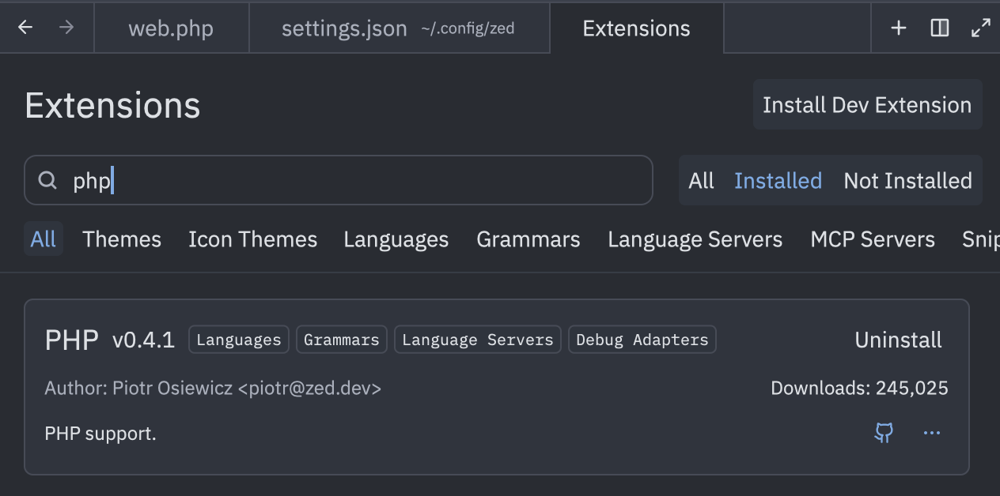
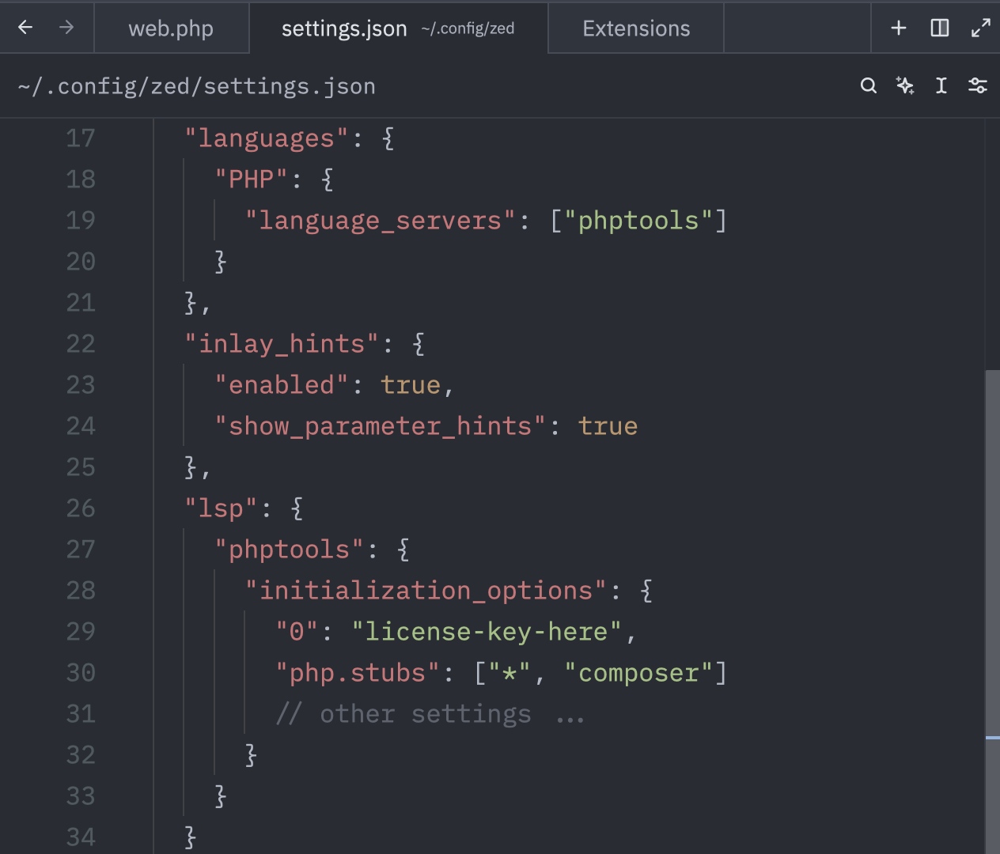
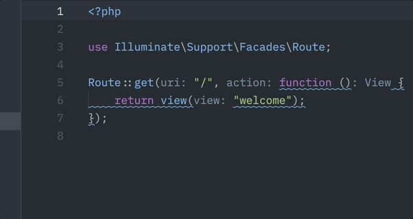

# 🎉 PHP Tools Now Supports Zed IDE – Full Tutorial Inside!

We're thrilled to announce that **Zed IDE** is now officially supported by our **PHP Tools** extension! 🎉

<!-- more -->

Zed is a modern, fast, and hackable IDE, and we’ve been hard at work making sure that PHP developers get the **best experience** when using it. That includes features you’ve come to expect, such as:

- ✅ Full IntelliSense
- ✅ Code Actions & Quick Fixes
- ✅ Real-time Code Diagnostics
- ✅ Code Formatting
- ✅ Laravel IDE Support
- ✅ Inlay Hints

In this post, we’ll walk you through setting it all up in just a few steps.

---

## 🛠️ Step 1 – Install the PHP Extension

1. Open Zed IDE.
2. From the top menu, go to:  
   `Zed` → `Extensions`
3. In the search box, type:  
   `php`
4. Click **Install** on the PHP extension.



---

## ⚙️ Step 2 – Configure PHP Language Support

1. From the top menu, go to:  
   `Zed → Settings → Open Settings`
2. In the settings JSON, add the following section:

```json
"languages": {
  "PHP": {
    "language_servers": ["phptools"]
  }
}
```

This tells Zed to use our PHP Tools language server for all PHP files.



---

## 💡 Optional – Enable Inlay Hints

Want to see parameter names inline? Add this to your settings:

```json
"inlay_hints": {
  "enabled": true,
  "show_parameter_hints": true
}
```

---

## 🌟 Enable Premium Features

If you have a license key, you can unlock premium features like refactoring and quick fixes.

In the same settings file, add this section:

```json
"lsp": {
  "phptools": {
    "initialization_options": {
      "0": "<YOUR LICENSE KEY>"
    }
  }
}
```

Just replace `<YOUR LICENSE KEY>` with your actual key.



---

## 🚀 You're All Set!

With PHP Tools now integrated into Zed IDE, you're ready to enjoy a powerful PHP coding experience, including:

* Real-time code assistance
* Automatic formatting
* Deep Laravel integration
* Smooth workflow with modern IDE features

If you haven’t tried Zed yet, now’s the perfect time. And if you're already using it — welcome to the future of PHP development. 🐘✨

Happy coding!

## Related Links

- [docs.devsense.com/other/zed/](https://docs.devsense.com/other/zed/) - documentation of PHP Tools in Zed IDE.
- [devsense.com/features/comparison](https://www.devsense.com/en/features/comparison) - premium features comparison.