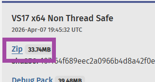
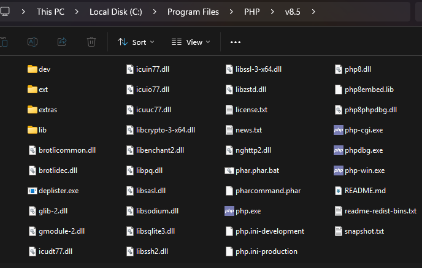
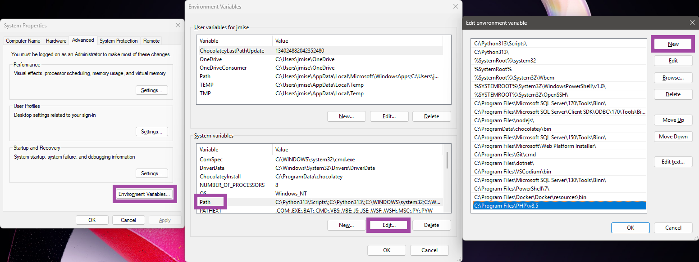
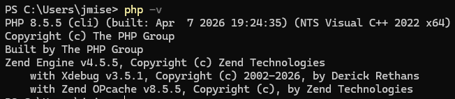
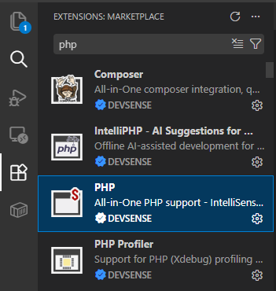
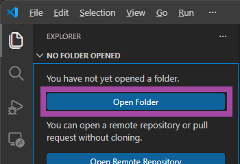
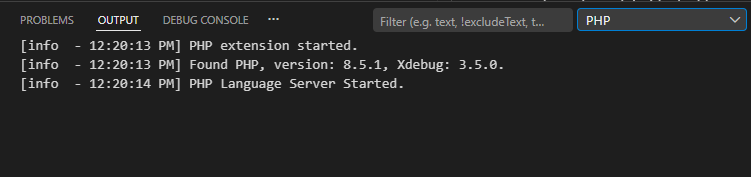
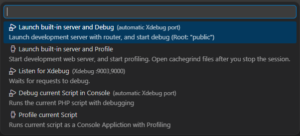
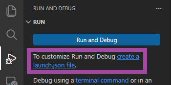
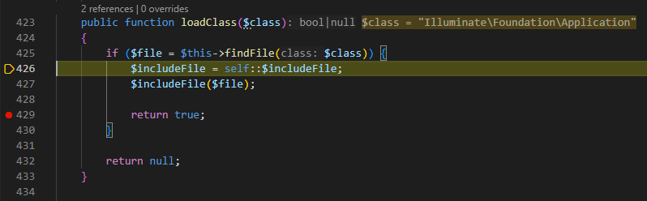

# Manual PHP installation with debugging support in VSCode on Windows

Setting up PHP manually on Windows may sound intimidating at first, especially when there are many ready-made bundles and installers available. Those solutions can certainly be convenient, but they often hide important details about how PHP actually works.

In this guide, we will go through a clean manual installation of PHP on Windows, configure debugging support with Xdebug, and connect everything to Visual Studio Code using **PHP Tools for Visual Studio Code**.

<!-- more -->

<center>
    <iframe width="560" height="315" src="https://www.youtube.com/embed/woiWsx0De2I" title="Manual PHP installation with debugging support in VSCode on Windows" frameborder="0" allow="accelerometer; autoplay; clipboard-write; encrypted-media; gyroscope; picture-in-picture" allowfullscreen></iframe>	
</center>

The advantage of this approach is reliability and understanding. Once completed, you will know exactly how your PHP environment is configured, how debugging works, and how the individual pieces communicate together.

---

# Downloading PHP

We’ll start by downloading PHP itself.

Open the official **PHP** downloads page:

[https://www.php.net/downloads.php](https://www.php.net/downloads.php)

Look for the latest Windows ZIP package named: **VS17 x64 Non Thread Safe**.

The important parts are:

* **VS17** — built using Visual Studio 2022 toolchain
* **x64** — 64-bit build
* **Non Thread Safe (NTS)** — recommended for most modern development setups, including FastCGI and debugging



---

# Installing the Visual C++ Runtime

Because the PHP package is compiled with the Visual Studio 2022, Windows also needs the corresponding Visual C++ runtime installed.

Most people are not sure whether they already have it installed, so the easiest approach is simply searching for `vc redist 140 x64` and installing it.

Navigate to the Microsoft's download page - [Visual C++ Runtime](https://www.microsoft.com/en-us/download/details.aspx?id=48145) - and download and install the official Microsoft Visual C++ Redistributable package. This runtime is required for PHP to start correctly, and you can safely install it even if you already have it.

---

# Extracting PHP

Once PHP is downloaded, extract the ZIP archive into: `C:\Program Files\PHP` or a sub-folder with your PHP version if you prefer.

You can technically place PHP anywhere, but keeping it inside Program Files is a clean and conventional choice.

After extraction, the folder should contain files such as:

```text
php.exe
php.ini-development
ext\
```



---

# Adding PHP to the PATH Environment Variable

This step is optional, but recommended.

Adding PHP to the system `PATH` allows you to run commands like:

```bash
php -v
```

from any terminal window.

To do this:

1. Open **System Environment Variables**
2. Edit the `PATH` variable
3. Add:
  ```text
  C:\Program Files\PHP
  ```
4. Make sure, there is not another path to another installation of PHP.



After saving the changes, open a new terminal and verify the installation:

```bash
php -v
```

---

# Installing Xdebug

Next, we’ll enable debugging and profiling using **Xdebug**.

Go to:

[https://xdebug.org/download](https://xdebug.org/download)

Download the version matching:

* your PHP version
* x64 architecture
* not `TS` build.

Then copy the downloaded `.dll` file into the `ext` sub-folder inside your PHP installation:

---

# Creating php.ini

Inside your PHP folder, locate:

```text
php.ini-development
```

Rename it to:

```text
php.ini
```

The development configuration already contains sensible defaults suitable for local development.

---

# Enabling Common PHP Extensions

Open `php.ini` in a text editor.

Search for lines starting with:

```ini
;extension=
```

The semicolon means the line is commented out.

Uncomment the extensions you need by removing the semicolon.

Commonly enabled extensions include:

```ini
extension=curl
extension=mbstring
extension=openssl
extension=pdo_mysql
extension=xsl
extension=zip
```

The exact list depends on your actual requirements.

---

# Enabling Xdebug

Scroll to the end of `php.ini` and add the following line:

```ini
zend_extension="C:\Program Files\PHP\ext\php_xdebug.dll"
```

> Replace the filename with the actual Xdebug DLL you downloaded.

Important details:

* use the full absolute path
* keep the path inside double quotes
* use `zend_extension`, not `extension`

Example:

```ini
zend_extension="C:\Program Files\PHP\ext\php_xdebug-3.5.1-8.5-nts-vs17-x86_64.dll"
```

At this point, PHP will load Xdebug every time it starts.

Additional Xdebug settings can be configured manually in this file, but when using VS Code together with PHP Tools, much of the debugging configuration is handled automatically.

You can verify everything works by opening a terminal and running:

```bash
php -v
```

You should see both PHP and Xdebug listed.



---

# Installing PHP Tools in Visual Studio Code

Now switch to **Visual Studio Code**.

Open the Extensions panel and install:

**PHP by DEVSENSE**

This extension provides:

* IntelliSense
* code analysis
* debugging support
* profiling support
* navigation
* refactoring
* test explorer and code coverage
* and many other PHP development features



---

# Opening Your Project

Open your PHP project folder in VS Code.



At this point, after opening a `.php` file, the extension should automatically recognize your PHP installation and initialize the workspace.

You can verify that PHP was correctly configured in the VSCode's **OUTPUT** window, tab **PHP**:



---

# Starting Debugging

To start debugging you have two options:

1. Open any `.php` file and hit `F5` (Quick Launch).
   
2. Or create a proper launch configuration in VSCode's **Run and Debug** panel.
   

Depending on your project type, there are multiple launch profiles available. For advanced scenarios, refer to the official documentation.

Please see [launch.json](https://docs.devsense.com/vscode/debug/launch-json/) for launch profiles where you can customize how to run and debug your project, or do the performance profiling.

---

# How Debugging Works

Behind the scenes, PHP Tools communicates with PHP runtime while PHP script is running.

This allows your IDE to:

* stop execution on breakpoints
* inspect variables
* step through code line by line
* evaluate expressions
* analyze call stacks

Instead of relying on `echo` or `var_dump`, you gain a fully interactive debugging experience directly inside the editor.



---

# Conclusion

You now have a complete PHP development setup on Windows with debugging support configured manually from scratch.

This setup is ideal for local development because it gives you full visibility and control over your PHP environment while avoiding hidden configuration performed by third-party bundles.
