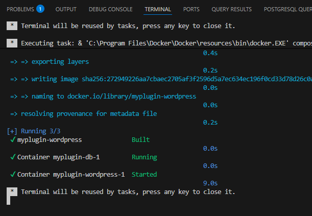
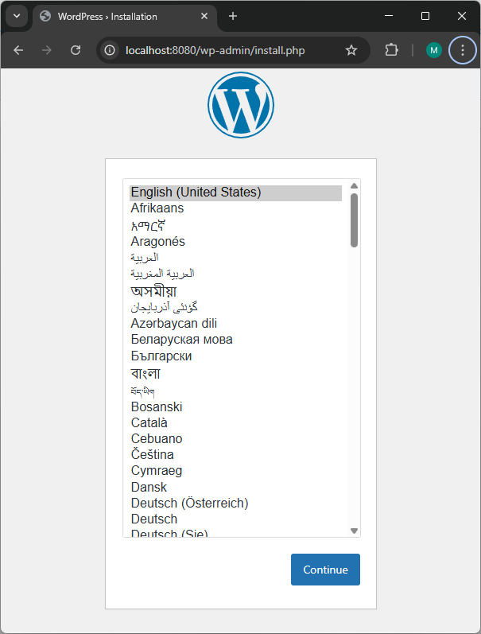
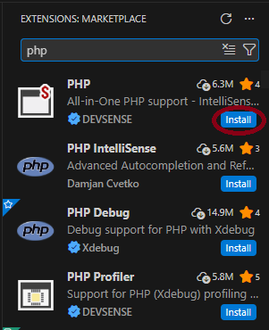
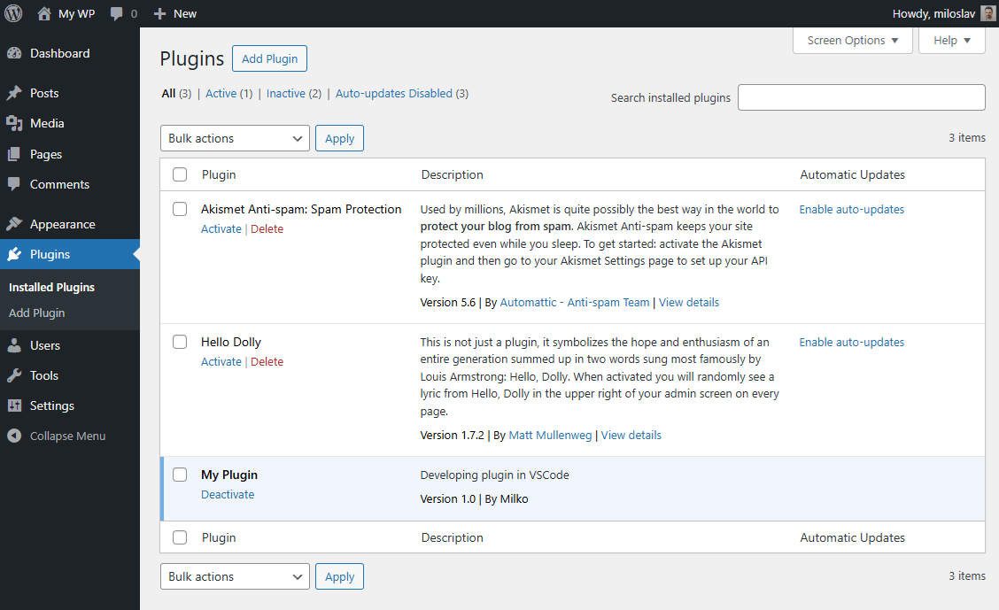
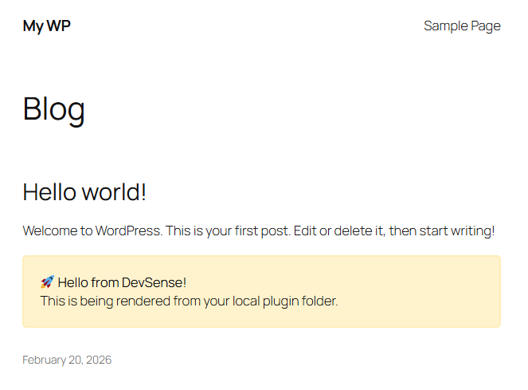
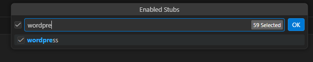
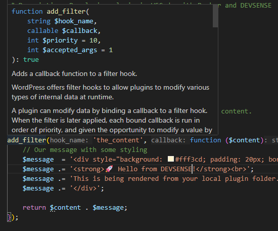
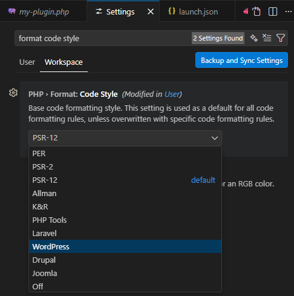
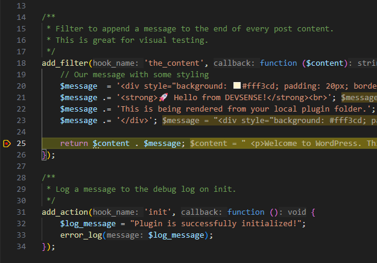
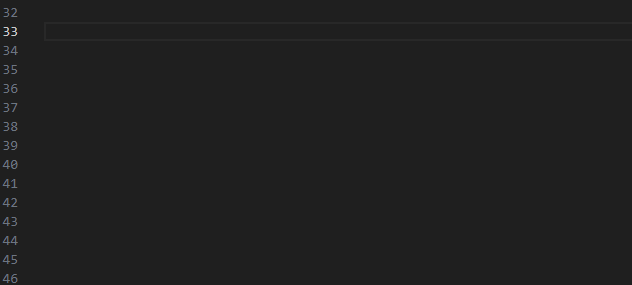

# Setting Up a Modern WordPress Plugin Dev Environment with VS Code (2026)

Developing WordPress plugins shouldn't mean cluttering your OS with PHP installations or getting lost in the `wp-admin` core folders. In this tutorial, we will build a professional, containerized environment using **Docker** and **PHP Tools for VS Code** from DEVSENSE.

<!-- more -->

## Step 1: Create Your Workspace
Instead of opening the entire WordPress directory, we focus only on our code.

- Create a new folder for your plugin (e.g., `my-plugin`).
- Open this folder in **VS Code**.

## Step 2: Define Infrastructure with Docker
We use Docker to keep our environment isolated and portable. Create a `docker-compose.yml` file in your root:

```yaml
services:
  db:
    image: mysql:8.0
    volumes:
      - db_data:/var/lib/mysql
    restart: always
    environment:
      MYSQL_ROOT_PASSWORD: password
      MYSQL_DATABASE: wordpress
      MYSQL_USER: wordpress
      MYSQL_PASSWORD: wordpress

  wordpress:
    depends_on:
      - db
    build: .
    ports:
      - "8080:80"
    restart: always
    environment:
      WORDPRESS_DB_HOST: db:3306
      WORDPRESS_DB_USER: wordpress
      WORDPRESS_DB_PASSWORD: wordpress
      WORDPRESS_DB_NAME: wordpress
      XDEBUG_MODE: debug
      XDEBUG_CONFIG: "client_host=host.docker.internal client_port=9003 start_with_request=yes"
    volumes:
      - .:/var/www/html/wp-content/plugins/my-plugin
volumes:
  db_data:
```

Next, create a `Dockerfile` to ensure **Xdebug** is installed and active in your container:

```Dockerfile
FROM wordpress:latest

# Installs and enables Xdebug
RUN pecl install xdebug && docker-php-ext-enable xdebug
```

Right Click in the VS Code Explorer on `docker-compose.yml` and click `Compose up` (or if you prefer console, run `docker compose up -d`)



## Step 3: The Famous 5-Minute Install in 1 Minute

Navigate to `http://localhost:8080` in your browser.

Follow the WordPress setup wizard. You will not need to enter database details only admin credentials.



## Step 4: Turn VS Code into a Full PHP IDE

Now, let's make the editor smart. Install the **PHP Tools** extension from the Marketplace.



Contrary to other tutorials that ask you to install 10+ extensions, you only need this one. It keeps your VS Code lean and fast—no more duplicate background tasks from competing extensions. 

**Continuous Code Validation:** Everything is integrated. You get your code checked as you type, revealing troublesome issues and logic problems without even running the code. The built-in type analysis and code validation check the entire project in seconds, updating instantly as you work. Problems are listed in the `Problems` window and underlined directly in the editor, ensuring your WordPress plugin is solid from the first line.

## Step 5: Activate Your Plugin

Create your main plugin file (e.g., `my-plugin.php`):

```php
<?php
/**
 * Plugin Name: My Plugin
 * Description: Developing plugin in VSCode with Docker and DEVSENSE
 * Version: 1.0
 * Author: Milko
 */

// Exit if accessed directly.
if (!defined('ABSPATH')) {
    exit;
}

/**
 * Filter to append a message to the end of every post content.
 * This is great for visual testing.
 */
add_filter('the_content', function ($content) {
    // Our message with some styling
    $message  = '<div style="background: #fff3cd; padding: 20px; border: 2px solid #ffeeba; margin-top: 20px; border-radius: 5px;">';
    $message .= '<strong>🚀 Hello from DEVSENSE!</strong><br>';
    $message .= 'This is being rendered from your local plugin folder.';
    $message .= '</div>';

    return $content . $message;
});

```

Once you've added the file, go to **WordPress Admin -> Plugins**. Because of our Docker Volume mapping, your plugin is already there. Click **Activate**



Verify if the plugin is working by opening `http://localhost:8080`



## Step 6: Leveraging IDE Intelligence

### Enable WordPress Stubs
You don't need the WP core files locally. Just activate Wordpress stubs:

- Open VS Code Settings <kbd>Ctrl + ,</kbd>
- Search for `PHP: Workspace Stubs` and set it to `WordPress`.



This provides full IntelliSense and documentation for Wordpress functions without the file system bloat.

e.g. you can go to the Plugin file and hover over `add_filter` and you will see all the parameters.



### Enforce Wordpress Code style

WordPress has specific formatting rules, such as Yoda conditions and specific spacing.

- Open VS Code Settings <kbd>Ctrl + ,</kbd>
- Search for `PHP Format: Code Style` and set it to `WordPress`.

This utilizes the DEVSENSE formatter to instantly "comb" your code into compliance whenever you hit <kbd>Alt+Shift+F</kbd> or save the document.



Both stubs and codestyle can be configured by adding these two options into your `.vscode/settings.json` file:
```json
{
    "php.stubs": [
        "wordpress",
        "*"
    ],
    "php.format.codeStyle": "WordPress"
}
```

## Step 7: Debugging

Forget browser extensions or manual session cookies.

- In VS Code, go to the **Run and Debug** tab and create a `launch.json`.
- Set the port to `9003` and ensure pathMappings points your local folder to `/var/www/html/wp-content/plugins/my-plugin`.

```json
{
    "version": "0.2.0",
    "configurations": [
        {
            "name": "Listen for Xdebug",
            "type": "php",
            "request": "launch",
            "port": 9003,
            "pathMappings": {
                "/var/www/html/wp-content/plugins/my-plugin": "${workspaceFolder}"
            }
        },
    ]
}
```
- Set a breakpoint by clicking the red dot next to a line of code.
- Press <kbd>F5</kbd> to start listening.
- Refresh your browser on `http://localhost:8080`.
- VS Code will pause execution where you need it.

  
- You can step the execution, explore the variables etc.

## Bonus: Local AI with IntelliPHP
PHP Tools comes with a small, local model trained specifically on PHP code. Think of it as **PHP Snippets on steroids** rather than a full-blown Copilot replacement for generating massive blocks of code.

- **Privacy:** Nothing is sent to the cloud; your code stays on your machine.
- **Micro-completions:** It excels at predicting the next few tokens, like function names, variables, or short logic patterns, making your typing flow much smoother.
- **Mobility:** It works completely offline (perfect for coding on a laptop during travel).
- **Speed:** Zero latency. It works even on old laptops because it doesn't wait for a round-trip to a server.



## Conclusion
You now have a modern, professional workflow. Your workspace is lightweight, and your debugging is seamless.