# What's New in PHP extension for Visual Studio Code (December 2025 – January 2026)

The end of 2025 and the beginning of 2026 brought another substantial update to the [**PHP extension for Visual Studio Code**](https://marketplace.visualstudio.com/items?itemName=DEVSENSE.phptools-vscode) by DEVSENSE. This release focuses on deeper code understanding, smarter refactorings, better framework support, full alignment with the latest PHP language changes, and stability. Alongside major IntelliSense improvements and advanced generics support, we’ve also delivered significant performance optimizations to make your daily development smoother than ever.

<!-- more -->

## More Editor Features

### New Refactorings

This update introduces several new refactoring and code actions that help modernize and simplify your code with a single click.

You can now replace `clone` with the new `clone with` syntax using a dedicated code action. This is especially useful as projects adopt newer PHP versions and want to align with updated language constructs.

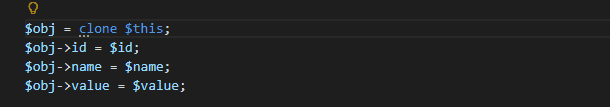

Working with arrays is more convenient as well. A new quick refactoring allows you to replace `array_merge()` with the more concise array spread syntax, helping you keep your code modern and expressive.

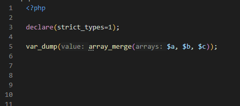

Similarly, if you are using an unnecessary spread operator, the editor will suggest a **Remove Unnecessary Spread** action to clean things up.

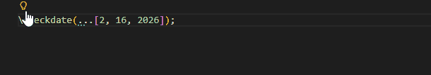

For functional-style code, you can quickly transform an anonymous function into the new callable syntax. This makes it easier to adopt modern callable patterns while keeping your code concise and readable.

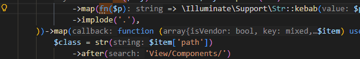

PHP 8.4 and newer projects also benefit from a refactoring that removes unnecessary parentheses around `new` expressions, ensuring your code stays clean and compliant with the current language rules.

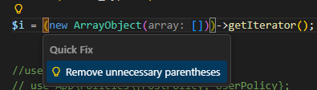

Together, these refactorings reduce boilerplate, encourage modern syntax, and help maintain a consistent code style across your project.

### Auto-Import with Grouping

Auto-import has been improved to better respect existing `use` statement groupings. When a new symbol is auto-imported, the extension now intelligently adds it into the appropriate group instead of creating redundant standalone imports.

You can also enable a new mode that allows the editor to create grouped `use` statements automatically when suitable:

```json
"php.completion.autoimport": "auto-import-grouped"
```


This ensures your imports remain organized and readable, especially in large files with many dependencies.

### IntelliSense Enhancements

The editor’s core engine has received major enhancements. The parser is now faster, error-tolerant, and better at handling incomplete or partially written code. Type inference has been improved across the board, resulting in more accurate completions, diagnostics, and tooltips.

Several practical improvements have been added. Code completion can suggest specific argument string values when applicable. The editor reports always-false strict comparisons, helping you detect logical mistakes early. The `explode()` function now reflects PHP-version-specific return types in tooltips, type analysis, and generated documentation.

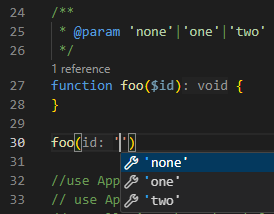

Additionally variable names are now suggested inside the `compact()` function. 

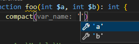

Syntax highlighting has also been refined, with specific colors for interfaces, enums, and classes (if supported by your theme):

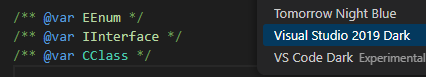

A new diagnostic, `TraitMethodConflict (PHP2447)`, detects trait method conflicts more reliably.

When using the spread operator in function calls, the editor validates that array keys do not conflict with already provided arguments.

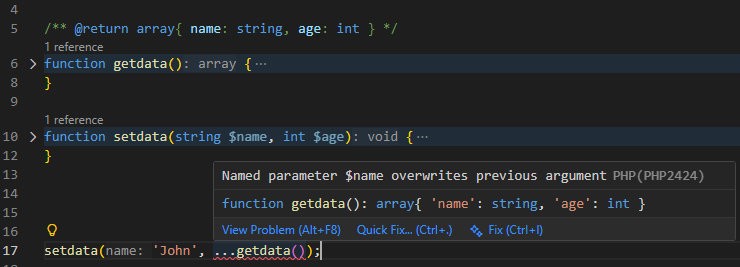

Additionally, PHPDoc annotations for closures and callables with optional parameters are now fully respected, improving type precision and reducing false warnings.

#### Parameter Validation

Parameter validation has been extended to cover closures and indirect function invocations. This means that when you call a closure or dynamically invoke a callable, the editor checks the argument count and types just like it would for a regular function. This significantly improves reliability in functional-style or framework-heavy codebases.


#### Refactoring, References, and Navigation

Navigation and symbol resolution have been improved across string literals in specific patterns, such as:

```php
new ReflectionMethod(FQN::class, "HERE");
```

The editor now resolves symbols inside such strings, enabling go-to-definition, find references, and rename refactoring to work seamlessly even in reflective or dynamic scenarios.


#### Editor Insight & Navigation

Mouse hover and navigation have been enhanced to provide deeper insight into method resolution results. The editor now displays detailed information based on the same internal logic used for code analysis. This makes it much clearer how generated stubs, helpers, overloaded methods, and framework magic are interpreted internally.

As a result, what you see in tooltips and navigation results more accurately reflects what the editor truly understands about your code.


### Advanced Generics Support

Generics support has been significantly expanded, especially for complex and nested template types. The IDE now understands advanced PHPDoc annotations across the entire codebase, resulting in more precise type inference and safer refactorings.

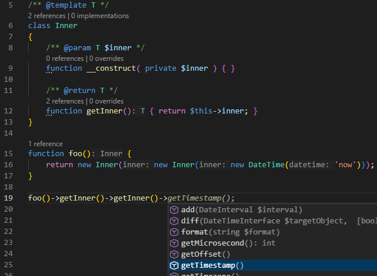

A powerful new `@return` conditional annotation is now supported. You can define return types that depend on constant values or parameter comparisons, including numbers, strings, and `null`. Conditional expressions can use operators such as `is`, `==`, `<=`, `>=`, `<`, and `>` to describe complex type behavior. This enables highly expressive and accurate type modeling directly in PHPDoc.

  ```php
  /** @return ( $name == null ? false : int ) */
  function foo( $name ) { return $name === null ? false : strlen($name); }
  ```
  _or_
  ```php
  /** @return ( PHP_MAJOR_VERSION >= 8 ? string[] : array|false ) */
  function foo() { ... }
  ```

Support has also been added for `@psalm-assert-if-true` and `@psalm-assert-if-false`, which are commonly used in PHPUnit and Pest tests. The editor leverages these annotations to infer more precise types after assertions. Additionally, `@phpstan-assert` and `psalm-assert` annotations with `=`-prefixed types are supported, as used by `assertInstanceOf()`.

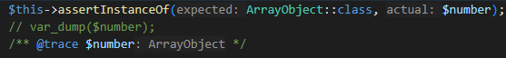

Finally, the extension respects `@phpstan-ignore-line`, reducing noise and aligning with established static analysis workflows.

## Better Laravel IDE

Laravel developers will appreciate several framework-specific improvements.

Completion support has been added for Laravel controller action methods, making routing and controller development more fluid.


The editor now understands `Storage::fake('')` in tests and correctly infers that subsequent `Storage::disk('')` calls return a `FileSystemAdapter` with assertion methods available.

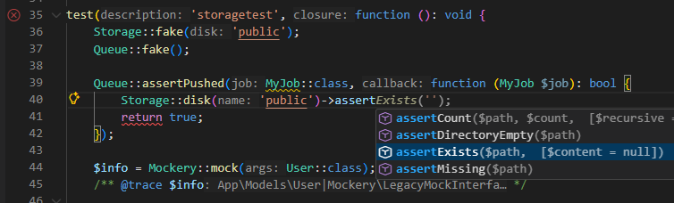

For Pest and Laravel integration, `\Pest\Laravel\actingAs()` now respects the more specific `TestCase` class, including traits such as `Architectable` and `Browsable`. This results in richer completions and more accurate type information inside your tests.

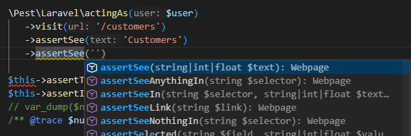

## Tests, Pest PHP, PHPUnit 10–13

Testing support continues to evolve. Inline PestPHP test case runner support is now available, allowing you to execute tests directly from the editor.

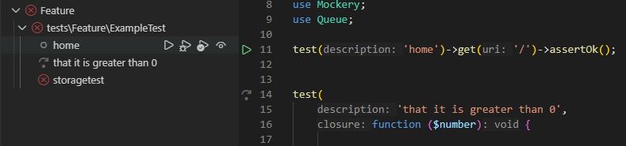

High Order Tests in Pest are fully supported with complete IntelliSense, including `Browsable` and `Architectable` traits. This ensures that even expressive, fluent test definitions remain fully analyzable and navigable.


The Test View now respects test groups. You can filter and exclude tests based on groups, making it easier to skip slow or large test suites and focus on specific categories during development.

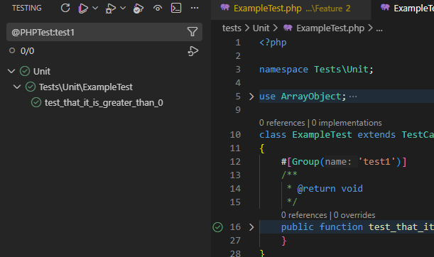

Support extends across PHPUnit versions 10, 11, 12, and 13, ensuring compatibility with modern testing stacks.

## PHP 8.5

PHP Tools for VS Code version 1.67 fully supports the latest features introduced in PHP 8.5. You can select the PHP version using the version selector in the lower-right corner of the editor, via the `"php.version"` setting, or through the `"require"` field in your `composer.json`.

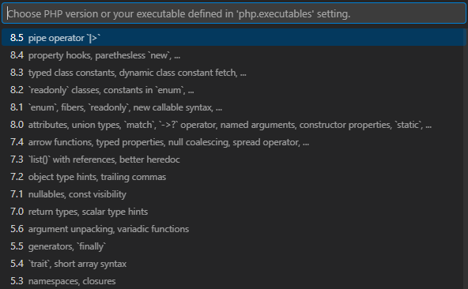

The new `clone` function syntax with optional arguments is supported. Minor syntax differences between PHP 7.x and 8.x are correctly respected, including semi-reserved tokens inside namespace names. When you change the configured PHP version, open documents are automatically re-evaluated to reflect the correct syntax rules.

Stubs for the PHP 8.5 URI extension have been added. The new pipe operator is fully supported, including type inference, validation that arguments are valid callables, compatibility checks, and helpful code actions for simplifying pipe expressions.

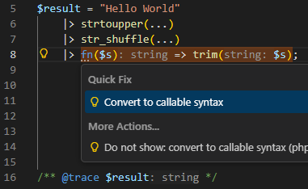

Closures in constant expressions are also recognized and validated against your selected PHP version, ensuring that your code remains forward-compatible and standards-compliant.

## Optimizations

Performance has been a major focus of this release. The editor now tracks incremental changes more efficiently and parses code lazily. When edits are insignificant, parsing can be skipped entirely. This reduces CPU usage while typing by approximately 90%, which is especially noticeable in large PHP files.

Initial indexing has also been optimized. For best performance, **we still recommend excluding your workspace folder from antivirus scanning**.

CodeLens support (reference count above class members) has been reimplemented with a more efficient algorithm, resulting in significantly lower CPU usage without sacrificing functionality.

## Fixes

In addition to the features above, this release includes hundreds of fixes and small improvements based on your feedback. We greatly appreciate your reports and suggestions. For a complete list of changes, please see [the full changelog on our website](https://www.devsense.com/en/download/vscode).

Thank you for using PHP Tools for Visual Studio Code and for helping us continuously improve the experience.
