# Newsletter: PHP Tools for VS Code - March 2026

The latest updates to **PHP Tools for Visual Studio Code** introduce a broad set of improvements focused on developer productivity, language support, and deeper code intelligence. Across the past development cycle, the extension has gained new language features aligned with the latest PHP releases, expanded framework awareness, improved navigation and debugging workflows, and numerous refinements to code analysis.

<!-- more -->

Together, these enhancements strengthen the extension’s role as a powerful development environment for modern PHP projects. From advanced code navigation and debugging capabilities to improved framework integration and smarter IntelliSense, the editor now understands PHP codebases with even greater depth and precision.

Below is an overview of the most significant additions.

---

## Language Features and Modern PHP Support

As PHP continues to evolve, development tools must keep pace. This release introduces support for several modern language capabilities and syntax improvements, ensuring that developers working with the newest PHP versions benefit from full tooling support directly inside the editor.

### PHP 8.5 Language Enhancements

With **PHP 8.5** released, the extension includes full support for its new language features, ensuring developers can adopt the latest syntax while maintaining accurate IntelliSense, diagnostics, and code analysis.

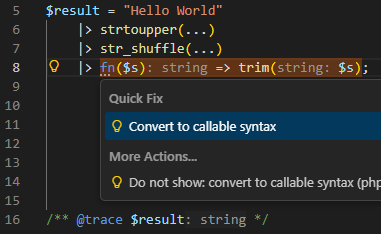

Among the supported features are the new **`|>` pipe operator** and **`(void)` cast**, which allows developers to explicitly discard expression results. The editor fully understands this syntax and integrates it into its analysis pipeline, providing correct parsing, formatting, and diagnostics.


Support has also been added for the updated **`clone` function syntax**, enabling modern cloning patterns to be recognized by the editor’s code intelligence features. We also added a quick refactoring to change `clone` to the new `clone with` construct. See below for details.

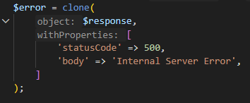

Additionally, workspace stubs now include the newly introduced **URI extension**, allowing the editor to correctly recognize APIs provided by the extension when it is enabled in PHP environments.

---

## Advanced Code Navigation and Project Insight

Large PHP projects often contain deep inheritance hierarchies and complex code relationships. This update brings significant improvements to how developers explore and understand these structures directly within the editor.

### Type Hierarchy Exploration

Developers can now explore class and interface relationships through **Type Hierarchy support**, allowing them to quickly identify parent classes, derived classes, and interface implementations.

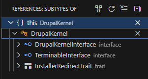

This capability is particularly valuable when navigating large frameworks or legacy systems, where understanding structural relationships between types is essential. With the hierarchy view, developers can immediately trace how objects relate to each other across the entire workspace.

### Symbol Resolution Inside Strings

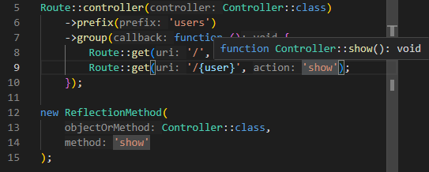

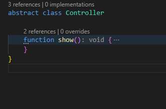

Navigation and reference resolution have been enhanced to recognize symbols embedded within string arguments used in specific patterns. For example, constructs such as:

```php
new ReflectionMethod(FQN::class, 'methodName');
```

can now be resolved directly by the editor. Developers can navigate to the referenced method or symbol even when it appears as a string literal, improving productivity in reflection-heavy codebases and meta-programming scenarios.

### Richer Hover and Navigation Results

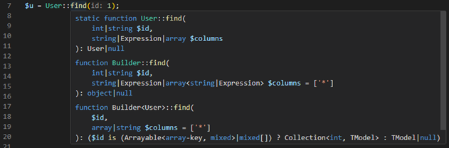

Mouse hover and navigation features have been enhanced to present a clearer view of all methods visible to the editor, including generated stubs, helpers, and overloaded implementations.

By aligning hover information with the same analysis engine used for code diagnostics, the editor now provides a more accurate representation of what the language server understands internally. This transparency helps developers better reason about complex frameworks and generated code.

---

## Smarter IntelliSense and Code Completion

Code completion continues to evolve with a focus on real-world developer workflows and popular frameworks.

### WordPress Actions and Filters Completion

The extension now provides **code completion for custom WordPress actions and filters**, making it easier to discover and implement hooks in WordPress-based projects. This feature helps developers navigate large ecosystems of plugin hooks while reducing errors caused by typos or incorrect hook names.

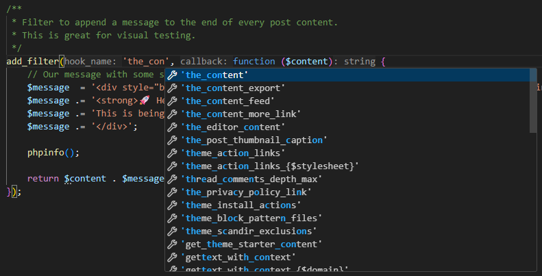

### PHP Tag Completion

Typing PHP opening tags is now faster and more consistent thanks to **code completion for PHP open tags** such as `<?php`. This small but practical improvement reduces friction when switching between PHP and template contexts.

### Laravel Controller Method Completion


Framework awareness continues to expand with improved support for **Laravel controller actions**. The editor now provides completion suggestions for controller methods when referencing them in routing definitions or similar contexts.

This helps developers move faster when working inside **Laravel** applications, where controllers frequently serve as central entry points for application logic.

Additional Laravel and testing ecosystem improvements include more precise type inference for common testing helpers and a better understanding of modern test frameworks such as **Pest PHP**.

---

## Code Analysis and Developer Assistance

Beyond navigation and completion, several enhancements strengthen the editor’s ability to analyze code correctness and provide actionable guidance.

### Parameter Validation for Closures and Dynamic Calls


The static analysis engine now validates parameters for **closures and indirect function calls**. This ensures that arguments passed to dynamically invoked functions are checked against expected parameter signatures.

For developers working with higher-order functions, callbacks, and functional programming patterns, this adds another layer of correctness checking directly inside the editor.

### Improved Refactoring and Code Actions

Several new code actions simplify everyday refactoring tasks. Developers can now:

* Remove unnecessary spread operators in function calls.

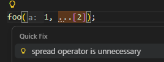

* Convert `clone` expressions to the new `clone with` syntax.

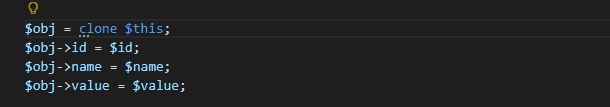

* Transform string concatenation into cleaner string interpolation where applicable.

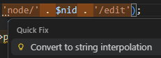

These automated transformations help maintain consistent and modern code style across large projects.

### Intelligent Argument and Spread Validation

The editor now checks spread operators used in function calls to ensure their array keys do not conflict with explicitly defined arguments. This prevents subtle runtime issues and highlights problematic patterns during development rather than at execution time.

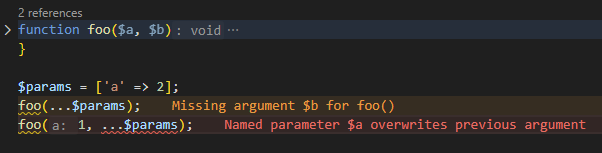

---

## Debugging Improvements

Debugging PHP applications inside the editor has also been enhanced.

Developers can now inspect **function return values directly during debugging sessions**. After stepping out of a function call, the debugger automatically captures and displays the returned value in the variables pane, clearly associated with the originating function.

This improvement eliminates the need for temporary variables when investigating function results and makes debugging workflows significantly smoother.

In addition, configuration of debugging features through **Xdebug settings** has become more flexible, allowing developers to reliably override debugger parameters directly within their workspace configuration.

---

## Editor Experience and Visual Enhancements

Several improvements refine the visual experience and overall usability of the editor:

* Interfaces and enums can now appear with dedicated semantic colors when supported by the active theme.
* Type hints in property hooks receive improved syntax coloring.
* Unused class members—including properties, methods, and constants—are visually dimmed when they are not referenced anywhere in the workspace.

These visual cues make it easier to maintain large codebases by highlighting unused code and improving overall readability.

---

## Stability Improvements and Bug Fixes

Alongside new features, this update includes numerous fixes and stability improvements across the code analysis engine, formatter, parser, and framework integrations.

These fixes address issues related to formatting rules, syntax recovery, trait handling, diagnostics accuracy, framework stubs, and IntelliSense behavior in complex scenarios. Improvements have also been made to parsing reliability, error recovery, and workspace indexing, ensuring a more stable editing experience even in very large PHP projects.

---

## A Continuously Improving PHP Development Experience

With these updates, **PHP Tools for Visual Studio Code** continues to push forward as a comprehensive development environment for modern PHP applications.

From deeper language awareness and improved framework integration to smarter debugging and navigation capabilities, the extension now offers an even more refined experience for developers building everything from small scripts to enterprise-scale PHP platforms.

As the PHP ecosystem evolves, the editor evolves alongside it—delivering tools that help developers write better code, understand their projects faster, and stay productive every day. 🚀
