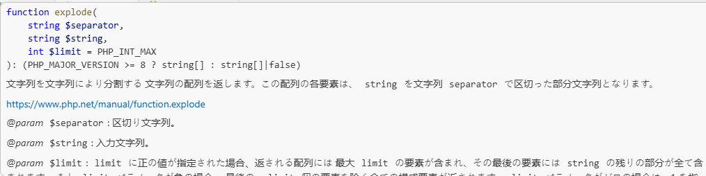

# June 2026: Smarter IntelliSense, Better Debugging, and Improved PHP Development Experience

The latest updates of **PHP Tools for Visual Studio Code** and **PHP Tool for Visual Studio** bring a wide range of improvements focused on making PHP development faster, more accurate, and more enjoyable.

Recent releases introduce smarter code completion, deeper understanding of modern PHP patterns, improved debugging, better framework support, and a more complete PHP ecosystem experience.

<!-- more -->

Whether you are working with Laravel, WordPress, or a custom PHP application, the update improves the way PHP Tools understands your code and helps you write better software with less friction.

# Smarter Code Completion with Starred Suggestions

Finding the right completion item is now faster with **Starred Suggestions**.

The most probable member completions are automatically marked with a ★ and displayed at the top of the completion list.


The goal is simple: help you reach the symbol you need with fewer keystrokes.

Nothing changes in your workflow — you can continue typing as usual, and the feature stays quietly in the background.

You can also control this behavior using:

```
"php.completion.starredSuggestions": true
```

This update also includes improvements to the underlying IntelliSense engine, including:

* Better generic template handling
* Improved type inference
* More accurate suggestions after generic annotations
* Better understanding of modern PHP code patterns

Read more at [docs.devsense.com](https://docs.devsense.com/vscode/editor/completion/#starred-suggestions-local-ai-ranking).

# Advanced Callback Intelligence

PHP supports many dynamic calling patterns, including string callbacks and array-style callbacks.

PHP Tools now understands these patterns much better.

Functions referenced through:

* String callbacks
* Array callable syntax
* Dynamic callable patterns

are now validated, navigated, and analyzed with full IntelliSense support.


You now get:

* Context-aware completion
* Function tooltips
* Navigation to referenced functions
* Semantic highlighting
* Rename refactoring support
* Better validation of callable references

The result is a much more reliable experience when working with frameworks and applications that rely heavily on dynamic invocation.

# Improved WordPress Development Experience

WordPress development gets several important improvements.

PHP Tools now provides better support for WordPress hooks, including:

* Navigation to hook invocations
* Find All References for hooks
* Better tooltips showing hook types
* Improved WordPress-specific type understanding


For example, WordPress hook names are now recognized as meaningful symbols rather than simple strings.

This makes navigating large WordPress projects much easier.

More about WordPress support at [docs.devsense.com](https://docs.devsense.com/vscode/frameworks/wordpress/).

## Hooks Intelligence


The completion of hooks gets even better. When implementing a hook (an action or a filter), the editor suggests an anonymous function with pre-filled arguments. And if there is an anonymous function, the inlay hints show types of the function's parameters - in this case `array` for `$new_autosave` and `bool` for `$is_update`.

# Updated PHP Manual Integration

The integrated PHP Manual support has received a major update.

The complete multi-language PHP manual now includes:

* Updated PHP stubs
* Additional translations
* Previously undocumented functions and classes
* Better code intelligence integration



These improvements enhance:

* IntelliSense
* Code analysis
* Navigation
* Code actions

The update also introduces better localization support, including a Japanese UI translation and Chinese language support when VS Code is configured to use Chinese display language.

How to work with available stubs can be found at [docs.devsense.com](https://docs.devsense.com/vscode/stubs-packages/).

# Laravel Improvements

Laravel developers will benefit from improved framework awareness.

This release improves:

* Controller completion
* Route navigation and _Find All References_ to a route string.
* Livewire specific completions
* Controller method resolution
* Framework-specific type inference

Examples include better navigation from grouped Laravel route definitions and additional Livewire methods such as:

* `View::layout()`
* `View::title()`

PHP Tools continues to improve its understanding of modern PHP frameworks and their conventions.

More about Laravel support at [docs.devsense.com](https://docs.devsense.com/vscode/frameworks/laravel/).

# More Accurate Code Analysis and PHP Intelligence

The update includes many improvements to PHP's static analysis engine.

New and improved checks include:

* Detection of incorrect variadic arguments with default values
* Better property visibility analysis
* Improved handling of numeric strings with `numeric-string` type annotation.
* Better support for `BcMath\Number` [#2559](https://community.devsense.com/d/2559)
* Improved PHPDoc parsing, specific to WordPress code base.
* More accurate generic template analysis
* Better handling of ambiguous array and foreach types

Attribute completion is also now context-aware; Only valid PHP attribute classes are suggested — specifically classes marked with `#[Attribute]`.

This reduces unnecessary suggestions and prevents incorrect usage.

# More Powerful Code Actions

New code actions help reduce repetitive editing.

You can now:

* Add missing parameter type hints automatically
* Improve code consistency with smarter fixes
* Apply safer refactoring suggestions

Additional improvements include better handling of:

* `is_null()` transformation adds parentheses to keep the code semantic.
* Function override fixes for tentative types.
* Not showing refactoring hints (three dots), if code actions are turned off. [#1038](https://github.com/DEVSENSE/phptools-docs/issues/1038)

# Smaller Improvements and Important Fixes

Alongside the major features, this release contains many smaller improvements that make everyday development smoother.

Highlights include:

* Better HEREDOC error reporting with precise underlining of incorrect indentation
* Fixed false warnings in HEREDOC strings [#2577](https://community.devsense.com/d/2577), [#1053](https://github.com/DEVSENSE/phptools-docs/issues/1053), [#2591](https://community.devsense.com/d/2591)
* Code lens references to `__construct` now count references to `new` as well (consistent with _Find All References_ behavior). [#1050-comment](https://github.com/DEVSENSE/phptools-docs/issues/1050#issuecomment-4742244665)
* Better handling of `$GLOBALS` usage
* More accurate `@global` handling
* Better support for WordPress type conventions in PHPDoc
* Improved generic types substitution passed to base classes
* Optimized workspace loading and memory usage
* Faster re-analysis of edited files
* Improved Blade syntax handling
* Namespace display in the Outline view
* Reduced unnecessary diagnostics for common patterns such as dummy `$_` variables
* Added compatibility with Alpine Linux (`musl`) installations

The update also includes numerous stability improvements and bug fixes, resulting in a faster and more reliable PHP development experience in Visual Studio Code.

Upgrade PHP Tools for VS Code and enjoy smarter IntelliSense, improved debugging, stronger framework support, and a smoother PHP workflow.

---

See the [complete changelog](https://www.devsense.com/download/vscode) for more details.
