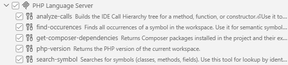

# September 2026: MCP Server, IntelliSense, Code Actions

September brings another set of improvements to PHP Tools for Visual Studio Code, with a particular focus on **AI-assisted development, code navigation, refactoring, and type inference**.

<!-- more -->

This update continues to build on the language server's understanding of your PHP codebase. From exploring relationships between classes to performing semantic refactorings and providing context to AI agents, PHP Tools increasingly works with your code at the level of its structure and meaning rather than treating PHP files as plain text.

Let's take a look at the highlights.

## MCP: Give AI Agents a Deeper Understanding of PHP

AI coding agents are becoming an increasingly important part of the development workflow. However, an AI model working with a large PHP application still needs to discover the structure and relationships within the codebase before it can make useful changes.

PHP Tools now provides an integrated **MCP (Model Context Protocol) server** that allows AI agents to access the language server's knowledge about your project.

The MCP server exposes **tools, skills, and context** that AI agents such as Claude can use to work with information already understood by PHP Tools.



Instead of an AI agent having to infer everything from the contents of individual files, it can make use of information such as:

* PHP symbols and their locations
* Types and type relationships
* Class inheritance and implementations
* References and usages
* Call hierarchies
* Framework-specific information
* Project structure

This can be particularly useful when working with large applications where understanding the relationship between files is more important than understanding any individual file.

### Why semantic context matters

Consider a simple request such as:

> "Rename this service and update everything that uses it."

A text-based AI tool has to search the repository and determine which occurrences actually refer to the class. A language server already has this information.

The same applies to more complex requests:

> "What could be affected if I change the return type of this method?"

Understanding the callers, implementations, inherited methods, and inferred types can provide an AI agent with significantly better context for making such decisions.

With MCP, PHP Tools can provide this semantic information directly to AI agents.

## Call Hierarchy: Follow the Flow of Your Code

Understanding a large PHP codebase often means answering a simple question:

> "Who calls this?"

The new **Call Hierarchy** functionality lets you explore these relationships directly from your code.


The language server analyzes your project and provides both incoming and outgoing calls, making it possible to navigate from a method to the methods that call it, or to the methods it calls.

This is particularly useful when working with unfamiliar code or tracing the execution path through services, controllers, repositories, and other application layers.

### A useful debugging and refactoring technique

Call Hierarchy can also help before making potentially risky changes.

For example, before modifying:

```php
public function calculateTotal(Order $order): Money
{
    // ...
}
```

check its callers first.

You may discover that the method is used not only by a controller but also by a background job and a command-line application. Understanding those dependencies before changing the method can prevent subtle regressions.

The same technique is useful when removing methods: **find the callers first, then determine whether the method can safely be removed.**

## Better Laravel Support

Laravel applications make extensive use of conventions, dynamic behavior, magic properties, and framework-provided abstractions. Providing useful IntelliSense for such code requires understanding more than PHP syntax alone.

We continue to improve support for **Laravel and Generics**, with a focus on real-world projects and common Laravel development patterns.

This update improves support for Laravel models and factories without requiring additional annotations. PHP Tools can also make better use of type information already present in your codebase.

Among the improvements are:

* Better handling of annotations for relationship properties.
* Greater use of `class-string<>` in code completion.
* Completion for additional magic properties on the `Illuminate\View` contract.
* Improved enumeration of `SimpleXMLElement`.
* Various additional improvements to Laravel and generic type inference.

### Tip: Let your types describe your Laravel code

When working with generic APIs, providing precise type information can significantly improve the quality of IntelliSense.

For example:

```php
/**
 * @return Collection<int, User>
 */
public function users(): Collection
{
    return User::query()->get();
}
```

Generic information such as `Collection<int, User>` gives the language server additional information about the contents of the collection and allows subsequent expressions to be analyzed more accurately.

The goal is not to add annotations everywhere, though. PHP Tools increasingly understands common framework patterns automatically, reducing the amount of PHPDoc you need to maintain manually.

## Code Actions: Refactor Without Leaving the Editor

Code Actions provide a convenient way to perform common transformations directly from the editor.

This release adds and improves several actions that are especially useful when modernizing existing PHP code or implementing object-oriented patterns.

### Promote Constructor Property


PHP's constructor property promotion can eliminate a significant amount of repetitive code.

Given:

```php
class User
{
    private string $name;

    public function __construct(string $name)
    {
        $this->name = $name;
    }
}
```

PHP Tools can suggest converting the declaration into a **promoted constructor property**:

```php
class User
{
    public function __construct(
        private string $name,
    ) {}
}
```

When appropriate, the **Promote Constructor Property** Code Action is offered automatically.

This is particularly useful when modernizing older PHP applications where many classes still use the traditional property-and-constructor pattern.

### Extract Interface


The **Extract Interface** Code Action creates a new interface in a new file based on the public members of the current class.

This can be useful when introducing abstractions into existing code.

For example, if a service has grown into a concrete implementation that needs to be replaced or mocked, extracting an interface provides a starting point for dependency inversion without manually copying method declarations.

### Override Members


Implementing inherited behavior can involve repetitive boilerplate, especially in classes with large parent classes or interfaces.

The **Override Members** Code Action lets you select the methods to override and automatically creates their default implementations in the current class.

Because PHP Tools understands the inheritance hierarchy, it can offer the relevant members instead of requiring you to search through the parent class manually.

### Implement Abstracts


If a class is missing an implementation of an abstract method or property inherited from an abstract parent class or interface, **Implement Abstracts** adds the required default implementations.

The action is also available as a Quick Fix for the corresponding diagnostic.

This means you can trigger it directly from the editor or from the **Problems** window.

These kinds of semantic Code Actions are especially useful when working with interfaces and inheritance-heavy code because the language server can determine exactly which members are required by the type hierarchy.

## IntelliJ IDEA `.editorconfig` Format Options

Different teams often use different IDEs while working on the same PHP codebase. Maintaining consistent formatting across those environments can therefore become surprisingly difficult.

New `php.workspace.editorConfig` settings give you more control over how `.editorconfig` files are processed, including their processing order and whether **IntelliJ IDEA formatting directives** should be applied.

This is useful when your team uses a mixture of Visual Studio Code, IntelliJ IDEA, and other editors while sharing the same repository.

See our blog post [Leveraging `.editorconfig` for Consistent Code Style Across Different IDEs](https://blog.devsense.com/2024/leveraging-.editorconfig-for-consistent-code-style-across-different-ides/) to learn how to export formatting settings from an IntelliJ IDEA IDE.

### Tip: Keep formatting configuration in the repository

Whenever possible, keeping formatting rules alongside the project is preferable to relying on individual developer settings.

A shared `.editorconfig` provides a common baseline for the entire team and helps avoid unnecessary formatting-only changes in pull requests.

## FQN Completions

PHP developers frequently need to decide between importing a class:

```php
use App\Services\PaymentService;
```

and using its fully qualified name directly:

```php
$service = new \App\Services\PaymentService();
```

**FQN Completion** provides a convenient way to choose the latter directly from code completion.

Type `\` as the first character and code completion will list available symbols.

Once confirmed, PHP Tools inserts the selected symbol as a **fully qualified name**, rather than adding an import statement.

This can be useful when you intentionally want to avoid changing the import section—for example, when a class is used only once or when you need to disambiguate between classes with the same short name.

### Faster completion on multi-core CPUs

The completion engine has also received major **performance improvements for multi-core CPUs**.

Code completion now triggers faster while using less CPU, making it more responsive when working with large projects.

This is particularly important for PHP applications with large dependency trees and thousands of indexed symbols, where code completion needs to perform substantial type and symbol analysis in the background.

## Improved Compatibility with Generics, PHPStan, and Psalm

Modern PHP projects increasingly rely on advanced type information provided by **Generics, PHPStan, and Psalm**.

The latest version expands compatibility with these tools and understands additional Psalm directives such as:

```php
@psalm-if-this-is
```

Type inference has also been improved for various array-shape scenarios and for expressions involving array casting.

For example, array shapes can provide valuable information that would otherwise be lost when working with generic arrays:

```php
/**
 * @param array{
 *     id: int,
 *     name: string,
 *     active: bool
 * } $user
 */
function processUser(array $user): void
{
    // PHP Tools can infer the individual field types here.
}
```

The update also improves type inference for a wide range of real-world expressions and common PHP code patterns.

### Better alignment with static analysis

PHP Tools aims to provide IntelliSense and diagnostics that behave consistently with the static analysis tools developers already use.

This update further aligns type inference with tools such as **PHPStan**, helping reduce situations where the IDE and static analyzer appear to disagree about the type of an expression.

The result is more accurate code completion, diagnostics, navigation, and type information when working with modern PHP codebases that make extensive use of PHPDoc, Generics, PHPStan, and Psalm annotations.

## More to Come

This update continues the evolution of PHP Tools from a traditional PHP editor extension into a deeper **code intelligence platform** for modern PHP development.

With semantic code navigation, increasingly powerful refactoring capabilities, improved framework and type-system support, and an integrated MCP server for AI agents, PHP Tools can provide useful information not only to developers, but also to the tools and AI agents working alongside them.

As PHP applications continue to grow in size and complexity, understanding the relationships within the codebase becomes just as important as understanding the code itself.
