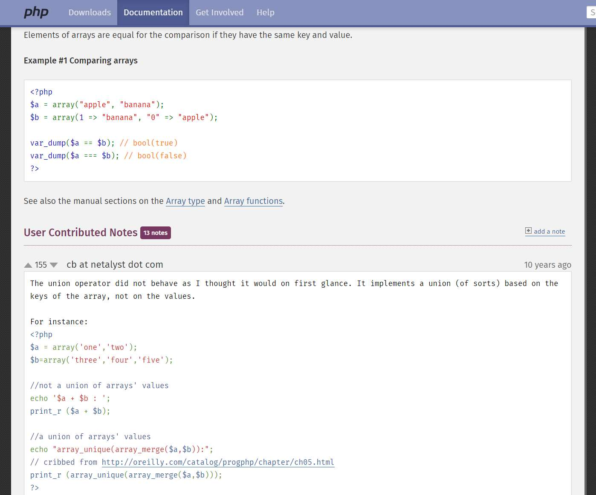
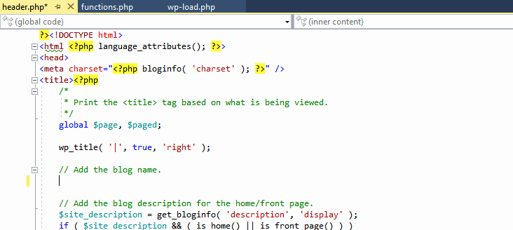
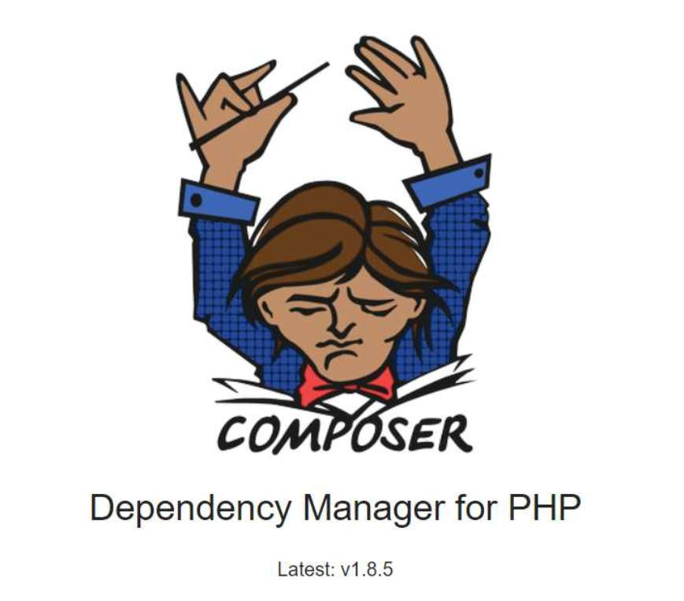
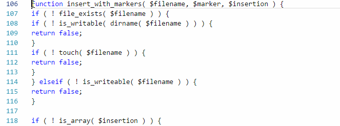
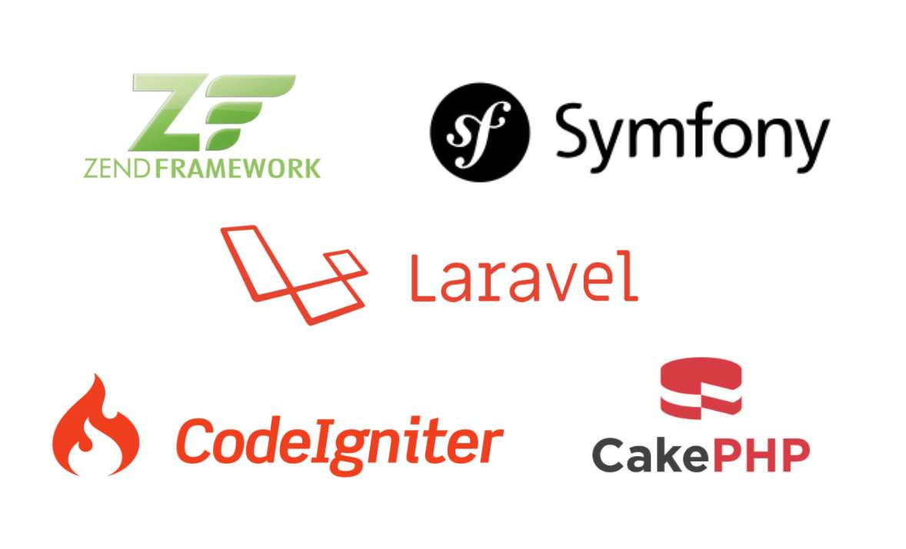

# 8 Tips a new PHP developer should know

PHP is highly popular- it has become almost impossible for all web developers not to have at least a working knowledge of PHP. This article is aimed to help those who are beginning with PHP, but are willing to make extra efforts to excel in the field.

<!-- more -->

### 1) Consult the PHP manual if you’re learning (but if you’re not, do it too!)

It might sound obvious, but there are many developers that don’t do this. For the newer developers, each PHP function is documented, most of the time with examples and contributed notes from other developers, which will make learning PHP much easier.

For more advanced developers, consulting the [PHP manual](https://www.php.net/docs.php) will help, too. Over the course of its 20-year history, PHP has evolved to become a very sophisticated language and after learning the basics, some PHP developers enter a false sense of comfort, resulting in their projects not working properly and leaving themselves vulnerable to hours of PHP debugging due to some of the nuances of the language. 

So, it doesn’t matter if you’re a beginner or an advanced PHP developer, you need to familiarize yourself with subtleties of PHP to ensure that the code you produce is functional, understandable and maintainable.

### 2) Use an IDE specialized for PHP (the correct development tools for PHP)

All developers want to be more productive, make fewer mistakes and write better code. And, of course, that all depends on the developer and their level of experience, but in many cases an [integrated development environment (IDE) for PHP](https://www.devsense.com/) can help any developer achieve those goals faster. A good IDE can save a lot of time, help you fix bugs and even teach you a thing or two.

Choosing the right IDE is not a simple task because a lot needs to be considered, but you can take a look at the [core factors](https://blog.devsense.com/en/2019/03/factors-to-consider-when-choosing-your-php-development-tool).

### 3) Download Composer

[Composer](https://getcomposer.org/doc/00-intro.md) is a tool for managing the libraries you need on your project. It will simplify the inclusion, installation and update of third-party code or projects for you. Everything will be already configured, so, you don’t have to include any files, just call them and PHP will take care of the rest.

PHP Tools installs Composer for you, but, if you don´t have PHP Tools yet, another option is shown in this tutorial to [Install and Use Composer for PHP](https://blog.devsense.com/installing-and-user-composer-for-php)

### 4) Store code snippets - keep them handy

Code snippets are small blocks of code that can be used and re-used any time you need them. They save a lot of typing time, because you just insert and adapt them to your needs.

For Microsoft Visual Studio users, you will find them available under Tools | Code Snippets Manager. You can also create and save [your own code snippets](https://docs.microsoft.com/en-us/visualstudio/ide/walkthrough-creating-a-code-snippet?view=vs-2017). If you’re a Visual Studio Code user, you can download them from the marketplace or [define your own under](https://code.visualstudio.com/docs/editor/userdefinedsnippets) File | Preferences.

### 5) Comment only complicated parts of your code

This is a controversial topic. Some developers think that commenting the code is important for future reference to know what’s going on, what does the code do and why. While some others think that the code should be self-explanatory, that you don’t need to write a lot of comments when you can just read the code and understand it.

The truth is that commenting your code is essential. Comments should describe the purpose of the code, so that future users (including yourself) can easily understand it. But keep in mind that over-commenting your code can be detrimental, redundant, “noisy” and visually harder to read by anyone – so forget about writing a comment for every line of code and start [writing clarification comments](https://blog.devsense.com/commenting-your-php-code), instead.

### 6) Add white space and format your code

Nobody likes to read a code that doesn’t have structure, it’s intertwined and very difficult to follow- the dreadful “spaghetti code”. There’s also “lasagna code”- the one that has way too many layers, for example, a lot of small classes. Or we can find “ravioli code”, structured as small packages; or even “macaroni code”, with a mixture of different computer languages. All of these code structures (or lack of) are difficult to understand, difficult to edit, tedious, and sometimes impossible to debug and maintain (You can read more about programming pasta [here](https://www.docsity.com/en/news/programming-2/programming-pasta-spaghetti-lasagna-ravioli-macaroni-code/))

So, unless you’re aiming to produce a [new esoteric programming language](https://en.wikipedia.org/wiki/Esoteric_programming_language#Examples) the ideal structure of you code should be one that is easy to read and understand by a human. Use whitespace and format your code, group lines into logical pieces, and in general, write cleaner code. Check [these tips](https://techindustan.com/ways-to-write-a-cleaner-code-become-a-better-programmer/).

You can also try an [IDE]( https://www.devsense.com/en/features#vscode) that offers the formatting feature, for it would help you to automatically format your code, making it look clean and easy to follow. 

### 7) Learn when to use frameworks

Frameworks are a skeleton that will help you build your application without having to do everything from scratch. They can be very helpful especially when the tasks at hand are repetitive and tedious. There are many frameworks available for PHP, but the most popular nowadays could be Laravel, Symfony, Zend, CakePHP and CodeIgniter. You can check this [comparison between Symfony and Laravel](https://blog.devsense.com/2019/02/symfony-vs-laravel).

Why would you use frameworks instead of writing everything from scratch? Simply because they:

* Speed up the development process. You can use and reuse code in similar projects, thus saving time and effort.
* Help reduce bad coding, which beginners may not realize it’s there.
* Offer stability and security. For new developers, this is key, because you might have an open security hole and don’t know about it. With frameworks all loose ends are tied up.
* Allow to interact with other developers in their forums or communities. Very helpful when you have questions or need help figuring something out.

Frameworks could be helpful, but you shouldn’t use them in every project. They may even slow your developing process when used incorrectly. In time, beginners will learn when it’s best to use a framework, but the basics of using a framework are:

* When you have a tight deadline. You’ll develop your project faster and simpler.
* When the tasks are repetitive and tedious. They will provide standard functionality for commonly used tasks.
* When many other developers are going to read your code. Frameworks provide good quality code and limit mistakes; thus, other developers can easily go through it and maintain it.

It’s worth mentioning that before using any type of framework, it is necessary to understand each framework’s working. Every framework has its special features, brings its own value and can be used to target certain projects. 

If you would like to keep on reading about PHP Frameworks, take a look at the [Discussion of PHP frameworks](https://www.jotform.com/blog/discussing-php-frameworks/) 

### 8) Design before you code

One of the most important things that we need to learn as a beginner in PHP, and actually for any other language, is to think before writing code. The fastest way to be more productive is to think before developing the website – to plan the solution.

Can you imagine building a house without having a plan? How would that house turn out to be? I bet it would need a hundred more reparations than a house that was built with a plan. So, planning your solution is the first step. Planning your code is actually more important than coding.

If you don’t start by designing, you’ll have to change and rewrite your code several times before you achieve your goal, that is, if you manage to achieve it. This slows down the process and delays the deliverable. 

On the other hand, if you design in advance what you want to do, you can:
* Minimize development time.
* Easily change things and predict problems before starting to work.
* Establish a timeline and distribute work, and then, keep track of progress.
* Make sure that all requirements are met.
* Actually reach your goal!

Also, you won’t:
* Need to alter code as much.
* Spend a lot of time working on the wrong solution.

Angela Zhang, Eng Manager at Plaid, believes that when planning your code, you have to “provide a big picture first, then fill in lots of details”. She proposes a specific way of [writing a good software doc](https://medium.freecodecamp.org/how-to-write-a-good-software-design-document-66fcf019569c) especially for long projects (more than a month) for designing before you code.  If you need an idea of what your design should have, you can gather ideas from her article.

To summarize, if it isn’t something that you’ve done many times before, the best way to start is to think before you code. Take you time to see the big picture, brainstorm, draw the possible solutions, think about pros and cons and then decide on most appropriate solution. 

Don’t rush out to code. Plan your solution and save headaches. 

# Related articles

[How to set up a PHP web server](https://blog.devsense.com/how-to-set-up-php-web-server)

[PHP Basics: Forms, GET and POST](https://blog.devsense.com/php-basics-forms-get-and-post)

[Creating a PHP API for logging messages calls](https://blog.devsense.com/creating-a-php-api-for-logging-messages-calls)

