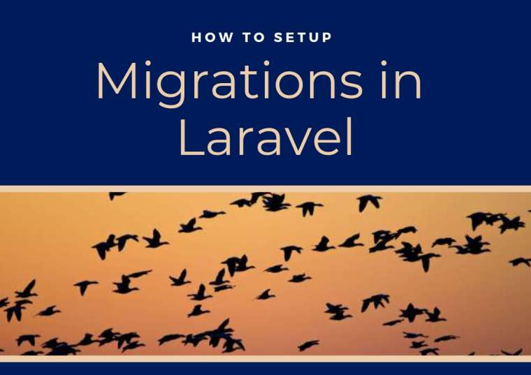

# How to setup Migrations in Laravel



Migrations work as a version control for databases. If you want to keep a record of your database creation and alterations over time, you can use migrations and simplify application re-deployment or distribution. Migrations will help you interact with your database by only using the CLI interface of [Laravel](//https://blog.devsense.com/2019/02/symfony-vs-laravel). This means that after you install your application and configure the database connection, you just have to run “php artisan migrate” and it will instantly set up the database again.

<!-- more -->

###Prerequisites

For migrations, you need to have the following installed:
-	Visual Studio Code 
-	Composer (see how to install both VS Code and Composer [here](//https://blog.devsense.com/2019/03/how-to-install-laravel-for-visual-studio-code#2-install-composer))
-	A Web Development Environment. For this article, we’re going to use [WampServer](//http://www.wampserver.com/en/) to manage databases. 
There are no particular configurations for WampServer, it will be downloaded and installed quite easily. Just follow the instructions given by the software or check [this video](//https://www.youtube.com/watch?v=yj_KWo4pNzE).

###1) Use Composer to make a Laravel application
* Run the following command: 

```
composer create-project laravel/laravel TestingMigrations
```

###2) Open your application directory in VS Code

* Open VS Code. Click **File |Open folder**. A pop up window will appear on the screen.
* Open your downloaded app (wherever you downloaded it). Your app will be loaded into VS Code. 

###3) Set the .env file. 
* Open it and change the following items there


###4) Start WampServer
* Open Wampserver


* Wait until the icon in the task bar turns green


###5) Open your browser
* Type in “localhost” in your url to open WampServer’s localhost, where your local databases will be embedded.


###6) Go to phpMyAdmin


The default user and password will be “root” and empty, respectively.


Finally, after this, you’ll be able to see your Database Management System, where you can alter your databases already present or you’ll be able to see the tables created in the Laravel application. 


#####Now we’ll make a sample database for future use:


###7) Open VS Code terminal 
* Open the VS Code terminal by pressing CTRL + Shift + `  or by clicking the Terminal option in the Menu bar and selecting the first option

*Execute the following command in the terminal: 

```
php artisan make:migration create_users_table
```


If it gives you an error, delete the old migration and make this new one.
Your new migrations will be created in the migration sub-directory of database directory of your application. It includes two functions:

Up function (responsible for making tables)
Down function (responsible for dropping tables)


###8) Add code to the migration
* Add the following code in the up and down function of the created migration


* Go the localhost and check if you can see your table.


###A few useful commands

Migrations commands along with their uses:

| Migration command | Use |
| ----------- | ----------- |
|```Php artisan make:migration```|Make migrations in your app|
|```Php artisan migrate``` |Run your migrations|
|```Php artisan migrate --force```|Force running your migrations|
|```Php artisan migrate:rollback```|Rollback migrations|
|```Php artisan migrate:rollback --step=6```|Rollback last 6 migrations|


####Additional reading
If you want to keep on reading about Migrations in Laravel, you can try:
* [Artisan and Laravel Migrations](//https://www.sitepoint.com/laravel-migrations/)
* [Database: Migrations - Laravel](//https://laravel.com/docs/5.8/migrations)


        
	                   


