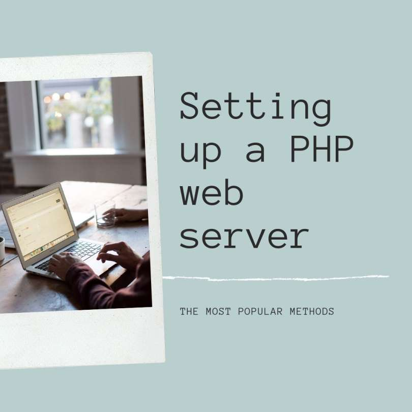
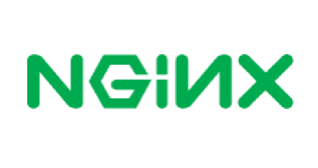
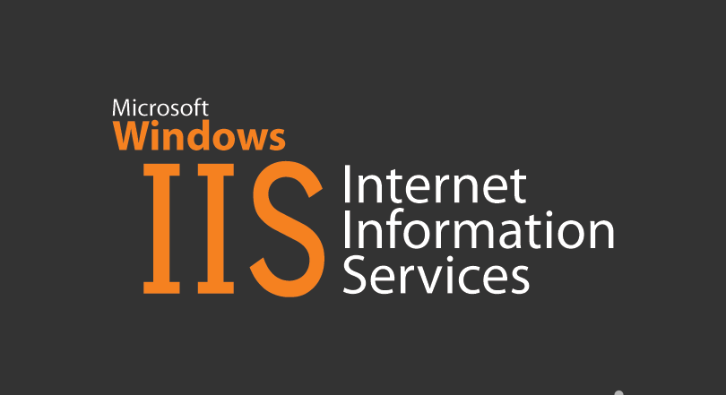
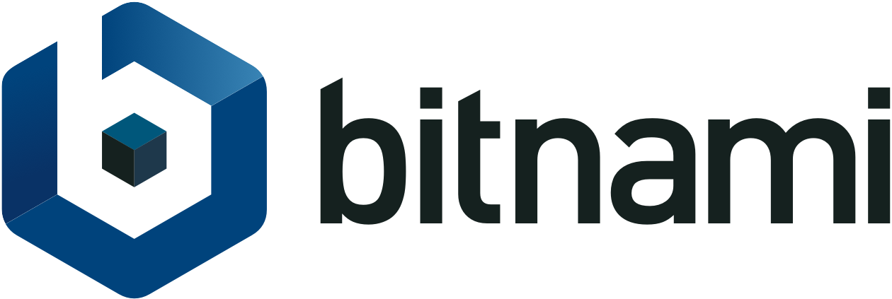

# How to set up a PHP based web server - Overview

# Overview

<!-- more -->

The great thing about PHP is how ubiquitous it is - there’s a version for nearly every operating system or flavor of Unix out there.  Even if it’s not available on that platform by default, PHP’s Open Source license allows ambitious developers to port it to their platform of choice.  

When a developer is looking to set up their own web server with PHP development environment, the following considerations should be taken into account:

* Operating System:  There are different options for installing a PHP based web server depending on what operating system is being used.  For example, users running Linux will have the option of using PHP with the web server [Apache](http://www.apache.org/) or [Nginx](http://nginx.org/), while Windows users might want to use [Microsoft IIS](https://www.iis.net/).
* Level of Control:  It’s easy to just get started with a package installer, like [Bitnami](https://bitnami.com/) or [XAMPP](https://www.apachefriends.org/index.html), which installs the most common systems (such as a web server, a version of PHP, and a database server like [MySQL](https://www.mysql.com/) or [MariaDB](https://mariadb.com)).  Other users might want more particular control, and install the various components themselves so they know exactly what version they're using.
* Components:  Just what do you need to get things done?  Maybe you’re just wanting to use PHP and don’t need data storage, so there’s no need to install a database.  Maybe your company uses Microsoft SQL Server or a “SQL-less” database like [MongoDB](https://www.mongodb.com/).  

We’ll provide detailed instructions on how to set up a web server with PHP with each of these PHP environments in other articles, but let’s start with a list of some of the different methods for installation and the most popular options.

# Common PHP Stacks

PHP is rarely installed in isolation from other components.  It’s like a good team - you need a group of people who are good at their particular skill set.  Over time people have gravitated to their particular favorites when it comes to how to set up a web server, how to develop interactive programs, how to store data and other needs.  

PHP is typically run as part of a “stack” - a “stack” refers to the environment that provides HTTP, database, PHP, and related components as one complete package.  Most stacks are composed of:

* The operating system
* The web server
* The database server
* The scripting language (in this case, PHP)

These days, most of the development tools can work on whatever desktop operating system of choice.  Visual Studio Code runs the same whether you’re on Mac, Windows or your favorite flavor of Linux, and extensions like PHP Tools run on all of them.  Visual Studio has versions for platforms other than Windows, though the Windows version is still the most robust.  This leaves the question as to what PHP based stack up to the needs of the business and the individual developer.

## LAMP and WAMP and MAMP - Oh My!

The most common way of using PHP is with a web server and a database server.  By far, the most common environment is running PHP with the Apache web server and the MySQL (or the Open Source community variant, MariaDB).  

Apache and MySQL/MariaDB are popular for a few simple reasons:

* Cost:  Both are “free as in cost”, maintained by communities or organizations with a financial incentive to keeping these systems updated and improved.
* Open:  Both are “free as in information”, which means that any user can download not just the programs, but can see the source code of how they were built to make custom improvements of their own.

The difference between the various ?AMP environments comes down to the operating systems.

### LAMP (Linux Based) 

The most popular of the ?AMP varieties is LAMP.  While the L stands for Linux, it can also stand in for nearly any Unix based or Unix like operating system.  These operating systems comprise over 65% of all operating systems used by servers on the Internet, according to reports from [W3Techs](https://w3techs.com/technologies/overview/operating_system/all).

The popularity of LAMP is based on the same features that makes Apache and MySQL popular:  free as in cost, and free as in information. The Linux based systems are also incredibly versatile - users can run it from a minimal system such as a Raspberry PI all the way to a cluster of servers with liquid cooled processor cores stored in the volcano lair of a supervillain.

The one downside to this system is the sheer possibilities.  Are you going to use [Ubuntu](https://www.ubuntu.com/) or [Red Hat](https://www.redhat.com)?  What if you want to go with a BSD based solution like [FreeBSD](https://www.freebsd.org/) server or, because security is such a big deal, perhaps the team will go with [OpenBSD](https://www.openbsd.org/)?

Picking a different flavor of Linux or Unix can result in minor differences in how the LAMP is installed and maintained.  The good news is that once the LAMP environment is set up, the environment won’t change much, even if the PHP developers constantly change the code.

### WAMP (Windows Based)

WAMP does not mean WIMP - running Apache, MySQL and PHP is just as valid under Microsoft Windows as any other platform.  Of course, running under Windows has different issues than under a Unix-like system.  Differences in paths and how permissions are handled are the main concerns, but running WAMP either by installing the components individually or with a package installer makes it easy for Windows developers to use the same PHP code as they'd use in the production systems - with some modifications.

### MAMP (Apple Macintosh Based)

Few would argue that Macintosh servers make up even a significant fraction of Internet servers, but their popularity as desktop systems and development environments can not be denied.  When you see Macs being used at Microsoft conferences to show off the latest development library updates, you know there’s something going on.

Modern Mac systems run OS X.  With its very Unix-like underpinning, it’s a popular choice with developers.  They get the UNIX commands and interfaces like they will likely use on the server, with a friendly desktop environment.  The paths are the same as other Unix systems, and using [Homebrew](https://brew.sh/) - a package installer similar to apt - makes setting up a MAMP very simple.

Developers who set up a MAMP as their development environment can develop, test on their local system, then transfer to their production system with a minimal amount of configuration changes - while still working within a desktop environment that’s more user friendly than many Linux environments.

>**NOTE:**  The author is aware that by saying that Linux environments are not as user friendly desktop experiences, he runs the risk of Linux users brigading his house with signs demonstrating how wonderful Linux desktop environments are.  As John Lennon once sang - “Whatever gets you through the night, it's alright, it's alright.”

## Nginx Environments

While Apache is one of the most popular web servers, nginx is web HTTP and proxy server that is very lightweight compared to the other platforms mentioned here, and can be used to serve PHP through a CGI interface.

OK - that might have been a lot of complex stuff.  The point is - if you want to run PHP but don’t want to go through the entire process of dealing with Apache and the extensions, running an environment with nginx and PHP through [PHP-FPM](https://php-fpm.org/) (FastCGI Process Manager) is a popular alternative.

## IIS Windows Based

If you’re already running a Windows server, rather than using Apache Apache, users can run [Microsoft’s Internet Information Server](https://www.iis.net/) that contains all of the Microsoft based authentication and authorization connections.  There’s also a version that can be installed on Windows 10 as a component.  Just install a plugin for PHP, and you’re off to the races.  

Rather than a MySQL/MariaDB database solution, a Windows setup may default to a Microsoft SQL Server or their free version [SQL Server Express](https://www.microsoft.com/en-us/sql-server/sql-server-editions-express) as the database, which offers Active Directory security support.  PHP can connect to Active Directory through LDAP, so an IT shop based on Windows can leverage their PHP expertise while still having their Microsoft based system integrations.

Like running a LAMP or MAMP on a desktop environment, running IIS on both the development and server system makes it easier for Windows based developers to install, test, and deploy on similar environments.  Microsoft’s support for languages like PHP has become incredibly robust, so users working in Visual Studio or Visual Studio Code can use extensions like PHP Tools, and connect natively to Microsoft based services like Azure.

# Package Solutions

The various PHP serving solutions based on web servers such as Apache or IIS can have each component installed separately.  This is usually best for environments that rely on a specific version of their web server, database, or PHP.  But this can also make it more difficult to track when updates are needed, or remember various command line scripts to start and stop each system compared to a simple GUI interface.

Package solutions put the entire system into one easy-to-maintain system.  Instead of installing Apache, then MariaDB, then PHP one after the other, a package solution allows a user to run one installer, start/stop the system from one simple command, and use convenient interfaces to update configurations.

## XAMPP

[XAMPP](https://www.apachefriends.org/index.html) sounds like one of the MP3 music players from the 1990’s - the kind with 50 different kinds of psychedelic visual effects, but it stands for Apache + MariaDB + PHP + Perl.  XAMPP is made to be a cross platform development environment for Windows, Mac and Linux, so you can install it from one command, and control it through the XAMPP Control Panel.  No more command line typing away - start and stop with just a click of the button!  Click and configure!  Live life away from the command line!

>**Note:** The author recognizes that some people *like* working from the command line (including himself!), and that mentioning life away from the command line may cause breakouts of pitchforks and torches.  The author completely supports your life choices.  Want to edit text files from vi?  Go for it.  Prefer to use Visual Studio Code with PHP Tools so you can point and click to happiness?  Knock yourself out.  You do you.

## Bitnami

XAMPP is made to be cross platform, so it runs the same on Mac as it does on Windows as it does on Linux. [Stacks provided by Bitnami](https://bitnami.com/stacks/infrastructure) are a package solution that provides not just ?AMP stacks for Mac, Windows or Linux, but with a simple install users can download as one package a ?APP (operating system with Apache, Postgre SQL, PHP), or other options.

For Bitnami, it’s about making it easy to set up and manage those separate pieces through their installation platforms.  Just click, and it’s running.  

# Scratching the Surface

We only listed just a few of the most popular methods of setting up a web server powered by PHP.  Future articles we’ll explore how to set up stacks in different ways, from direct installations to running them in container based systems.  If you’re ready to get developing with PHP, it’s easier than ever to get started from easy to install platforms, friendly development systems like PHP tools, and user centric tutorials to get you going.

You know.  Like this one.
<!--stackedit_data:
eyJoaXN0b3J5IjpbMTA1MDM4Mjk2LDEwNTAzODI5Nl19
-->

# Related Articles

[How to install Xdebug for PHP Tools for Visual Studio Code on Mac OS](https://blog.devsense.com/2019/03/how-to-install-xdebug-for-phptools-for-vscode-on-mac)

[How to setup Windows Subsystem for Linux for a PHP Development on Visual Studio](https://blog.devsense.com/2018/04/wsl)

