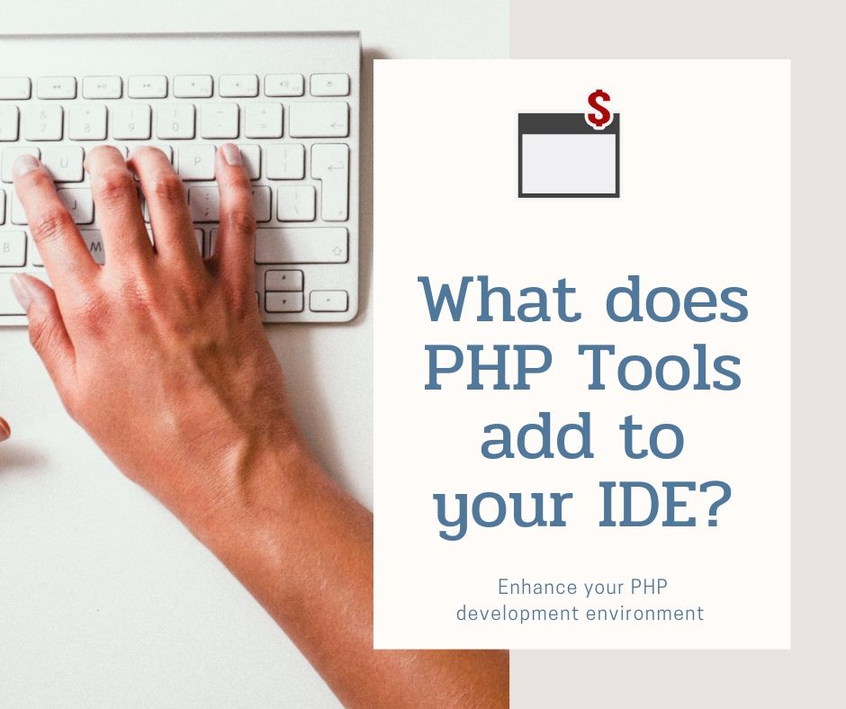
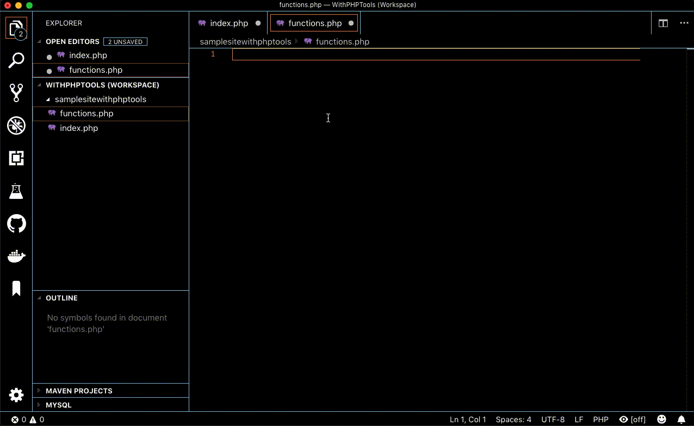
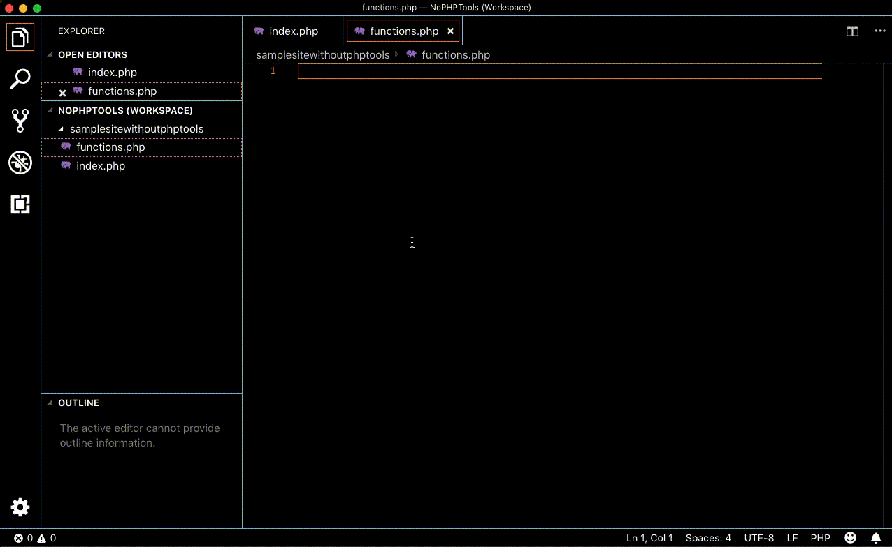
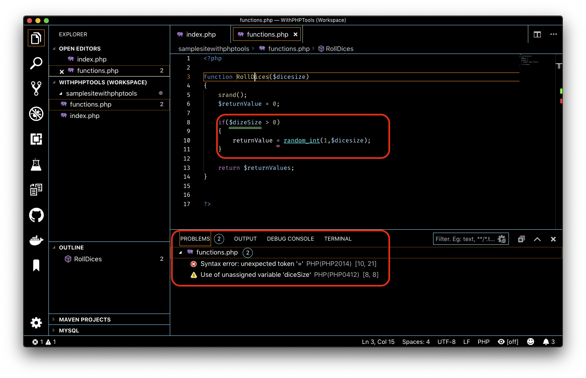
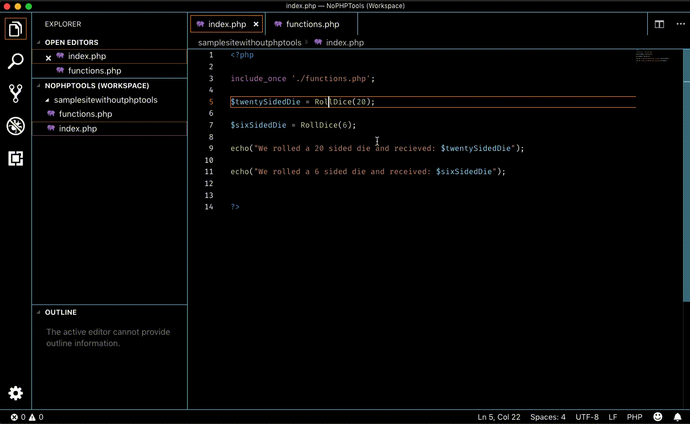
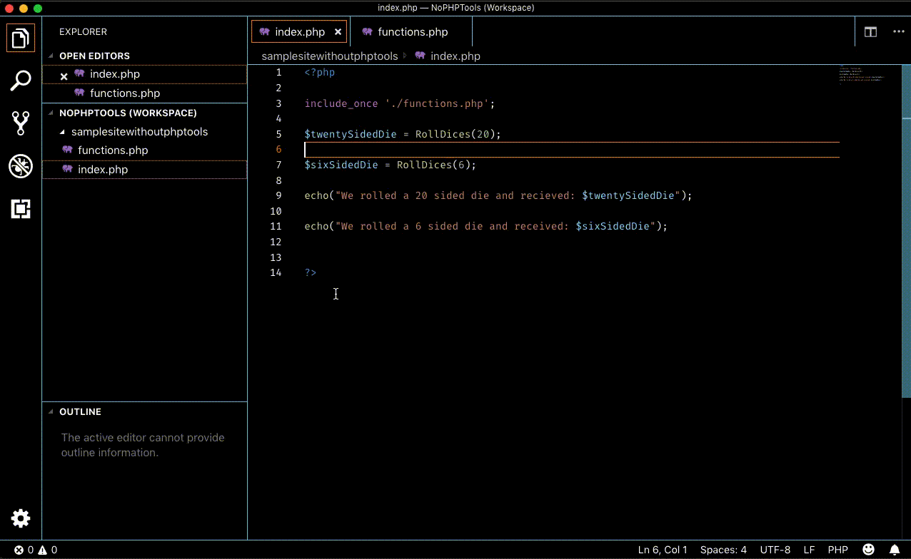
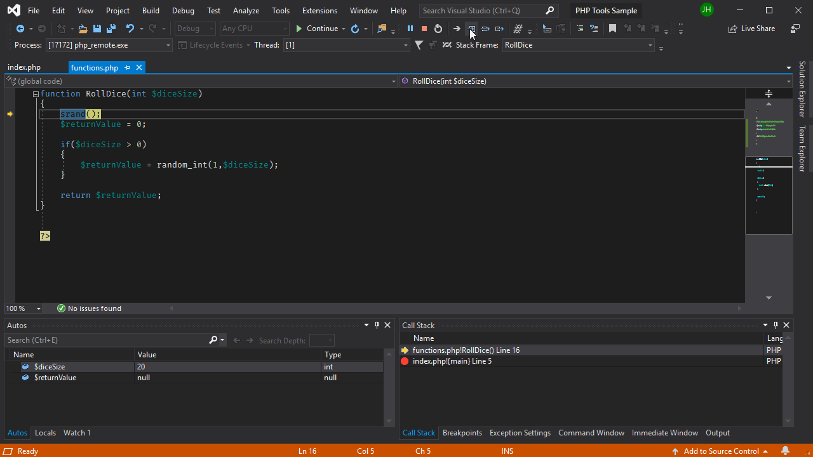
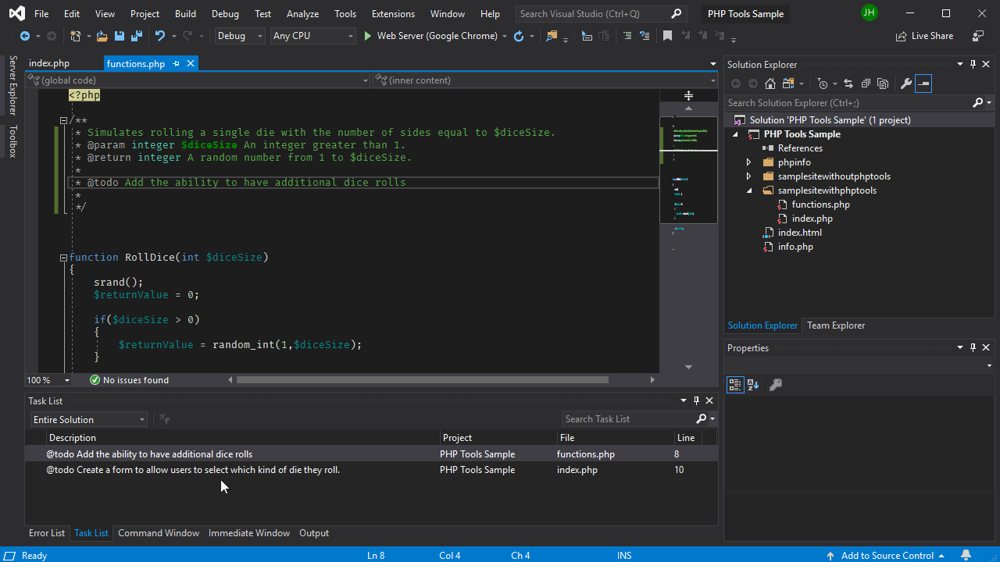
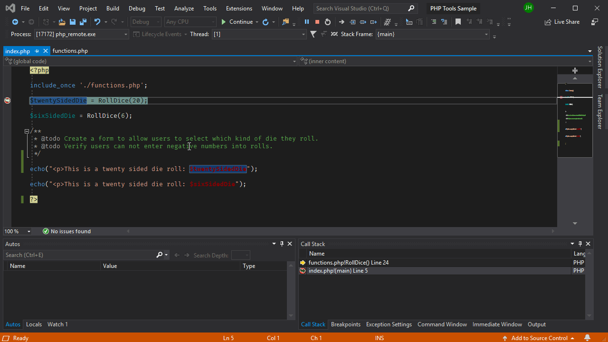

# What does PHP Tools add to your IDE?



# Overview

<!-- more -->

Developers have moved on from the early days when all of their coding was done through vi terminals with just basic text editors.  PHP Tools saves developers time and increases accuracy, which makes for better programs.

PHP Tools can be integrated both into both [Microsoft Visual Studio Code and Microsoft Visual Studio](https://blog.devsense.com/php-tools-at-a-glance), but what does a development environment look like with PHP Tools installed versus the vanilla development studios?

# Visual Studio Code

PHP Tools makes developing on PHP even faster.  We’ll be testing out Visual Studio Code running on OS X Mojave with PHP 7.2 installed, with Xdebug installed as well.

What we want to do is show how a development is like on a vanilla Visual Studio Code setup, versus one that has PHP Tools installed for some of the major developer enhancements:

* Code Completion
* Code Definition/Peek/References
* Code Refactor
* Debugging

>Note: PHP Tools extends [Visual Studio Code](https://marketplace.visualstudio.com/items?itemName=DEVSENSE.phptools-vscode) with many more features than the above mentioned.

## Code Completion

Code completion is the first tool most developers use to quickly add in standard built-in functions into their software. From the moment a user starts entering in text, PHP Tools can match it against standard PHP functions, show the required parameters, and a quick definition of what the function does.  For example, typing in `random_int` displays:


Here’s what it looks like on a side by side comparison between using PHP Tools to make a simple script with two files:
* `functions.php` - contains the functions used by the entire script.
* `index.php` - the starting program

##### With PHP Tools 



##### Without PHP Tools 




In the second example, notice that the developer has to move back and forth between the code editor, back to a browser to look up the functions they’ll be using.  Code completion that includes these PHP functions saves developers time looking up what code to use, and gets them into just using it.

## Code Help

Those who looked closely may have noticed coding errors within the program.  Here’s how it looks in vanilla Visual Studio Code:

```php
function RollDice($diceSize)
{
	srand();

	$returnValue = 0;

	if($dizesize > 0)
	{
    		returnValue = random_int(1, $diceSize);
	}

	return $returnValue;
}
```

Notice that `$dizeSize` has two different capitalizations?  Standard Visual Studio code didn’t notice that, but PHP Tools did, and informs us that `$returnValue` isn’t properly formatted:



As you may know, problems in a program are cheapest and easiest to solve when they’re found in the code before it’s deployed.  

## Code Definition/Peek/References

When programs span multiple files or contain a lot of code, the ability to peek a function can save a lot of time rather than jumping back and forth between different files or windows.  With PHP Tools, right click on a function call or class method, and take a look at what the standard or custom function does.

This time we’ll swap back and forth between two different Visual Code views - one with PHP Tools enabled, the other without and show how to:

**Peek**: Show without the current display the function being used
**Go To Definition**:  Head directly to the function call to make edits or see how it works
**Find All References**:  See how any place the function, variable, or similar is used anywhere in the program.




Without this ability, tracking down where code is being used would rely on Visual Studio Code’s search multiple files feature, which can work but lacks the elegance of finding by reference.

## Code Refactor

Code Refactor replaces a variable or function name everywhere it is used through the program.  This goes beyond just search and replace - this process automatically looks through included files to update them when a name change is necessary.  If you’ve ever had a developer who misspelled a variable, Code Refactor can get it correct faster:

##### With PHP Tools 


##### Without PHP Tools 




## Debugging

Every developer reaches a point when they’ve cleared out all of the syntax or naming errors in their code, and it’s all just to logic problems. For those who have the XDebug module installed on their development system, PHP Tools lets them step through their programs to find where the code stops working.  

To save developers time, rather than bouncing back and forth between a browser, PHP Tools can show the results directly within Visual Studio Code.

Since this isn’t built into native Visual Studio Code, we’ll just show how it works here.  First, we’ll mark where to start debugging, then step through the code to show the results:




# Visual Studio 2019

The abilities provided by PHP Tools are available in the version for  Visual Studio (PHP Tools for Visual Studio) - but as the old commercial once said, “But wait, there’s more”!  Some of the additional functions in the Visual Studio version include:

* PHPDoc Support
* Task List
* Advanced Debugging

>Note: PHP Tools extends [Visual Studio](https://marketplace.visualstudio.com/items?itemName=DEVSENSE.PHPToolsforVisualStudio2019) with many more features than the above mentioned.


## PHPDoc Support

If there’s anything that developers don’t like to do, it’s document their code. Though they really should.

No, really - [document your code](https://blog.devsense.com/commenting-your-php-code). Please.

PHP Tools helps make that easier with PHPDocumentor compatible comments.  It’s so simple, it’s almost laughable:  Start a line before the function or class with `/**` and hit enter.  That’s it.  Fill in the rest of the details from there like a good programmer should:


Even if you don’t provide additional descriptions, this ability lets you quickly generated your PHPDocumentor based documentation directly from the code.

This also carried into other areas.  In our example above, we added commentary to the function RollDice.  Now any other file that includes that function automatically displays that definition when we hover the mouse over it:


## Task List

Ever been working away within a project, and think “I need to remember to do that later.”  Then when later comes - you totally forgot.

Keep track of them with PHPDoc compatible `@todo` commands.  Simple enough: within a PHPDoc compatible block, enter in what needs to be done.  Then the Task List will display what was listed to be done, and take you exactly where it was set:



## Advanced Debugging

We showed how to do debugging with Visual Studio Code - but what about doing it in Visual Studio itself?  Here’s some of the advanced features provided for debugging in PHP Tools:




### Call Stack

Debugging is much easier when you see now just where the break point is, but also where you get to.  This is where the Call Stack comes into play - not only you do see where the break point is, but how do you get there?  It displays the entry point into the exception, and the current line of code that’s being executed from that point.  This can relieve a lot of headaches when you’re trying to track down just where things went wrong in your code and how you got there.

### The Stack

Don’t just see what’s in the stack - interact with it.  Add in whatever values you want to verify proper values, or test out improper ones.  You’ll be able to see the results immediately.

This only scratches the surface of how PHP Tools can enhance your PHP development environment.  Other tools include multi-user debugging, Smarty and Twig support, enhancements for Laravel - take a look at the [PHP Tools documentation page](https://docs.devsense.com/en/vs) to find out more abilities, and [install it for a free trial](https://www.devsense.com/en/download).

## Related articles

[PHP Tools at a glance](https://blog.devsense.com/php-tools-at-a-glance)

[6 core factors to consider when choosing a PHP developing tool](https://blog.devsense.com/2019/03/factors-to-consider-when-choosing-your-php-development-tool)

[How to install PHP Tools for VS Code on Windows](https://blog.devsense.com/2019/03/how-to-install-phptools-for-vscode-on-windows)


