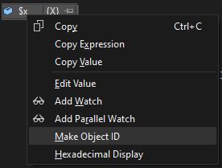
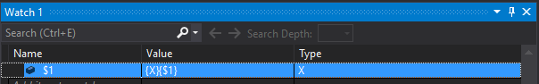
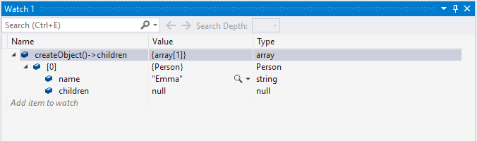
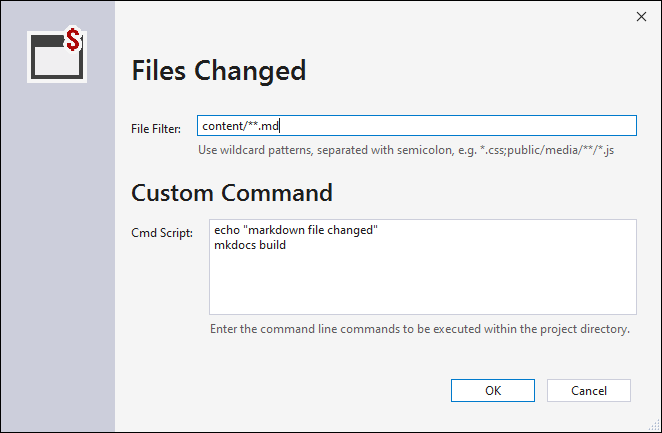
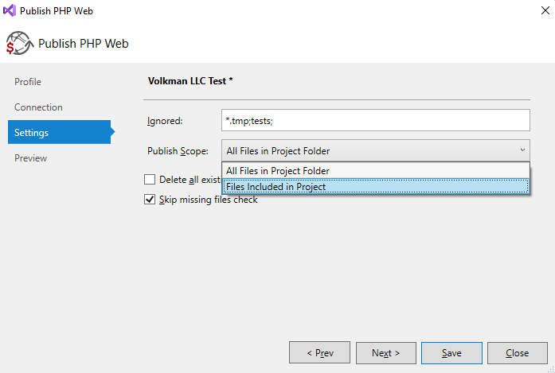
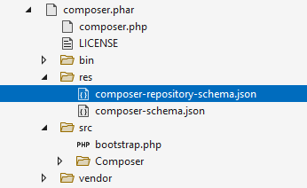
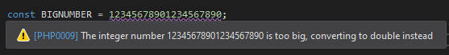

/*
Title: October 2021 (1.57)
Tags: release notes,visual studio
Date: 2021-10-09
*/

# October 2021 (version 1.57)

**Downloads:** https://www.devsense.com/download 
**Purchase:** https://www.devsense.com/purchase

Welcome to the PHP Tools for Visual Studio update. Check out what's new and what has been updated.

## Debugger

This update improves existing debugger functionaity, and adds new features.

### Make Object ID

The new debugger feature alows to **pin** an object from Watch Window or Quick Watch using `Make Object ID` context menu command. The pinned object can be tracked during the whole request execution.

Pinning an object creates a weak reference which can be always revealed in **Locals** window or in **Watch** window using **`$1`** alias (or `$2`, `$3`, ... correspondingly). Pinned objects are also marked in quick watches by its {$-index} alias. This works even within arrays and inside other objects.

### Complex Expressions

Newly the Watch and the Immediate window allow to expand complex expressions, including results of function calls, magic properties, and complex combination with operators.

Also, array values as a result of such complex expressions can be now expanded and listed through all its entries. It is not limited to 32 entries anymore.

## Editor

IntelliSense tool-tips and error tool-tips are now shown even during debugging. Previously, tool-tips were only displayed when Visual Studio was in design mode (not debug mode).

## Project Events

An important part of the project work flow is automatization. With the new update, there are customizable [`Project Events`](https://docs.devsense.com/en/vs/project/project-events) allowing to trigger commands upon certain events. Open the `Project Events` in Project Properties:

Creating or editing events looks like the following dialog.

Initially, there are the following triggers:

- `Project Opened` gets triggered when a project is opened in Visual Studio.
- `Before Publish` is called before publish (i.e. upload pending changes) gets started.
- `After Publish` gets called after the publish.
- `After Clean` is triggered by Project / Clean command.
- `Files Changed` happens when a file is modified both inside or outside Visual Studio.
- `File Saved` is caused by saving a file inside Visual Studio.

And the following actions to choose from:

- `Publish` uploads pending changes using selected remote profile. In case of `File Saved`, only that file is uploaded.
- `Custom Command` allows to enter a custom cmd commands. The commands have `php.exe` (which is chosen in `Application` project property page) in its %PATH% environmental variable.

## Remote Explorer

Publish and the whole Remote Explorer is more configurable now. Open the [Remote Explorer](https://docs.devsense.com/en/vs/project/remote-explorer) and follow the `Manage` button.

It is now possible to specify wildcard file mask to simply ignore files or folders from being tracked by the Remote Explorer. Folders or files matching the *Ignored* wildcards won't be shown and won't be uploaded to the remote servers.

Secondly, there is an option to choose `Publish Scope`; whether to track the whole project directory (`All Files in Project Folder`) or to track files included in the project, i.e. the files shown in the project in Solution Explorer (`Files Included in Project`).

Finally, the Remote Explorer respects the legacy setting - **`Publishable`** - which could be set in project items properties. File items annotated with this project property are ignored by the Remote Explorer. This feature requires you to set the `Publish Scope` to `Files Included in Project`.

## Automatic Publish

We have made improvements when configuring automatic uploads to the remote server. It is more configurable, using the new **Project Events**, and the option is more accessible.

Open the [Remote Explorer](https://docs.devsense.com/en/vs/project/remote-explorer) and change the `Auto` setting.  Clicking `Manage Project Events` opens all the project events, where additional settings can be changed.

## Visual Studio 2022

### Phar Browser with Icons

Expanding `.phar` files in Solution Explorer reveals corresponding file icons as well now. See the screenshot below:

## Fixes

- Rename refactoring correctly replaces class names within `extends` and `implements`.
- Fixed opening project properties on VS 2022.
- Fixed `Remote Explorer` to correctly create directories on SFTP server.
- Fixed `Remote Explorer` to be working with **Open Folder** feature.
- Fixes some errors locations, e.g. the warning about overflowing an integer number into floating-point number.
  
  
