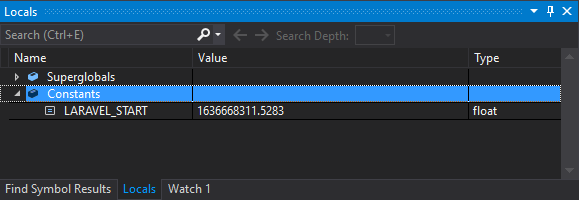

/*
Title: November 2021 (1.58)
Tags: release notes,visual studio
Date: 2021-11-11
*/

# November 2021 (version 1.58)

**Downloads:** https://www.devsense.com/download 
**Purchase:** https://www.devsense.com/purchase

This is a maintenance release improving current features, and fixing stability and performance issues. Thank you all for your feedback!

## Improvements

- Debugger shows more specific icon glyphs in Watch window for class statics container and constants.
- Debugger does not allow to make object ID of pseudo variables (class statics container)
- Debugger shows user constants in Watch window.
  
- When creating CakePHP project from composer, `/webroot` is automatically set as project root folder.
- Wizard for new project from composer prefetches `cakephp/app` package information for quick create.

## Fixes

- Visual Studio 2022: adds back PHP project and file icons in Solution Explorer.
- Fixes rare Visual Studio freeze during project load.
- Performance fixes during project load, avoids making Visual Studio unresponsive for a period of time.
- Fixes Visual Studio unresponsiveness when Remote Explorer is opened and the remote profile set to `Files Included in Project`.
- Fixes "PHP Console Project" new project template. Now it contains the default `index.php` file.
- General optimizations.
