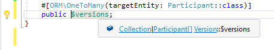

/*
Title: March 2022 (1.62)
Tags: release notes,visual studio
Date: 2022-03-01
*/

# March 2022 (version 1.62)

**Downloads:** https://www.devsense.com/download 
**Purchase:** https://www.devsense.com/purchase

The March 2022 update of PHP Tools for Visual Studio, version **1.62**, improves the current features and stability.

## New Features

- auto-importing alias and adding "use" code action inserts the newly inserted alias sorted in
- workspaces opened as "Open Folder" have several debug configurations (listen, builtin server, debug current script)
- debug launch of workspace opened as "Open Folder" is configurable

## Fixes

- stability fix for too large solutions (`StackOverflowException`)
- some PHAR files were not visible in IntelliSense, fixed
- fixes smart indentation after PHP 8 attributes `#[]`
- debugger stability fixes
- debugger shows stack traces of unhandled exceptions
- IntelliSense respects PHPDoc that are followed with PHP 8 attributes

## Improvements

- more details in the built-in PHP manual
- updated built-in PHP manual
- updated translations of the built-in PHP manual
- generated PHPDoc for properties respect its type hint
- IntelliSense respects ORM notation
- IntelliSense and code analysis combines PHPDoc types and type-hint information
- more detailed IntelliSense for deprecated functions and classes
- IntelliSense and tool-tips show the correct version of `implode` function

IntelliSense has been greatly improved and the integrated multilanguage manual updated. The code analysis now takes ORM attributes into account, and type information from PHPDoc is combined with the type hints. This improves the overall code completions and code analysis.
