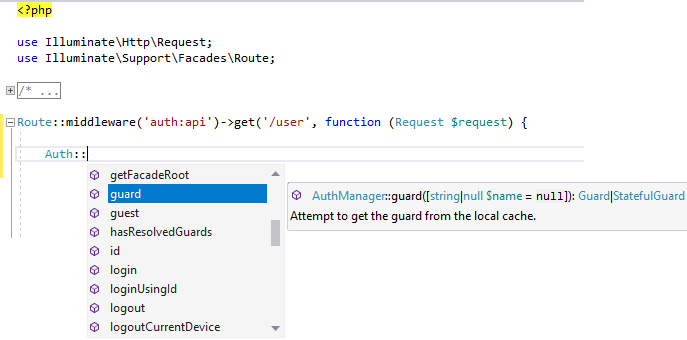

/*
Title: March 2022 (1.62)
Tags: release notes,visual studio
Date: 2022-03-01
*/

# March 2022 (version 1.62)

**Downloads:** https://www.devsense.com/download<br/>
**Purchase:** https://www.devsense.com/purchase

Welcome to the March 2022 release of PHP Tools for Visual Studio.

## Editor

### Adding `use` Code Action

The editor inserts `use` statements for you; either from a code action over a class name, or when completing a class that is not imported in the current file yet.

Newly, whenever the new `use` is inserted, the editor inserts it within the existing `use` statements in order, sorted alphabetically.

### Laravel Facades

Laravel framework is known for it's use features like _Service Containers_, use of class aliases, and _Facades_. This allows for seamless dependency injection and basically shorter code you have to write.

```php
// Cache is a facade to the 'cache' service ...
return Cache::get('key');
```

Newly, the editor is recognizing built-in and your custom facades, it recognizes the facade accessor service, it recognizes defined services as well. Also, the editor scans the workspace for laravel class aliases defined in `config/app.php` file.



Here, the editor knows that the class `\Auth` is actually an alias to a class `\Illuminate\Support\Facades\Auth`, which is a facade to a service `auth`, which is an instance of class `AuthManager` .. in the result, it is able to provide code completion and full IntelliSense here.

## Workspace

- workspaces opened as "Open Folder" have several debug configurations (listen, builtin server, debug current script)
- debug launch of workspace opened as "Open Folder" is configurable

## Fixes

- stability fix for too large solutions (`StackOverflowException`)
- some PHAR files were not visible in IntelliSense, fixed
- fixes smart indentation after PHP 8 attributes `#[]`
- debugger stability fixes
- debugger shows stack traces of unhandled exceptions
- IntelliSense respects PHPDoc that are followed with PHP 8 attributes

## Improvements

- more details in the built-in PHP manual
- updated built-in PHP manual
- updated translations of the built-in PHP manual
- generated PHPDoc for properties respect its type hint
- IntelliSense respects ORM notation
- IntelliSense and code analysis combines PHPDoc types and type-hint information
- more detailed IntelliSense for deprecated functions and classes
- IntelliSense and tool-tips show the correct version of `implode` function


IntelliSense has been greatly improved and the integrated multilanguage manual updated. The code analysis now takes ORM attributes into account, and type information from PHPDoc is combined with the type hints. This improves the overall code completions and code analysis.
