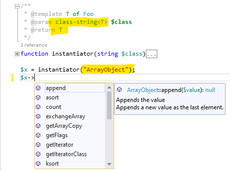
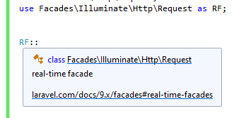

/*
Title: June 2022 (1.66)
Tags: release notes,visual studio,codelens,IntelliSense,PHP
Date: 2022-06-06
*/

# June 2022 (version 1.66)

**Downloads:** https://www.devsense.com/download<br/>
**Purchase:** https://www.devsense.com/purchase

Welcome to the June 2022 release of PHP Tools for Visual Studio!

## Code Lens

The release `1.66` introduces **Code Lenses** for PHP code. This neat feature, best known from C# in Visual Studio and from Visual Studio Code, helps with navigating through definitions and references.

Code Lenses are displayed above each function, class, interface, trait, enum, and properties. This little adornment is seamlessly showing number of references and implementations. For overriden methods, it's also providing a quick link to the parent definition (displayed as `prototype`).


The image above displays code lenses for a PHP class and PHP methods.

> The feature can be enabled or disabled in `Tools` / `Options`, under `Text Editor` / `All Languages` / `CodeLens`, the option `Enable CodeLens`. It is available in Visual Studio 2019, Visual Studio 2022, and further.

## Generic `class-string<T>`

There is a special syntax used in Documentary Comments to annotate a variable, which value should be a name of a class. It's usually used by code linters like PHPStan or Psalm.

PHPTools now use this annotation in combination with the [support for generics](https://blog.devsense.com/2022/update-php-generics). Parameters annotated with `class-string<T>`, where `T` is a template arguments, allows the editor to infer the type of `T` when possible.

Consider the following code:

```php
/**
 * @template T of Foo
 * @param class-string<T> $class
 * @return T
 */
function instantiator(string $class) { ... }
```

Now, whenever the editor know the value of `$class`, it can infer the type `T`, and thus recognize the type of `instantiator` return value. This helps user with IntelliSense, code completion, and further code analysis.



The screenshot above shows the use `instantiator()` function.

## Laravel Real-Time Facades

The editor recognizes [real-time facades](https://laravel.com/docs/9.x/facades#real-time-facades), and provides code analysis, code completion, and overall IntelliSense for them. Each class name which is prefixed with `Facades\` is treated as a real-time facade (in case there are Laravel Facades included in the project).



With the support of real-time facades, user is getting code completion as on the picture below, including all the code checks.


## Eloquent Local Scopes

We have added an initial support for [Eloquent's Local Scopes](https://laravel.com/docs/9.x/eloquent#local-scopes), i.e. functions prefixed with `scope` in the Eloquent Model. Those functions show up in the IntelliSense without the prefix as both static and non-static with its scoped arguments.


The editor scans for the local scopes (the functions prefixed with `scope` on a class that implements `Illuminate\Database\Eloquent\Model` or on a trait that is used within a `Model` class); such functions are displayed in the IntelliSense and also recognized by the code analysis.

> The feature is in-progress. We're still working on it. Although we hope even this will help with coding.

## Debug Notices and Warnings

PHP notices and warnings sometimes slide unnoticed. They are now displayed in the Debug Output Pane.


## Fixes

- Fixes crashing Visual Studio 2022 when saing a file in a *Folder* project.
- Visual Studio startup; avoids blocking UI when Visual Studio is loading, and avoids showing of the yellow notification bar.
- Installer ensures there is .NET SDK installed; otherwise PHP projects won't work properly.
- PHP 8.1 constants dereferencing `->` supported, and not reported as syntax error anymore.
- Completion after `->` with `new` in the expression chain.
- Fixes issue when debug inlines may cause debugging to sporadically start.
- Fixes highlighting of unused `use` when it is actually used in an Doc Comment which is not associated with anything.
- Fixes debugging when the product license is not activated.
- Fixes UI of the Project Issues window on Visual Studio's 2022 *dark* theme.
- Fixes internal error causing IntelliSense to show nonsense.
- Fixes Test Explorer discovery for tests annotated with `@test` Doc Comment.
- Fixes *Go To Definition* (`F12`) on PHP manual symbols.

## See Also

- [Release `1.65` with Generic Types](https://www.devsense.com/en/updates/vs/v1-64#generic-types)
- [Generic Types Support](https://blog.devsense.com/2022/update-php-generics)
