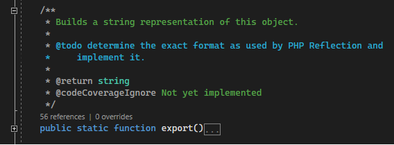
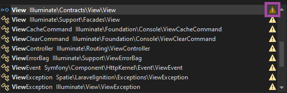
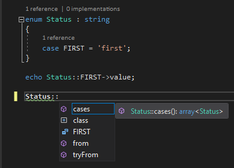
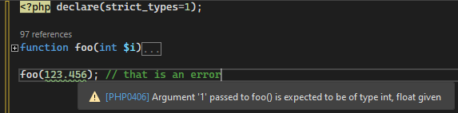
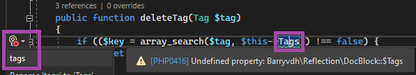
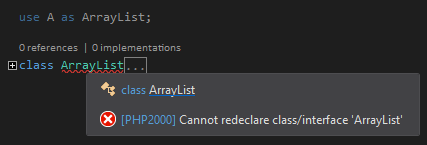
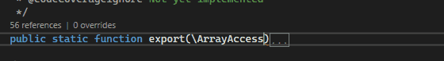

/*
Title: August 2022 (1.67)
Tags: release notes,visual studio,codelens,IntelliSense,PHP
Date: 2022-08-06
*/

# August 2022 (version 1.67)

**Downloads:** https://www.devsense.com/download 
**Purchase:** https://www.devsense.com/purchase

Welcome to the August 2022 release of PHP Tools for Visual Studio!

## To-Do on Dark Theme

This release improves and updates color scheme of to-do comments on Dark Theme. It makes the the caret navigation more readable.

In case you missed it, PHP Tools in Visual Studio highlights to-do comments in your code. You can also always access the list of all the to-do's in the _Task List_ pane (in `View` / `Task List`).

## IntelliSense Enhancements

Code Completion has several neat new features and improvements to make the daily tasks easier.

- More precise `static` type resolve, especially when defined in `trait`.
- **Variadic parameters** are handled correctly. We have also added code analysis and type checks for variadic parameters.
- **Tooltips** shows cleaner information. There are fixes in the case of trait aliased methods.
- Overall improvements in **type analysis**.
- Not reporting correctly used `$this` in template files.
- Improves resolving of corresponding `__construct`.
- **Auto-import** `use` respects the already existing alias with the same name.

> _Auto-Importing of a namespace avoids creating conflict names in `use` and current `class`_

### PHP 8.1 `enum`

PHP 8.1 `enum`s are now correctly handled. It is not a well known feature, that there are implicit members always defined on an `enum` type and its cases. IntelliSense shows the implicit `enum` members in the list, and type analysis respects the implicit `enum` members types.

## Code Diagnostics

### Strict Types Checking

Newly, the code diagnostic respects the `strict_types` directive. Whenever there is `declare(strict_types=1);` code at the top of source file, implicit numeric conversions are treated strictly. Any conversion that would reduce the value precision is reported as a warning.

### Unknown Property Diagnostic and Code Fix (`PHP0416`)

The code diagnostic for unknown properties has been introduced. In case there is no magic `__get()` method, and it is not a `stdClass`, the unknown property is reported in the editor, and the error list. Eventually a quick code action is provided, allowing to quickly insert the correct property name, if it can be inferred at the moment.

The quick code action fixes common typos and fixes letter casing.

### Namespace Declaration Correctness (`PHP2432`)

We have added a code diagnostic that validates use of `namespace` and other statements in the global code. Also it checks the user is not mixing short and long `namespace` syntaxes.

### Class Name Correctness (`PHP2000`)

There must not be same class names defined. The editor was already checking for that. Newly, it also checks aliases introduced with `use` statement in combination with classes inside the current namespace. This reports names of `class`es conflicting with a name already specified in a `use` alias.

## Code Compose

The PHP Editor is getting a new feature called _Code Compose_. It is also known as _inline suggestion_. The editor is guessing the next word or a sequence of words you might type according to the context.

The suggestion is shown dimmed right in the code, and can be confirmed with `TAB` key.

This will be extended in the future releases for more cases and suggestions.

## Fixes

There are number of fixes and small improvements as well:

- Fix: unused `use` not reported twice.
- Fixes word occurence highlighting stopped working.
- `Ctrl+F5` (run without debug) allows to ignore issues about Xdebug.
- `F12` (go to def) on an include/require navigates to the file.
- Several localized texts have fixed punctuation.
- Fixes code completion exception on VS 2022 (`17.3.0` with _IntelliCode_).
- Memory optimizations.
- Internal fixes.
