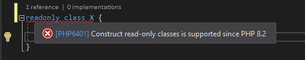
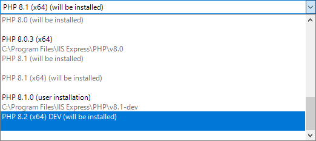
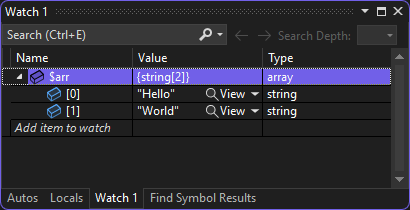
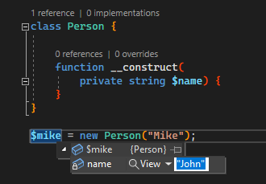
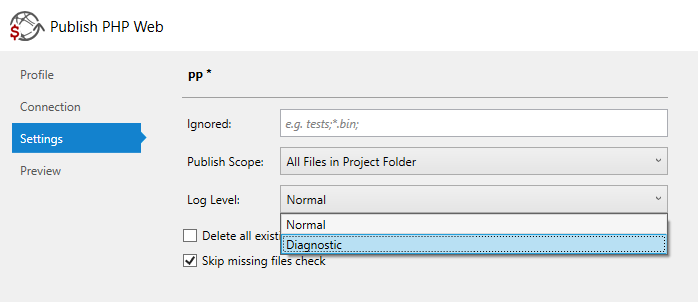

/*
Title: Setember 2022 (1.68)
Tags: release notes,visual studio,PHP 8.2
Date: 2022-09-17
*/

# September 2022 (version 1.68)

**Downloads:** https://www.devsense.com/download<br/>
**Purchase:** https://www.devsense.com/purchase

Welcome to the September 2022 release of PHP Tools for Visual Studio!

## PHP 8.2 Support

The new version of PHP, version **8.2**, will be released soon (expected November 2022). Our PHP editor is getting ready and already supports most of the new language syntax. You can try the new `readonly` classes and even use the latest development build of PHP 8.2 in Visual Studio.



Just go to your PHP project properties, and choose `PHP 8.2 (x64) DEV`. It will get installed and configured for debugging automatically.



## Diagnostics

### Dynamic Properties

The editor checks accessing class dynamic properties, i.e. properties that were not declared, according to their access. When reading a property and there is no magic `__get()` method, the property gets reported. When writing to a property and there is no magic `__set()`, the property gets reported. This behavior can be improved by specifying the dynamic properties in the `class` DocComment, using `@property`, `@property-read`, `@property-write` tags.

Note, since PHP 8.2, use of dynamic properties (without `__get()`, or `__set()`) is deprecated ([#rfc](https://wiki.php.net/rfc/deprecate_dynamic_properties)).

### Annotating `foreach` Control Variables

The type of control variables can be annotated using inlined DocComment, i.e.:

```php
foreach ($array as /* @var MyClass */$x) {
    //$x-> ...
}
```

or

```php
/* @var MyClass $x */
foreach ($array as $x) {
    //$x-> ...
}
```

The same works for the key variable as well.

### More Control Flow Diagnostics

Since `v1.68`, diagnostics treat `finally` block correctly and detect missing `return` with a value in more cases. Also, in case a function has a return type-hint `mixed`, a missing `return` is reported as well.

## Debug Improvements

We've implemented some quality-of-life improvements to the debugger, as well as fixing issues.

### Array item types are shown

When inspecting arrays, the debugger determines the type of array items and shows the array object more conveniently.



### Editing private properties 

You can now change a value of a private property during debugging session.



### Fixes

In addition, we have fixed inspecting values of more complex expressions.

## Publish Log Level

We've added a log level setting to publish profiles. Turn on `Diagnostic` log level to find out what exactly is going on during the publishing process - detailed information will be written to `Publish` output pane. 



## Other Fixes &amp; Improvements

Additionally, there are some fixes and small improvements. Please see the list below:

- Updated `Attribute` class definition.
- Fixed colorization of attributes (`#[]`) above `enum` cases.
- Generated getter/setter snippet (through a property code action) respects the `static` keyword.
- Doc Comments allow the type hints to be enclosed in parentheses `(`, `)`.
- Memory usage optimizations.
- Performance improvements.
