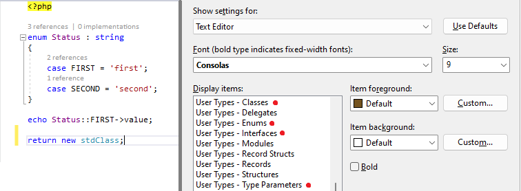

/*
Title: October 2022 (1.69)
Tags: release notes,visual studio,PHP 8.2
Date: 2022-10-07
*/

# October 2022 (version 1.69)

**Downloads:** https://www.devsense.com/download 
**Purchase:** https://www.devsense.com/purchase

Welcome to the October 2022 release of PHP Tools for Visual Studio!

## Interface and Enum Colors

Newly, the PHP Editor respects Visual Studio colors for `Interface` and `Enum`. In the next update, we'll be adding colors for Type Parameters as well. To change the colors, go to `Tools`/`Options`, `Environment`, `Fonts and Colors`.

## New Diagnostics

We have added and updated a lot of code diagnostics, mostly based on your feedback! Please see the list below:

- New PHP 8.2 compatibility diagnostics.
- There is a diagnostic for invalid use of `break;` or `continue` when they are out of the allowed scope.
- Diagnostic of code reachability with `try`/`finally` was fixed.
- Diagnostic of function return has been improved in cases, where there is a type hint `mixed`, but the function does not return anything.
- Unknown properties get reported (PHP0416).
  - Additionally, there is a new quick fix for unknown property, if there is just a typo in the name.
  - `stdClass` and classes with `__get()` magic method are ignored (as specified in the PHP 8.2 RFC).
- Dynamic properties are reported if there isn't a corresponding `__get`/`__set`, or `@property` annotation.
- Duplicate field declaration reported.
- Duplicate class constant declaration reported.
- `foreach` control variables can be annotated with a DocBlock.
- Reporting anonymous functions with unused `use` variables.
- Reporting anonymous function' `use` variable is not initialized.
- Reporting of empty namespaces.
- Checking that value from a function returning `void` is being used.
- Reports accessing a property on `void`.
- Checks expressions in string interpolation are convertible to `string`.
- Checks that type of a property is defined.
- Checks too many arguments passed to a function.
- Check for duplicate modifiers in function, property, or constructor property declaration.

## Fixes

We're constantly improving features based on your feedback! So thank you all for your messages, and here is the list of the most noticeable fixes:

- Fixed return type check when type hint is `void`.
- We have fixed the incorrect duplicate key check in the case of `enum`' case values. ([#658](https://community.devsense.com/d/658-problem-with-enums-as-keys)).
- Fixed code analysis not getting results when there was a specific case of recursion.
- Publishing handles case, when deleted file was already deleted on the server.
- Fixes internal error in Code Lenses, when a file is opened outside the project.
- Fixes color of `@` inside Doc Comment incorrectly recognized as a PHPDoc keyword.
