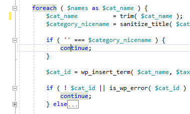
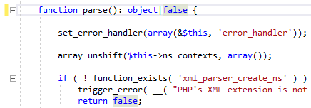
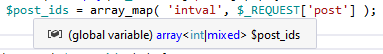
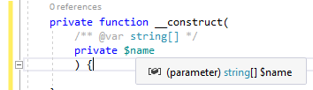

/*
Title: October 2022 (1.70)
Tags: release notes,visual studio,PHP 8.2
Date: 2022-11-07
*/

# November 2022 (version 1.70)

**Downloads:** https://www.devsense.com/download 
**Purchase:** https://www.devsense.com/purchase

Welcome to the November 2022 release of PHP Tools for Visual Studio!

## Editor

### Highlighting Scoped Keywords

Highlighting scoped keywords such as `while`, `do`, `for`, `switch` with the corresponding `break` and `continue`.

### IntelliSense

We have updated integrated language manual with more type informations, fixed type annotations for various PHP constants (which have it incorrectly in the official PHP manual), and more. This results in more precise IntellISense, type analysis, and code diagnostics.

Next, the editor supports the `false` pseudo-type as a part of PHP union types.

### Inline Completion

We're improving inline completions. Upon typing `function getSometing`, the rest of the getter method is smartly completed, if there is a property `$Something` in the local class scope. The same with `function setSomething` ...

### Laravel

New Laravel `defaultAliases` are recognized implicitly. This allows IntelliSense to work out-of-the-box with Laravel aliased classes.

## New Diagnostics

Diagnostics in general have been improved. We have fixed a lot of falsy warnings, and improved analysis performance.

- Newly, we report `interface` containing roperties, which is not allowed in PHP.
- Type analysis handles array type inferring, avoiding lots of falsy warnings.
- Newly, we report invalid type in `echo` and concatenation expressions.
- Type analysis for `array_map()` is more precise, if the "map" functions can be determined.
  
- It is now possible to use PHPDoc right above constructor property promotion, with just `@var` annotation.
  
- Imroved analysuis of `define()` with `object`.

## Doc Comments

### Generated PHPDoc Improvements

Generated PHP Doc Comments has been improved. Now the generated code complies with PSR-2 and PSR-12, contains more inerited type information and additional annotations.

### More PHPDoc Syntax

Newly, the PHP Editor recognizes pseudo type `never` as well. In case you're annotating never-returning functions with the `@return` tag.

### Tool-Tips from PHPDoc

We have improved tool-tips, which now render HTML annotations such as `<b>`, `<code>`, ` `, etc. nicely.

## Updated support for Visual Studio 2010 - 2017

We have released an update for older Visual Studio versions! If you're still using Visual Studio 2010, 2012, 2015, or 2017, you can now update to get almost all the latest features, PHP 8.2 support, fixes, new diagnostics, and more!

There are downloads for specific Microsoft Visual Studio versions:

- **Visual Studio 2010, 2012, 2013, 2015**: https://marketplace.visualstudio.com/items?itemName=DEVSENSE.PHPToolsforVisualStudio
- **Visual Studio 2017**: https://marketplace.visualstudio.com/items?itemName=DEVSENSE.PHPToolsforVisualStudio2017
- **Visual Studio 2019**: https://marketplace.visualstudio.com/items?itemName=DEVSENSE.PHPToolsforVisualStudio2019
- **Visual Studio 2022**: https://marketplace.visualstudio.com/items?itemName=DEVSENSE.PHPToolsforVisualStudio2022

## Fixes

There is vast array of fixes in code analysis, code highlighting, and finding symbol references. See the list below for details:

- Fake types such as `false`, `null`, and `never` are highlighted correctly as keywords in PHPDoc and type hints.
- Fixed highlighting of symbols within `const` initializers.
- Improved phpstorm meta file compatibility. Qualified names specified with forward slash are now recognized.
- Code compose is smart about getters and setters.
- Improved occurence highlighting of template type arguments in PHPDoc.
