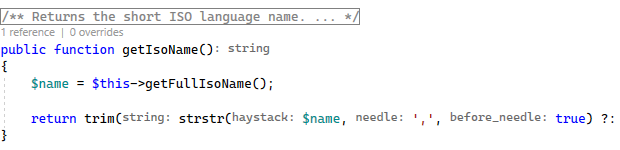

/*
Title: March 2023 (1.72)
Tags: release notes,visual studio,inlay hints
Date: 2023-03-04
*/

# March 2023 (version 1.72)

**Downloads:** https://www.devsense.com/download 
**Purchase:** https://www.devsense.com/purchase

Welcome to the March 2023 release of PHP Tools for Visual Studio!

## Inlay Hints

Sometimes it is not clear what function arguments are used for. We are adding so-called inlay hints that annotate function parameters, inferred function return type, by-ref semantics to arguments, and expressions type.

Enable or disable Inlay Hints in `Tools`/`Options`, under `Text Editor`/`PHP`/`Inlay Hints`,

## Short Open Tags Option

Now you can force the PHP Editor to treat short open tags `<?` differently. Go to `Tools`/`Options`, into `Text Editor`/`PHP`/`Advanced`. You'll find an option called **Short Open Tags**. You can enable or disable treating short open tags, or leave it to "Auto" which is the legacy behavior.

Previously the editor was parsing code next to `<?` according to various settings and the current PHP version. 

## Editor &amp; IntelliSense

- Facades from traits
- More Doc Comments validation
- Code diagnostics: readonly properties, fixes, dynamic properties, attribute classes exists, `throw` diagnostics
- More precise type inference for some builtin functions
- More precise analysis of `match` arms.
- More smart code actions
- More code refactorings, i.e. simplifications like `?=`, `?:`, `+=`, `switch` => `match`, etc.
- `@param-out`
- Doc Comments PHPStan and Psalm type names, generics, callable, structured array, literals, and more
- Doc Comments allow `...` in `@param` tag
- completion of properties after `?->`
- updated integrated PHP manual
- Go To Def prefers declaration in the same file, avoids showing list of all functions
- comment/uncomment block (`/* ... */`) instead of line comment (`//`)
- lots of minor UI fixes and code analysis improvements.