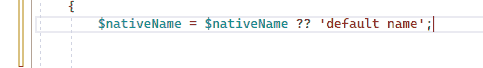
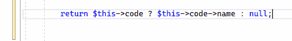
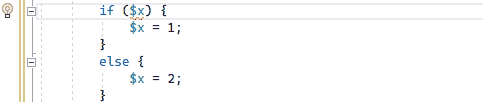
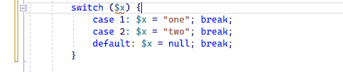
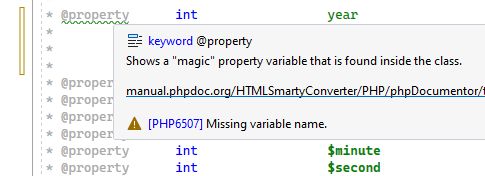

/*
Title: March 2023 (1.72)
Tags: release notes,visual studio,inlay hints
Date: 2023-03-04
*/

# March 2023 (version 1.72)

**Downloads:** https://www.devsense.com/download 
**Purchase:** https://www.devsense.com/purchase

Welcome to the March 2023 release of PHP Tools for Visual Studio!

## Inlay Hints

Sometimes it is not clear what function arguments are used for. We are adding so-called inlay hints that annotate function parameters, inferred function return type, by-ref semantics to arguments, and expressions type.

Enable or disable Inlay Hints in `Tools`/`Options`, under `Text Editor`/`PHP`/`Inlay Hints`,

## Short Open Tags Option

Now you can force the PHP Editor to treat short open tags `<?` differently. Go to `Tools`/`Options`, into `Text Editor`/`PHP`/`Advanced`. You'll find an option called **Short Open Tags**. You can enable or disable treating short open tags, or leave it to "Auto" which is the legacy behavior.

Previously the editor was parsing code next to `<?` according to various settings and the current PHP version. 

## Code Actions

Several quick refactorings through code actions have been added.

_Assignments can be simplified with `??=`, `+=`, `*=`, etc._

_Transforming expressions to the new nullable object operator `?->`._

_Assignment using `if` conditions can be simplified._

_And hard-to-read `switch` blocks can be simplified with the new `match` expression._

## Doc Comments

PHP Documentary Comments have been improved as well. In addition to more code diagnostics, the editor understands the wide range of _**Psalm**_ and _**PHPStan**_ type annotations.

Type names specified in Doc Comments can specify templates and generic types, callable specifications, structured arrays, literals, and more.

Additionally, the triple dot syntax `...` is now allowed within the `@param` tag, and the `@param-out` tag is recognized.

## New Diagnostics

- Checks for use of `readonly` properties.
- Assignment to non-existing properties is checked.
- Check for use of an unknown attribute class.
- Check that class used within the `throw` expression is throwable.
- Fixes many false-positive warnings!

## Other Editor &amp; IntelliSense Improvements

- Facades from traits are recognized.
- More precise type inference for some built-in functions.
- More precise analysis of `match` arms.
- Completion of properties after `?->`.
- Updated integrated PHP manual.
- Go To Def prefers declaration in the same file. It avoids showing the unnecessary list of all functions.
- Comment/uncomment block (`/* ... */`) instead of line comment (`//`).
- Lots of minor UI fixes and code analysis improvements.
