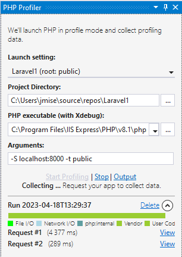
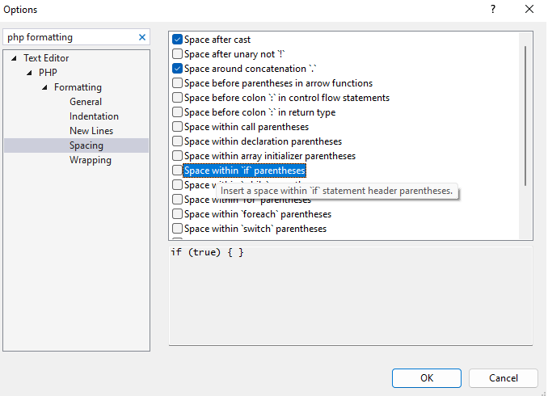
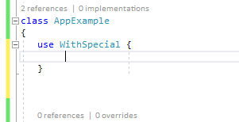
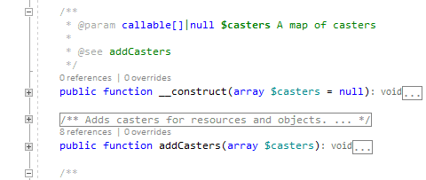

/*
Title: April 2023 (1.73)
Tags: release notes,visual studio,profiler,formatter,php
Date: 2023-04-15
*/

# April 2023 (version 1.73)

**Downloads:** https://www.devsense.com/download 
**Purchase:** https://www.devsense.com/purchase

Welcome to the April 2023 release of PHP Tools for Visual Studio!

## Profiler Tool

PHP code profiling allows you to inspect how much time and how many calls were made to every single function in the code. We have added a simple and efficient way of profiling your PHP projects.

Go to `Debug` / `Open PHP Profiler`, and initiate profiling. Additionally, profile your PHPUnit test cases right from the `Test Explorer`

The new **Profiler Tool Window** allows you to quickly start profiling, inspect requests, and inspect profiling data.

Profiling data are inspected in the new **Profiling View**! List and filter called functions, call details, and flame graph.

See [Profiler Overview](https://docs.devsense.com/en/vs/profiling/overview) for more information.

## Code Formatter &amp; Code Styles

PHP Tools for Visual Studio now includes a completely revamped code formatter that offers greater flexibility and customization options, including the ability to set formatting options from predefined code styles like `PSR-12`, `PSR-2`, `Allman`, `K&R`, `Laravel`, `WordPress`, and `Drupal`. 

The new formatter also provides users with more control over spacing options, new lines, wrapping, and indentations.

This significant upgrade makes it easier to adhere to coding conventions and enhances the overall coding experience for users.

## Refactorings

We have improved existing code actions, simplifying various expressions, and added a new one - converting a string with a class name to syntactically valid `::class` pseudo constant:

## IntelliSense

Code completion inside trait adaptation blocks (inside `use T { ... }`) has been implemented. This gets correct keywords, trait names, and function names in the correct context.

Newly, IntelliSense takes the **phpstorm.meta**s `expectedArguments()` annotation into account. Code completion provides the list of expected arguments if possible.

## Doc Blocks

Newly **@uses** and **@see** PHPDoc tags are recognized correctly, and the reference symbol names gets IntelliSense features - refactoring, highlighting, and tool-tips.

Additionally, there are various improvements to the PHPDoc type system, so it respects PHPStan and Psalm conventions. For example, the **`dynamic`** type specified in PHPDoc is treated as `mixed`, as it is used in this way in Laravel and other frameworks.

## Code Diagnostics

Analysis improved to avoid some false warnings. Fully supporting new PHP 8, 8.1, and 8.2 union and intersection types (including `true`, `false` as a type).

Newly we're reporting unknown properties, or non-static methods called statically.

Highlighting and code fixes for unused use have been optimized, and respect types within `@method`, `@see`, and `@uses`.

Respecting `class_alias()` when checking type inference.

## Fixes

- Stability fixes.
- Performance improvements.
- Less memory usage.
- Fixes crash when having large generated Drupal files.
- Code completion lists `static`, `as`, `insteadof` keywords correctly when they're needed.
- Doc block types `iterable<K,V>` and `array<K,V>` are treated correctly.
- The type specified as `?static` is treated correctly as a nullable `static`.
