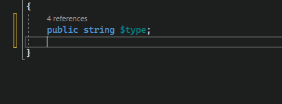
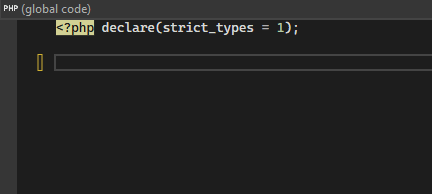
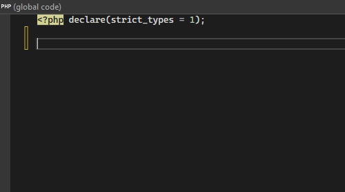

/*
Title: July 2023 (1.74)
Tags: release notes,visual studio,formatter,php,ai,IntelliPHP
Date: 2023-07-05
*/

# July 2023 (version 1.74)

**Downloads:** https://www.devsense.com/download<br/>
**Purchase:** https://www.devsense.com/purchase

Welcome to the July 2023 release of PHP Tools for Visual Studio!

## IntelliPHP

Introducing AI-powered inline code predictions enhancing productivity and code development experience for PHP. IntelliPHP leverages machine learning to provide intelligent code predictions. As you type, the extension suggests relevant code completions and shows them as grey text in your editor. This feature helps you write code faster and reduces the time spent on manual typing.



> The code predictions work completely offline, and do not send or receive any data to Internet. To disable/enable the feature, go to `Tools`/`Options`, `Text Editor`/`PHP`/`IntelliPHP`.



> The feature is only available to Visual Studio 2022 (and future versions).



## New IntelliSense Features

### IntelliSense &amp; `IteratorIterator`

`IteratorIterator` and `RecursiveIteratorIterator` are extended with generic type argument `TInner`, `@mixin TInner`, and their `__construct()` infers this `TInner`. Therefore, IntelliSense knows the inner iterator type and so it can provide inner iterator's members. ([#1613](https://community.devsense.com/d/1613))

### IntelliSense &amp; `@phpstan-type`, `@psalm-type`, `@phpstan-import-type`

Since now, we have a basic support for local type aliasing.

### IntelliSense &amp; Traits with Generics

Newly, `trait` use can be annotated with `@use` doc comment to specify the trait's generic arguments ([#840](https://community.devsense.com/d/840-generics-allow-template-for-trait-usages)), i.e.:

```php
class MyClass {
    /** @use MyTrait<int, string> */
    use MyTrait;
}
```

### IntelliSense &amp; `static` Type

We have reimplemented the internals and improved type analysis for various cases involving use of `static` and `$this` within traits, protected properties, and class inheritance in general. Moreover generic arguments and trait members are resolved better with more inherited type information ([#931](https://community.devsense.com/d/931-inherit-and-static-array-type/)).

### Other IntelliSense Features

- `@phpstan-type` and `@phpstan-import-type` are supported ([#1543](https://community.devsense.com/d/1543-local-type-aliases)).
- `phpstan.neon` (and `.dist` alternatives) in containing directories processed; supporting their global type aliases (`phpstan.neon` file's [`"typeAliases"`](https://phpstan.org/writing-php-code/phpdoc-types#global-type-aliases) setting).
- Handling `Collection<TValue>`, `Iterator<TInner>` correctly.
- Undefined properties accessed with magic `__get()` reported with lower severity.
- Fixes trait adaptation and class inheritance analysis. Classes with complex inheritance with trait `use` with adaptation are analysed correctly giving unseful insights about missing method implementation.
- Fixes control-flow analysis of certain `try`/`finally` blocks.
- Improves Laravel IntelliSense.
- Type inferring in the context of `is_a()` analyzed correctly.
- Less falsy warnings for non-static methods called statically in case there is `__callStatic()` magic method.
- New quick refactorings through code actions.
- Updated integrated PHP manual and localizations.
- `match`, `fn`, and `interface` are not reported as syntax errors when within a qualified name (PHP 8.0+).
- PHP 8.2 standalone `true`, `false`, and `null` type names. ([#338](https://github.com/DEVSENSE/phptools-docs/issues/338))
- Fixed a few type inferring cases.
- Fixed reporting functions annotated with `@ignore` tag as unknown.
- Type hinting through `/** @var */` above `if` fixed.
- Fixed check of `define()`. ([#340](https://github.com/DEVSENSE/phptools-docs/issues/340))
- Fixed issue causing removal of new lines when formatting after abstract method. [#1525](https://community.devsense.com/d/1525-formatting-issue)
- Arrow functions now respect php.format.rules.spaceWithinDeclParens to add spaces within parentheses. [#1536](https://community.devsense.com/d/1536-space-within-fn-parenthesis)
- Fixed unwanted space when function is named as keyword [#335](https://github.com/DEVSENSE/phptools-docs/issues/335)
- Do not increase indentation if previous sibling node ends on the same line [#333](https://github.com/DEVSENSE/phptools-docs/issues/333)
- Fix of array items aliging when keys are not simple literals [#1602](https://community.devsense.com/d/1602-auto-format-woes)

## Refactoring

Trait function members are resolved in semantic highlighting, finding references, code lenses with method overrides, and rename refactoring.

## Stability Fixes

- Memory leak when having `.phar` files in the solution has been fixed.