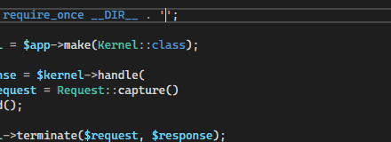
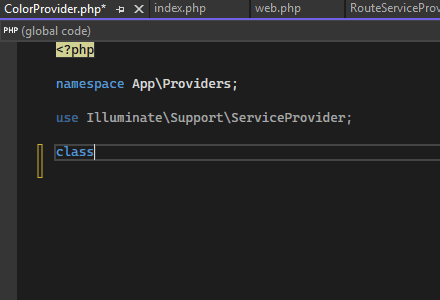

/*
Title: September 2023 (1.75)
Tags: release notes,visual studio,formatter,php,ai,IntelliPHP
Date: 2023-09-20
*/

# September 2023 (version 1.75)

Welcome to the September 2023 release of PHP Tools for Visual Studio!

## PHP 8.3 Syntax

Adding support for PHP 8.3 syntax features including:

- Typed class constants
- Anonymous readonly classes
- Dynamic class constant fetch

## `scalar_objects` Support

Thanks to the suggestions [#378](https://github.com/DEVSENSE/phptools-docs/issues/378), we're adding native support for the [`scalar_objects`](https://github.com/nikic/scalar_objects) extension by Nikita Popov.

The editor recognizes `register_primitive_type_handler()`` calls, and allows completion for specified scalar types.

## Completing File Paths

The editor is completing and navigating to files [#402](https://github.com/DEVSENSE/phptools-docs/issues/402).

## Class Name Inline Suggestion

Newly, when typing a new class, the class name is suggested based on the file name. The suggestion takes advantage of the inline compose lenses, so it's non disruptive; accepted with `TAB` key.

In combination with [IntelliPHP](https://blog.devsense.com/2023/php-and-visual-studio-updates-july-2023), which is a part of PHP Tools for Visual Studio 2022, there are even more code suggestions!

## Optimized Loading and Memory Use

The editor is caching `composer.lock` and cthe corresponding vendor folder. This significantly improves opening solutions based on Composer packages, and drops the RAM usage to the bare minimum.

## Inlay Hints for Attributes

Newly, attributes above classes will have inlay hints with parameter names ([#383](https://github.com/DEVSENSE/phptools-docs/issues/383)), if enabled.

## Fixes

- Fixes use statements sorting.
- Fixes go-to-def of a method defined in a trait.
- Fixes @psalm-import-type phpdoc tag support.
- Fixes inlay hints when there is a new without parameters.
- Fixes rename refactoring of static methods.
- Avoids showing keyword tooltip if it's not a keyword.
- Avoids showing duplicit items in peek window.
- More fixes of code diagnostics and IntelliSense.
- Stability fixes.
