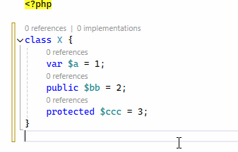

/*
Title: July 2024 (1.81)
Tags: release notes,visual studio,formatter,php,ai,IntelliPHP,performance
Date: 2024-07-31
*/

# July 2024 (version 1.81)

This release introduces support for PHP 8.4, including new language features such as property hooks and the __PROPERTY__ magic constant. Improvements include enhanced code suggestions, better PHPUnit test discovery, and additional support for PHPStan assertions. The update also brings enhancements to code formatting, such as property alignment within class definitions, along with numerous bug fixes and performance optimizations.

### PHP 8.4 Support (Preview)

This update adds support for the new PHP 8.4 features, including:

- Property hooks, and `__PROPERTY__` magic constant.
- `new` without parentheses.
- Formatting for properties and property hooks.

### Improvements

- Initial support for `@phpstan-assert`, `@phpstan-assert-if-true`, `@phpstan-assert-if-false`.
- PhpUnit tests discovered in nested directories, and respecting `prefix` configuration.
- Recognizes unsealed array shape type ([#587](https://github.com/DEVSENSE/phptools-docs/issues/587))
- Improves initial indexing, postpones discovering test cases after indexing is done.
- Optimizations, memory usage improvements.
- Better `ReflectionClass::getMethods()` type inference.
- Implementing abstract functions adds universal `@inheritDoc` doc comment.
- `Sort uses` code action removes duplicates.
- Adjusted completion sorting for not-imported global types ([#598](https://github.com/DEVSENSE/phptools-docs/issues/598)).
- Magic constants (`__METHOD__`, `__PROPERTY__`, etc.) are checked if they are used in a correct context.
- Diagnostics improvements, fixes for `try`/`finally` control flow and reachability analysis.
- We have successfully whitelisted both PHP Tools and IntelliPHP in AVAST CyberCapture, so there shouldn't be any prolonged scanning during runtime.

### Formatting

#### Align Properties

The formatter now includes an `Align Properties` feature to align properties within class definitions for better code readability. Activate this feature via `Tools | Options` and navigate to `Text Editor | PHP | Formatting | Wrapping`. Under `Class Properties`, enable `Align properties`.

## Automatic Installations

We've updated most of the PHPs and Xdebug (version `3.3.2`) which are installed automatically to their latest versions.

### Fixes

- Fixes an issue causing unwanted spaces after formatting `require` and similar statements.
- Crash fix when having `@extends parent<>` annotation, with template arguments ([#585](https://github.com/DEVSENSE/phptools-docs/issues/585)).
- Function override check respects `#[ReturnTypeWillChange]` attribute.
- Fixes false unused variable warning about object that is used as an array ([#533](https://github.com/DEVSENSE/phptools-docs/issues/533)).
- Rename and highlight occurences of private fields fixes.
- Fixes missing composer node in Dependencies in the Solution Explorer when other language than English is used. [#2045](https://community.devsense.com/d/2045-dependencies-not-shown-in-visual-studio-with-german-language)
- Stability fixes
- When using the automatic installer, we are enabling the `zip` extension by default starting with PHP `8.2`. Previously, if this extension was not enabled, some Composer commands might have failed.