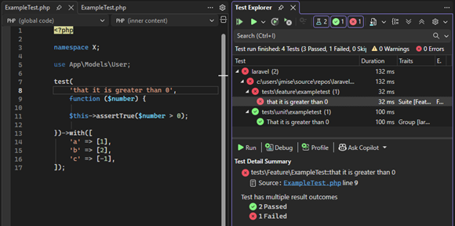
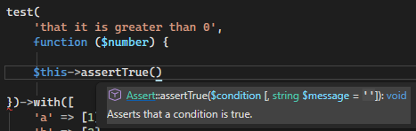
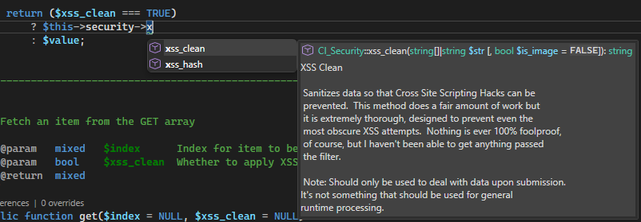
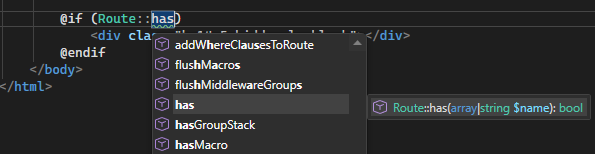
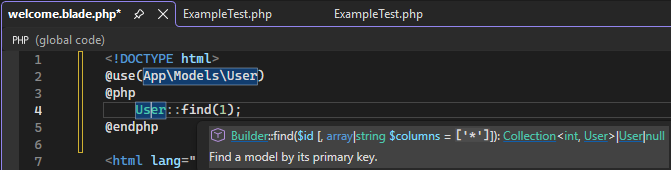
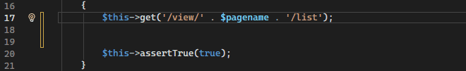
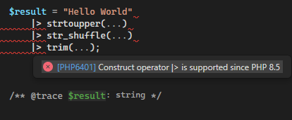

/*
Title: October 2025 (1.85)
Tags: release notes,visual studio,IntelliSense
Date: 2025-10-08
*/

# October 2025 (v1.88)

Welcome to the **October 2025** release of _PHP Tools for Visual Studio_!  
Version **1.88** introduces significant improvements to IntelliSense, expands the library of Code Analysis rules, adds full support for PHP 8.5 syntax, enhances the Blade and mixed HTML editors, and delivers numerous stability and performance updates across the board.

---

## Visual Studio 2026 Support 🟣

Exciting times are ahead — **Visual Studio 2026** is here!  
We’re delighted to announce that PHP Tools is now fully compatible with this upcoming major release of Visual Studio. Our team has worked extensively to ensure seamless integration, a smoother experience, and better overall performance when developing PHP applications in the next-generation IDE.

You can try Visual Studio 2026 today as a **pre-release** through the [Visual Studio Insiders Program](https://visualstudio.microsoft.com/insiders/). We’ll continue to refine compatibility as Microsoft finalizes the release, ensuring PHP developers can enjoy a fully supported and modern environment right from day one.

---

## PHPUnit 10–12 & Pest Framework

This version brings major upgrades to the **PHP Test Explorer**, extending compatibility with the latest testing frameworks and features. PHP Tools now supports **PHPUnit versions 10, 11, and 12**, along with full compatibility for the **Pest** testing framework.

Tests using **data sets** are now properly recognized, and their individual executions are displayed as separate results within the Test Explorer, making it easier to analyze test coverage and pinpoint issues. In addition to these new capabilities, we’ve improved the overall stability and reliability of test discovery and execution, providing a smoother, more consistent experience when running or debugging your PHP tests.

---

## IntelliSense Enhancements 💡

Our IntelliSense engine has received extensive improvements, many inspired by hundreds of suggestions and reports from our community — thank you for your incredible feedback! IntelliSense is now faster, smarter, and more deeply aware of modern PHP frameworks.

Compatibility with **Pest** and **Laravel** has been enhanced to deliver more precise completions for `$this` in Pest tests, Laravel models, facades, and helpers, as well as more accurate diagnostics. We’ve also improved support for **CodeIgniter 3**, allowing better type inference for controllers and their properties. The release adds dedicated support for the **OXID** framework as well, with smarter type detection via the `oxNew()` factory function.

Beyond framework-specific updates, IntelliSense completions now appear faster and more contextually relevant, helping developers write correct, expressive PHP code with minimal effort.

---

## Blade Editor & Mixed HTML Editor

Editing Blade templates and mixed PHP, HTML, CSS, and JavaScript files has become significantly more reliable and accurate. We’ve fixed several complex combinations of embedded CSS, JavaScript, and PHP code that could previously interfere with syntax highlighting or IntelliSense results.

In addition, this version introduces support for the Blade **`@use` directive**, which is now properly highlighted and integrated into IntelliSense. Classes imported using this directive are automatically recognized throughout the rest of the page, ensuring a smooth, cohesive editing experience when working with modern Laravel templates.

---

## Code Diagnostics & Refactorings 🧠

Version 1.88 greatly enhances our **Code Diagnostics** and **Refactoring** capabilities. Several new quick refactorings have been added, making it easier to simplify and clean up your code with just a few keystrokes.

We’ve introduced a wide range of new diagnostics that identify **PHP 8 compatibility issues** and common coding pitfalls, helping you modernize your codebase efficiently. The diagnostics engine is also fully compatible with the new **PHP 8.5 syntax**, including the **pipe operator (`|>`)**, ensuring full analysis coverage for the latest language features.

For a complete overview of all available diagnostics, you can refer to the official documentation at [docs.devsense.com/vs/code%20validation/diagnostics/](https://docs.devsense.com/vs/code%20validation/diagnostics/).

---

## Other Improvements

This release also includes many smaller enhancements and fixes. We’ve extended the existing **Code Analysis** library with new rules for modern PHP syntax and coding best practices. Support for **PHP 8.5** has been expanded to include its newest constructs and attributes, and several reported issues have been addressed to ensure a smoother and more stable development experience.

---

## Thank You

A massive thank-you to everyone who shared feedback, reported bugs, suggested improvements, and support us through the premium licenses.
Your support continues to drive PHP Tools forward, helping us make every release better than the last.  
