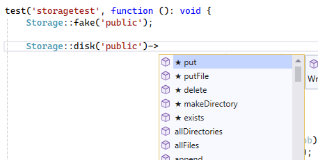
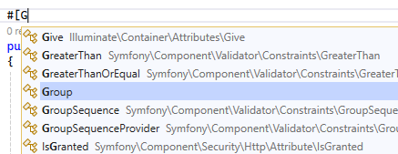
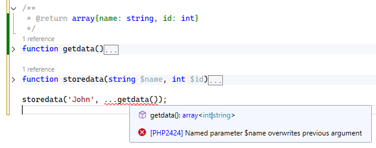
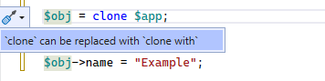
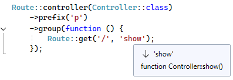
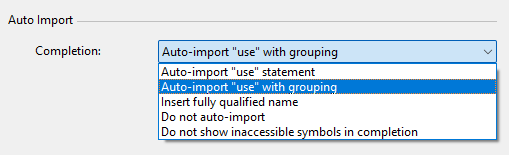
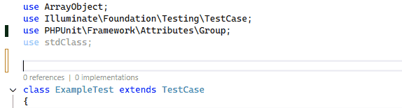

/*
Title: April 2026 (1.89)
Tags: release notes,visual studio,IntelliSense,starred suggestions
Date: 2026-04-05
*/

# April 2026 (version 1.89)

We’re excited to introduce version **1.89** of PHP Tools for Visual Studio - a release focused on making your coding experience more intuitive, more accurate, and significantly more productive.

This update sharpens the intelligence of the editor while staying out of your way. Let’s take a look at what matters most.

---

## Smarter Code Completion That Understands You

One of the standout improvements in this release is ⭐ **Starred Suggestions**.

The editor now highlights the most likely completion candidates with a ★ and automatically prioritizes them at the top of the list.

**Why it matters:**

* ⚡ Find the right symbol faster with less typing
* 🧠 Smarter IntelliSense based on context and probability
* 🎯 Zero disruption - it adapts to your workflow without changing it

This is one of those features that quietly saves seconds on every completion - and those seconds add up quickly.

---

## Deeper Code Intelligence & Accuracy

This release significantly improves how the editor understands your code - especially in complex and modern PHP patterns.

### Highlights include:

* Better handling of **closures, lambdas, and indirect function calls**
* Improved **generic templates**, even in nested contexts
* Smarter **attribute-aware completion** (only valid attribute classes suggested)

* More precise **PHPDoc interpretation**, including optional parameters
* Detection of subtle issues like **argument conflicts with spread operators**

**The benefit:**

* 🔍 Fewer false positives
* 🛡️ Earlier detection of real issues
* 💡 Better suggestions in advanced codebases

In short: the editor “gets” your code better than ever before.

---

## More Powerful Code Actions & Fixes

Version 1.89 introduces new and improved code actions that help you write cleaner, more modern PHP with less effort.

### New capabilities:

* Add missing **parameter type hints** instantly
* Automatically **simplify spread operators**
* Modernize code with transformations like `clone → clone with`
* Improved fixes for tricky override and signature issues

**Why it matters:**

* ✂️ Reduce boilerplate and manual edits
* 🧹 Keep your codebase clean and consistent
* ⚙️ Refactor faster with confidence

---

## Smarter Navigation - Even Inside Strings

Navigation and symbol resolution have been enhanced in places where most tools struggle - like string-based references.

For example:

The editor now correctly resolves `"show"` as a method name and navigates to it upon `Ctrl`+`Click`.

**The benefit:**

* 🧭 Navigate seamlessly across dynamic patterns
* 🔗 Better support for reflection-heavy and framework-driven code
* 🚀 Faster understanding of unfamiliar codebases

---

## New Auto-Import Option

In Visual Studio `Options` - `Text Editor` - `PHP`- `IntelliSense`, pick **`Auto-import "use" with grouping`**.

The editor will create `use` groups whenever it makes sense.

---

## Improved Validation for Dynamic Code

PHP’s flexibility is powerful - but it can hide bugs. This release adds **parameter validation for closures and indirect calls**, catching mistakes earlier.

**What you gain:**

* ⚠️ Immediate feedback on incorrect arguments
* 🧩 Better reliability in dynamic and functional patterns
* 🧘 More confidence when working with advanced constructs

---

## Laravel & Ecosystem Enhancements

If you’re working with Laravel or modern PHP tooling, this update brings a noticeable upgrade.

### Improvements include:

* Smarter IntelliSense for **controllers, Livewire, and storage APIs**
* Better type inference in **testing (Pest, Laravel helpers)**
* More accurate framework-specific completions and navigation

**The result:**

* 🧠 Framework-aware coding experience
* ⚡ Less guesswork, more flow
* 🎯 Higher productivity in real-world projects

---

## A More Resilient Editing Experience

A major step forward: the better **implementation of an error-tolerant parser**.

This means the editor can continue providing IntelliSense and analysis even when your code is incomplete or temporarily broken.

**Why it matters:**

* 🔄 Fewer interruptions while typing
* 🧩 Better support during refactoring or drafting
* 🛠️ IntelliSense that doesn’t “give up” on invalid code

---

## Polished, Consistent, and Reliable

Beyond the major features, this release includes a broad set of improvements that make everything feel tighter:

* More consistent diagnostics aligned with real-world tooling
* Cleaner formatting behavior across edge cases
* Numerous fixes in Laravel, Blade, traits, lambdas, and more
* Improved handling of modern PHP features like PHP 8.5 additions

**The outcome:**

* ✅ Fewer annoyances
* 🎯 More predictable behavior
* 🧑‍💻 A smoother day-to-day experience

---

## Final Thoughts

Version 1.89 is all about **precision and flow**.

It doesn’t just add features - it refines how the editor thinks, reacts, and supports you in real coding scenarios. From smarter suggestions to deeper analysis and more resilient behavior, this update helps you stay focused on what matters: writing great PHP.
