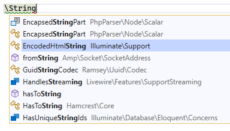
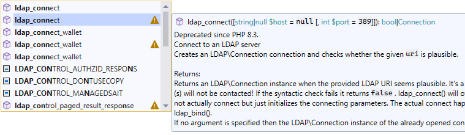
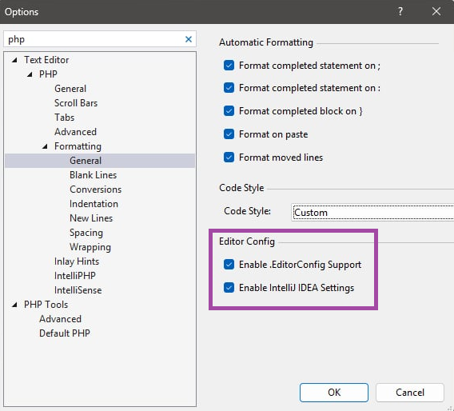
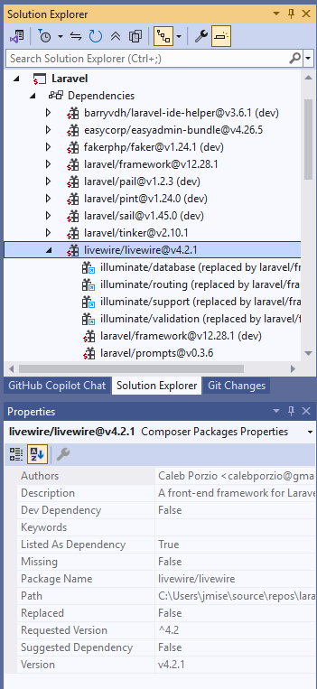
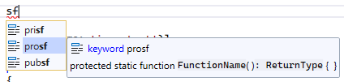

/*
Title: August 2026 (1.90)
Tags: release notes,visual studio,IntelliSense,starred suggestions
Date: 2026-08-09
*/

# August 2026 (version 1.90)

## Fast Code Completion for Large Projects

We have re-implemented code completion integration into Visual Studio to make it significantly faster by taking advantage of multi-core CPUs. The completion list now appears almost instantly, with little to no delay while typing.

This was rarely noticeable in regular projects, but makes a significant difference in large projects with 10,000, 50,000, or even more classes. Code completion now remains fast and responsive even in these large codebases.

## Fully Qualified Name Completion

When you start typing a backslash `\`, code completion lists all symbols under the namespace you have entered so far. Confirming a suggestion inserts the fully qualified name directly, without adding imports or aliases.

This provides a convenient way to explicitly use the fully qualified name of a class or function wherever appropriate.

## Code Completion Shows Deprecations

Code completion now indicates deprecated and removed symbols with a warning icon, based on the PHP version configured for your project.

This is particularly useful when a function has multiple overloads and only some of them are deprecated.

## New .EditorConfig Settings

New settings are available for customizing PHP formatting under *Tools* / *Options*, *Text Editor* / *PHP* / *Formatting*.

**Enable .EditorConfig Support** (enabled by default) reads formatting options from the `.editorconfig` file in your project and applies the settings relevant to the current file. The corresponding directive names for individual formatting rules are listed in the [formatting documentation](https://docs.devsense.com/vscode/formatting/customize-formatting/).

**Enable IntelliJ IDEA Settings** (enabled by default) additionally recognizes formatting settings imported from IntelliJ IDEA editors using `ij_php_***` directives. This makes it easier to transfer customized formatting settings from IntelliJ IDEA to `.editorconfig`.

## Long Paths Support

The internals of PHP Tools have been updated to properly handle long directory names and file paths. This is especially useful when working with projects located deep within a directory hierarchy or when Composer dependencies contain deeply nested packages.

Previously, PHP files with paths exceeding 260 characters could be ignored and therefore not indexed by IntelliSense.

## Composer Dependencies Tree

A new Composer tree is available under the project's *Dependencies* node in Visual Studio 2026 and the latest updates of Visual Studio 2022.

The tree lets you inspect installed Composer dependencies and their properties, as well as update or remove existing packages.

## Diagnostics

The diagnostics engine has received a number of improvements to provide more accurate analysis and more useful code fixes. PHP Tools now reports additional issues in callable syntax, including invalid function names, unknown functions, and invalid indirect calls through `__invoke`. It also provides better diagnostics for property access, `instanceof` expressions, variadic parameters, and other PHP language constructs.

Code fixes have also been expanded for unknown types, including suggestions for implementing missing interface properties and generating PHPDoc type information. Deprecation diagnostics can now use replacement information provided by the `#[Deprecated]` attribute and PHP stubs.

## Type Inference

Type inference has been improved in several areas, resulting in more precise analysis and fewer false-positive diagnostics. PHP Tools now better understands conditional return types, arithmetic involving BCMath functions, `numeric-string` values and their implicit conversions, as well as the types returned by functions such as `array_first()`.

Unused underscore variables are also handled more appropriately during type analysis.

## Snippets

Snippets have been expanded and improved. A new snippet makes it easy to insert `throw new ...` statements (`thr` snippet), while function snippets now follow the familiar conventions used by PhpStorm.

Insert snippet with `[TAB]` key.

Snippet previews are also displayed in tooltips, making it easier to understand what will be inserted before confirming a suggestion.

## Editor

The editor and IntelliSense experience includes numerous smaller improvements.

Inlay hints can now show parameter names for indirect function calls, while code actions for implementing members also take abstract properties into account. PHPDoc parsing and type simplification have been improved, and navigation and tooltips now provide better support for array-syntax callables and special PHP constructs.

WordPress support has also been enhanced with improved hook discovery and navigation, references to WordPress hook names, better completion and documentation links for WordPress functions and classes, and improved support for structured WordPress types.

Completion can now use `#[ExpectedValues]` attributes to suggest valid argument values, and IntelliSense provides more precise information for `$GLOBALS` access and other well-known string values.

## Fixes

There are numerous fixes and smaller improvements included in this version.

CodeLens references now correctly handle namespaced global functions and property positions. Various code actions have been improved, including `use` statements, parentheses, `is_null()`, and formatting-related actions.

Smart indentation has been improved for attributes, while PSR-12 formatting now handles blank lines more accurately.

Navigation and reference detection have been fixed for constructors, Laravel controller methods, WordPress-related code, and other PHP constructs. PHPDoc handling has also been improved, including better recognition of `Object` types, tentative types, `@property` definitions, and parameter annotations.

The parser has been updated with improved PCRE support and more accurate error positions for certain regular expressions. Additional fixes improve completion filtering, visibility keyword handling, and various edge cases throughout IntelliSense and code analysis.
