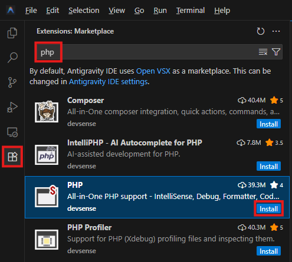

# Antigravity IDE

Google's _Antigravity IDE_ is supported with the standard [PHP Tools for VS Code extension](https://open-vsx.org/extension/devsense/phptools-vscode).

## Installation

Install the **PHP** extension from the extensions panel.



## Basic Usage

Please refer to the [PHP Tools for VS Code Documentation](../../vscode/index.md) for the standard features documentation.

## MCP Server

> Since `1.74.19294`

The MCP server provides MCP tools, skills, and contexts that AI agents such as Claude can use to access the same information that the PHP IDE knows internally.

> Note: As we tested, Antigravity agent seems to have issues with MCP Tools - it provides wrong arguments to the tools, and uses wrong results.

Antigravity IDE needs the following configuration to enable the use of our PHP MCP Server:

- In your _workspace_ settings, specify a local MCP Server port (this should be unique for every workspace that is opened at the same time):

  _.vscode/settings.json:_

  ```json
  {
    "php.mcp.serverPort": 58372
  }
  ```

- According to the [documentation](https://antigravity.google/docs/mcp/#antigravity-ide), the configuration file is located globally at `~/.gemini/config/mcp_config.json` (or locally in your workspace under `.agents/mcp_config.json`). Add the following setting:

  ```json
  {
    "mcpServers": {
        "phptools": {
            "serverUrl": "http://127.0.0.1:58372/"
        }
    }
  }
  ```

