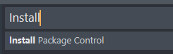
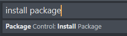
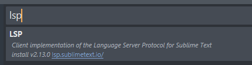
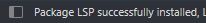
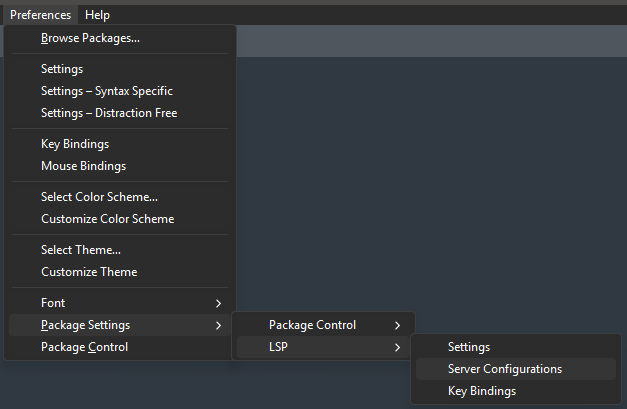

/*
Title: Sublime Text
Description: PHP Tools integration into Sublime Text.
*/

# PHP Tools for Sublime Text

PHP Tools for Sublime Text is provided as a language server (LSP).

## Requirements

- Node.js: https://nodejs.org/en/download
- Sublime Text: https://www.sublimetext.com/

## Installation

Install [PHP Tools Language Server](../lsp/index.md) as a NPM global tool:

```
npm i devsense-php-ls -g
```

**Open _Sublime Text_** and make sure you have installed _Package Control_ and _LSP_ package:

- Tools / Command Palette: `Install Package Control`

  

- Tools / Command Palette: `Package Control: Install Package`

  

- Search for `LSP`:

  

- You'll see a confirmation in the status bar:

  

**Enable PHP Tools Language Server**:

Go to `Preferences` / `Package Settings` / `LSP` / `Server Configurations`



In the newly opened file `LanguageServers.sublime-settings`, add the following configuration:

```json
{
	"phptools":
    {
        "enabled": true,
        "command": ["devsense-php-ls"],
        "selector": "embedding.php",
        "priority_selector": "source.php",
        "initialization_options" : {
            "0": "<YOUR_LICENSE_KEY>",
            "php.stubs": "*",
            "php.version": "8.5",
            "phpTools.language": "en",
            "php.completion.parameters": "parameters",
            "php.format.codeStyle": "psr-12"
        }
    }
}
```

> Note, `"initialization_options"` are optional.

## Registration

Add `<YOUR_LICENSE_KEY>` in the `"initialization_options"` above to enable additional premium features including [code actions](../../vscode/code%20actions/overview.md) and [starred suggestions](../../vscode/ai/starred-suggestions.md).

License key can be purchased on the [purchase page](https://www.devsense.com/en/purchase).

## Updating

To update the language server, update the NPM global tool `devsense-php-ls` using the command below:

```
npm update devsense-php-ls -g
```

