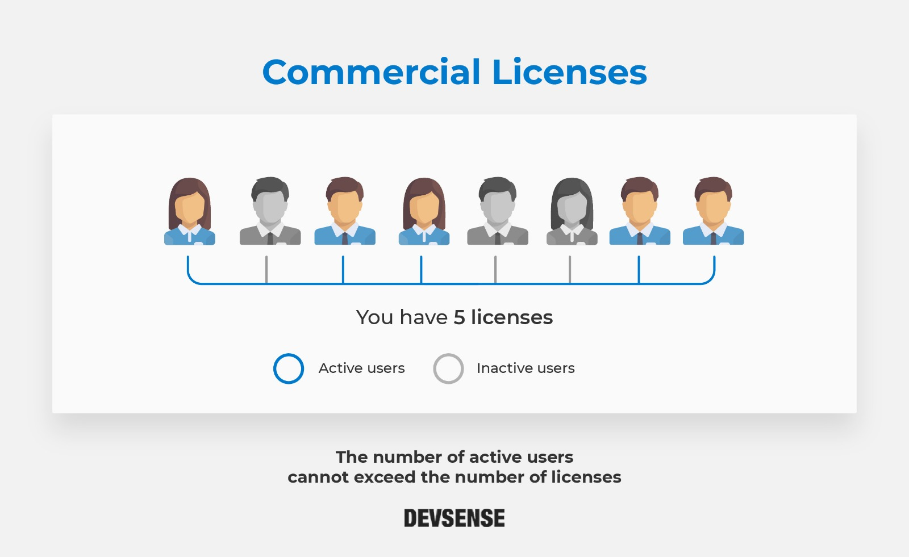

/*

Description: FAQ - Commercial License
*/

# Commercial License

## What is a commercial license? 

A **commercial license** is the option for companies or organizations. It grants the right to install and use the product by any developer on any machine within a company or organization, provided that the total number of developers using the software at a time does not exceed the number of purchased licenses. 

## What do I get when purchasing a commercial License? 

For commercial licenses, users can choose among three options: 

1. PHP Tools for Visual Studio  
2. PHP Tools for VS Code  
3. PHP Tools for All Platforms (VS + VS Code)  

All options include:

- **12-month subscription** for purchased platform, including access to all updates and new versions.  
- **12 months of Professional Support***  
- **Perpetual fallback license**, allowing indefinite use of the version available at the time of purchase or 12 months before subscription expiration.  

**New:** Monthly subscriptions are now available for commercial licenses:  

- Monthly payments with continuous access to updates and support while active.  
- **Perpetual fallback** is granted automatically **after 12 consecutive months** of active subscription.  
- If the monthly subscription is paused or cancelled before reaching 12 months, perpetual fallback is not granted.  

After the subscription period (annual or monthly) ends, if you do not renew, you will no longer receive updates or support, but you can continue using the versions covered by the perpetual fallback license.

For information about prices and purchasing options, click [here](https://www.devsense.com/purchase).  

*Support refers to Devsense’s tools for Visual Studio 2010–2022 or VS Code, and does not refer to support for Visual Studio’s IDE.  

## Can a commercial license be used on different machines? 

Yes, it can be used on different machines within the same company or organization. However, the number of active users cannot exceed the number of licenses. Two or more users cannot use the same license at the same time. In other words, if you have 5 licenses, the active users cannot be more than 5. Each active user must have their own license.  

## Can multiple employees use the same commercial license? 

Yes. Two users can share one license, as long as they do not use it simultaneously. Each active user must have their own license.  

## There are 12 developers in my company. How many licenses should I have? 

It all depends on the active users of the software. Two or more users cannot use the one license at the same time. If all developers are working at the same time, then you should have 12 licenses. However, two users can share one license if they do not run the software at the same time. Each active user must have their own license.  

## Can I use a commercial license at home? 

That depends on your company’s policy. Always confirm with your manager first.  

## License agreement 

We encourage you to take a look at our [License agreement](https://www.devsense.com/purchase/licenses/commercial) for commercial licenses.
