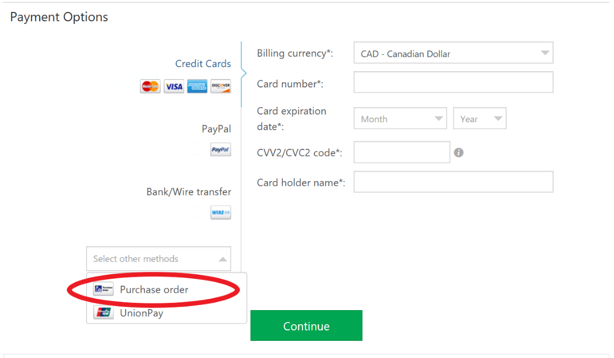

/*

Description: FAQ - Purchase and payment 

*/

# FAQ

## How is the process for purchasing PHP Tools for **individual developers**? 

Ordering is a simple process: 

 1. Go to our [purchase page](https://www.devsense.com/purchase) and choose "Personal". 
 2. Select the license type that you want to purchase: for Visual Studio, for Visual Studio Code or both platforms. Click on the “Buy Now” button under your choice. 
 3. Now, you should see the products in your shopping cart. If they are correct, scroll down and continue to fill in the billing information and payment options. 
 4. Select the payment option (Debit/Credit Card, Bank Transfer, etc.) and click “continue” to finish your order. 
 5. Once the order is placed and the payment has been approved, the license key number is delivered to the customer by email. Remember to check your spam folder in case it does not arrive immediately. 

## How is the process for purchasing PHP Tools for **organizations**? 

Ordering is a simple process: 

 1. Go to our [purchase page](https://www.devsense.com/purchase) and choose the “Organizations” tab. 
 2. Select the license type that you want to purchase: Single user, Team or Enterprise. Click on the “Buy Now” button under your choice. For large organizations, you can contact us and we’ll be happy to talk about your requirements.  
 3. Now, you should see the products in your shopping cart. If they are correct, scroll down and continue to fill in the billing information and payment options. 
 4. Select the payment option (Debit/Credit Card, Bank Transfer, etc.) and click “continue” to finish your order. 
 5. Once the order is placed and the payment has been approved, the license key number is delivered to the customer by email. Remember to check your spam folder in case it does not arrive immediately. 

## What payment methods does your vendor accept? 

Credit/debit card (Visa, Visa Electron, MasterCard, Maestro, Eurocard, Diners Club, American Express, etc), Paypal, bank transfer, purchase orders, and many others. More at: http://www.avangate.com/standard/vendor-faq.php#top14  

## Do you accept payments from all over the world? 

Yes, payments may be done from any country, by any credit card enrolled under one of the logos accepted by our system, no matter the currency in which the card was issued. More at: http://www.avangate.com/standard/vendor-faq.php#top14  

## Do prices on your website already include taxes?

No. As the VAT / GST rate differs from country to country, the final VAT / GST amount is added to the price only in the shopping cart. 

## Do you accept purchase orders?

Yes, we do accept purchase orders but only for commercial licenses. If you wish to pay with a purchase order, kindly note, we don’t sell our software directly, but through our authorized vendor Avangate/2CheckOut.  

## How do I submit a Purchase Order? 

It is very simple. Just follow these steps: 

 1. Enter our store or use the renewal link if you have already purchased the license. 
 2. Select the desired quantity of licenses. 
 3. Fill in the billing details. 
 4. As "payment method" select "Purchase Order".  

 

 5. Select the currency (only USD or EUR is available for Purchase orders)  
 6. Fill in the internal purchase order number if you want to use your own Purchase Order document. If not, you will be provided with a Purchase Order pre-filled form which is only necessary to add date and signature. 
 7. Fill in the delivery address from the subject which is going to be the end-user of the product (or do nothing if it is the same as in the billing details) 

After placing your order, you will receive an email confirmation and more information regarding the product´s delivery. 

 8. Please, send us the Purchase Order document by fax at 650-963-2973 (US/Canada) / +31 84 725 1599 (International) or by email at pay@avangate.com. 

Note: You can use the Purchase Order pre-filled form which will be generated for you. Or you can use your own Purchase Order document. To identify your order, please specify the reference number (the number will be available after the order has been made).  

## Can I use my own Purchase order document? 

Yes. However, it must:  

 1. be signed and dated by you, in order to be valid. 
 2. have "Avangate BV" as Vendor. 

Vendor Details: 

Name: **Avangate B.V.**
Address: De Cuserstraat 93, 2nd floor, 207-208 office, 1081 CN Amsterdam 
The Netherlands 
Registration Number: 34246766 with the Chamber of Commerce 
VAT ID: NL 815 605 468 B01 
E-mail: pay@avangate.com 
Tel: +31 20 890 8080 | Fax: +31 20 203 1309 

[W9 (Avangate)](https://www.devsense.com/content/company/avangate-w9-signed-avangate-inc-.pdf) Request for Taxpayer Identification Number and Certification  

## How long does it take a purchase order to process? 

Purchase orders are the slowest method of payment. They typically take 1-2 business days to process once they are received by our orders department.  

We will contact you if any revisions are necessary in order for us to process your Purchase Order. 

## I did not receive a license after an online purchase. Where is my license? 

If you already checked your spam folder and the email with the license key is not there, please follow these steps and to try and find out what happened: 

 1. First, check your payment confirmation to make sure that the payment transaction for your order was completed. 
 2. If your payment went through successfully, check the email address specified in your order. If it is correct, there might be some discrepancy in your order and you should contact us to verify your order status. If your email address appears to be wrong, please contact us to edit your order details. 
 3. If you find out that your online payment failed, place another order or contact us for information on alternative payment options. 

## Is there a way to renew my license automatically every year? 

Yes, we can activate the recurrent billing module by request. Besides, you will always receive a notification when your license is about to expire and when the payment has been approved. 

## Can I purchase your licenses from resellers? 

Yes, you can purchase PHP Tools from our resellers. Please note that an order placed through a reseller falls under the purchase terms and conditions applied by that reseller, including pricing, payment and delivery terms. 

## What about refunds? 

We refund up to 30 days after the purchase date.

To request a refund, please contact us at <a target="_blank" href="mailto:info@devsense.com"><i class="fas fa-envelope-o"></i> info@devsense.com</a> and send us the email address you used for ordering, the order reference number, invoice number and/or other purchase-related information that might be useful. 

## Do you offer any discounts? 

Yes! We do have volume discounts for commercial licenses. Please, check our [purchase page](https://www.devsense.com/purchase).  
