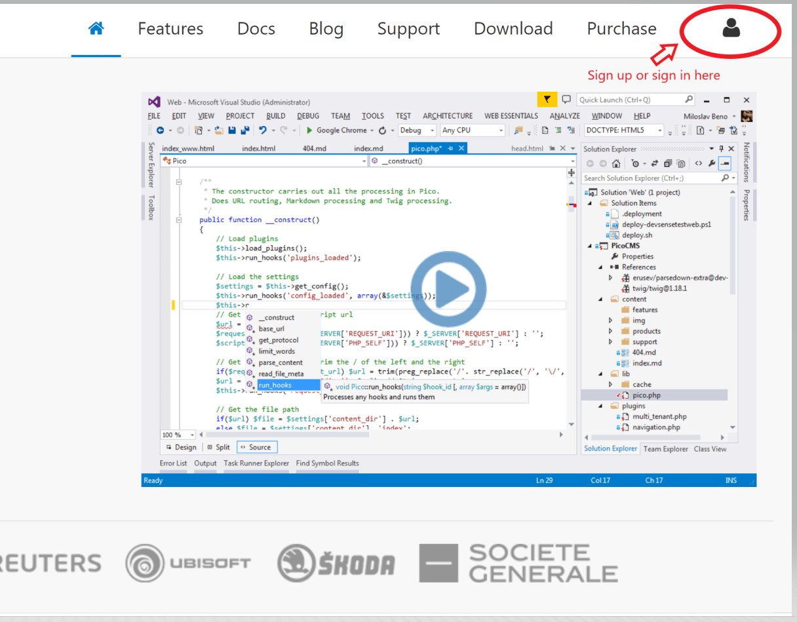

/*
Título: Preguntas Frecuentes (FAQ)
Descripción: Preguntas Frecuentes - Actualizaciones y Renovación
Plantilla: index_faq
*/

# Actualizaciones y Renovación 

## ¿Puedo renovar mi licencia antes de que expire?

Sí. Esta es la forma más conveniente de hacerlo: antes de que tu licencia expire.

- **Suscripciones anuales:** Renovar antes de la fecha de vencimiento extiende tu licencia 12 meses desde la fecha original de expiración.  
- **Suscripciones mensuales:** Puedes pagar el mes siguiente en cualquier momento antes de que termine el mes actual. Mantener **12 meses consecutivos** de pago te permite obtener automáticamente una **licencia perpetua** para la versión vigente 12 meses antes de completar los 12 meses consecutivos.

Renovar a tiempo garantiza acceso ininterrumpido a actualizaciones, soporte y mantiene el conteo de “meses consecutivos” cuando se trabaja para obtener la licencia perpetua.

## Licencia perpetua / Fallback

- **Compras anuales:** Al comprar una licencia de 1 año, conservas de forma permanente todas las versiones publicadas **hasta 12 meses antes del final de tu suscripción**.  
- **Compras mensuales:** Después de **12 meses consecutivos de suscripción activa**, conservas de forma permanente todas las versiones publicadas **hasta 12 meses antes de completar los 12 meses consecutivos**.  
- Para incluir versiones más recientes en tu licencia perpetua, solo debes **renovar tu suscripción**. Cada renovación extiende tu “cobertura perpetua” según la duración de tu suscripción.

> Esto asegura que tanto los suscriptores anuales como mensuales puedan construir un historial de licencia perpetua mientras mantienen la flexibilidad de un plan mensual.

## ¿Puedo renovar mi licencia después de que haya expirado?

Aunque no es recomendable, todavía hay un **período de gracia** para renovar la licencia.

- **Suscripciones anuales:** Hay un período de gracia de **3 meses** después de la expiración. Durante este tiempo, no podrás recibir actualizaciones gratuitas ni usar la última versión, salvo que renueves. Sin embargo, puedes usar la **versión de respaldo perpetua** — la versión publicada 12 meses antes de la expiración de la suscripción. Al finalizar el período de gracia, deberás comprar una nueva licencia.  
- **Suscripciones mensuales:** No hay un período de gracia separado; el acceso continúa hasta el final del último mes pagado. Si falla el pago mensual, la suscripción se interrumpe al final de ese período y deberás reanudar los pagos para recuperar el acceso.

*Nota:* Nuestro sistema siempre añade 12 meses a la **fecha de compra/expiración original**, **no a la fecha de renovación**.

## ¿Por cuánto tiempo es válido el precio de renovación?

- **Suscripciones anuales:** El precio de renovación es válido por un año desde la fecha de compra. Como cortesía, agregamos un **período de gracia de 3 meses** después de la expiración.  
- **Suscripciones mensuales:** La renovación es mes a mes; el precio se mantiene constante cada mes.

*Ejemplo:* Si compraste el 10 de agosto de 2025, la fecha de expiración será el 10 de agosto de 2026. Puedes renovar hasta el 10 de noviembre de 2026 (3 meses de gracia). Después de eso, deberás comprar una nueva licencia.

**Nota 1:** Durante el período de gracia, no podrás usar la última versión hasta que renueves.  
**Nota 2:** Si renuevas durante el período de gracia, la renovación seguirá sumando 12 meses desde la fecha de compra original, no desde la fecha de renovación.

`¡Consejo!` Puedes activar la **renovación automática** para evitar interrupciones.

## Explicación rápida sobre las renovaciones en nuestro sistema

El sistema añade 12 meses a la **fecha de compra**, no a la fecha de renovación. Después de la expiración, las licencias anuales tienen 3 meses de gracia. Las suscripciones mensuales continúan hasta el final del último mes pagado. Activar la renovación automática evita interrupciones.

## ¿Cómo sé si mi licencia está a punto de expirar?

Recibirás notificaciones por correo electrónico cuando la fecha de expiración esté cerca. También puedes iniciar sesión en nuestro sitio web y ver todas tus licencias y su estado.

Activar la renovación automática evita preocuparse por las fechas de expiración.

## ¿Debo renovar mi suscripción cada año?

Se recomienda renovar anualmente para recibir todas las correcciones, actualizaciones, la última versión y soporte para nuevas versiones de Visual Studio. Las suscripciones mensuales se renuevan automáticamente cada mes.

## ¿Debo comprar una nueva licencia si actualizo de un IDE a otro?

No, no es necesario. Sin embargo, tu licencia debe cubrir ese IDE. Solo necesitas una licencia para la versión de PHP Tools compatible con tu IDE.

## ¿Qué pasa si mi licencia expiró hace más de un año?

Lo que ocurre depende de tu tipo de suscripción y si obtuviste la **licencia perpetua**:

- **Suscripciones anuales:** Las versiones publicadas hasta 12 meses antes del final de tu suscripción son permanentes y puedes seguir usándolas.  
- **Suscripciones mensuales:** Si completaste **12 meses consecutivos**, las versiones hasta 12 meses antes del final del período de 12 meses son permanentes. Si no alcanzaste los 12 meses consecutivos, no obtienes licencia perpetua y deberás reanudar pagos para recuperar acceso.

Para usar la versión más reciente, necesitas una **suscripción activa**.  
Puedes [descargar](https://www.devsense.com/download) las versiones que te corresponden según tu licencia perpetua.
