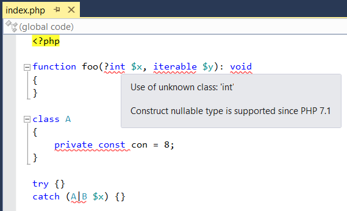
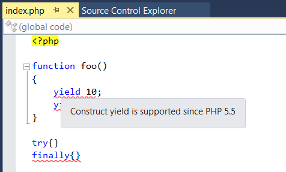

/*
Title: PHP Version Validation
Description: Validation of used constructs against current PHP version.
*/

# Validación de la versión de PHP

PHP Tools reporta los problemas de compatibilidad que se producen por funciones de otra versión de PHP diferente a la que se está utilizando en el proyecto en ese momento. Estos problemas son reportados como errores, ya que su uso causa que la ejecución del PHP se bloquee. 
PHP Tools reporta todos los problemas localizados en el código, aún cuando múltiples errores sean causados por un solo constructor, como en el ejemplo para PHP 7.0 más abajo.

Todos estos errores pueden ser reparados al actualizar a una nueva versión de PHP. Si esto no fuera posible, es necesario abstenerse de utilizar las nuevas funciones o la aplicación se bloqueará.

PHP Tools reporta los siguientes errores. Nótese que cada versión de PHP está acompañada por un ejemplo que muestra las funciones seleccionadas disponibles en la versión y cómo son reportadas cuando se utilizan versiones anteriores.

## PHP 7.1
- Tipo null. Un tipo es declarado _null_ utilizando el caracter '?', por ejemplo `function foo(?int $x) {}`.
- Catch de tipo múltiple. Una sentencia catch declarada con tipos de excepciones múltiples separados por el carácter '|'.
- Modificadores de visibilidad de constante de clase. Las constantes de clase declaradas `public`, `private` o `protected`.
- Tipos primitivos (`void`, `iterable`).

## PHP 7.0
- El operador de fusión de null  `??`. Este operador se utiliza para acceder valores _null_ o _unset_.
- El operador nave espacial `<=>`. Este operador compara dos valores.
- Clases anónimas. Una clase anónima es declarada directamente en una expresión, por ejemplo: `$x = new class($x) {}`.
- Declaraciones de _use_ en grupo. Una declaración en grupo de _use_ es utilizada para declarar alianzas múltiples con el mismo prefijo de espacio de nombres.
- Tipos escalares primitivos (`bool`, `float`, `int`, `string`).
- Declaraciones de tipo de devolución para funciones y métodos.
- Una delegación de generadores que utiliza `yield from` para llamar una función generadora, por ejemplo: `yield from foo();`.
- Clases nuevas: `IntlChar`, `Error`.
- Funciones nuevas: `intdiv`, `preg_replace_callback_array`, `random_bytes`, `random_int`.

## PHP 5.6
- Declaraciones de _use_ en grupo (funciones y constantes).
- Parámetros formales varíadicos declarados usando el prefijo `...`, por ejemplo, `function foo(...$x) {}`.
- Descifrar los parámetros reales con el prefijo `...` cuando se llama una función o método, por ejemplo, `foo(...$x);`.
- La expresión exponencial `**` y el operador de asignación exponencial `**=`.
- Expresiones constantes utilizadas para iniciar constantes.
- Funciones nuevas: `hash_equals`, `__debugInfo`.

## PHP 5.5
- Funciones generadoras que usan `yield` para devolver valores que pueden ser iterados.
- El bloque `finally` en el manejo de una excepción.
- Una lista iterada en un bucle  `foreach`.
- Un literal de tipo string y una expresión array hecha referencia, por ejemplo `$x = "hello"[3];`.

## PHP 5.4 y anteriores

PHP 5.4 es la versión más antigua de PHP compatible con PHP Tools y sus funciones están siempre disponibles.

## Tipos y funciones en desuso 

PHP Tools reporta tipos y funciones como obsoletas cuando se utilizan con versiones nuevas de PHP. Los tipos y funciones descontinuadas son reportadas por análisis previos. Únicamente los constructores disponibles, pero en desuso, son reportados acá. 
PHP Tools muestra la versión PHP donde el tipo o la función quedó obsoleta.

