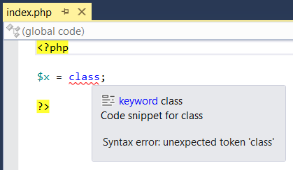

/*
Title: Validación de sintaxis
Description: PHP syntax validation.
*/

# Errores de sintaxis generales

Esta primera categoría contiene los errores fatales, debido a una sintaxis incorrecta.
Estos errores deben ser reparados antes de que el código pueda ser ejecutado.
A veces, algunos errores no permiten que el editor analice y resalte el código correctamente, ya que cambian considerablemente el significado del próximo código.

Estos errores pueden ser los más complejos, ya que generalmente requieren refactorizar el código.

PHP Tools reporta los siguientes errores:

- Un error de sintaxis - generalmente causado por un símbolo utilizado en un contexto incorrecto, como en esta muestra: `$x = class;`.
  - El sistema reporta el símbolo inesperado y su posición.
- Una declaración de _use_ duplicada - causada por declaraciones múltiples de _use_ que definen el mismo alias.
  - PHP Tools reconoce un conflicto hasta en las situaciones más complejas, como en la muestra más abajo.
  - Desde PHP 5.6, PHP Tools es compatible con los usos de constantes y funciones, mientras revisa también si hay duplicados.
  

- La sentencia __halt_compiler utilizada dentro de una función o un método.
  - La sentencia __halt_compiler puede ser utilizada únicamente en el código global (afuera de cualquier método o función).
- Una no-variable utilizada con un operador de incremento `++` o de reducción `--`, como por ejemplo `foo($x)++;`.
  - Este error puede ser solucionado al almacenar el valor en una variable y después se incrementa.
- Un estilo de declaración y espacio de nombres mezclado - ambos espacios de nombres utilizados en un mismo archivo (`namespace ns; ...` y `namespace ns { ... }`).
  - Para reparar este error se requiere que el archivo completo utilice una sola notación para el espacio de nombres.
- El desbordamiento de una constante integral- el valor es convertido al doble porque es demasiado grande para un integrador largo.
  - Este error indica que la constante integral es demasiado grande para un número integral y será guardada como el doble, perdiendo precisión.
- La palabra clave padre utilizada en una clase que no tiene una clase base (una clase que no tiene clase padre).
  - Este error indica un problema en la jerarquía, la clase no tiene padre o la palabra clave padre debe ser eliminada.

La siguiente imagen muestra un error de sintaxis simple, incluyendo la sugerencia que muestra PHP Tools. Todos los errores son resaltados y reportados de la misma manera.

