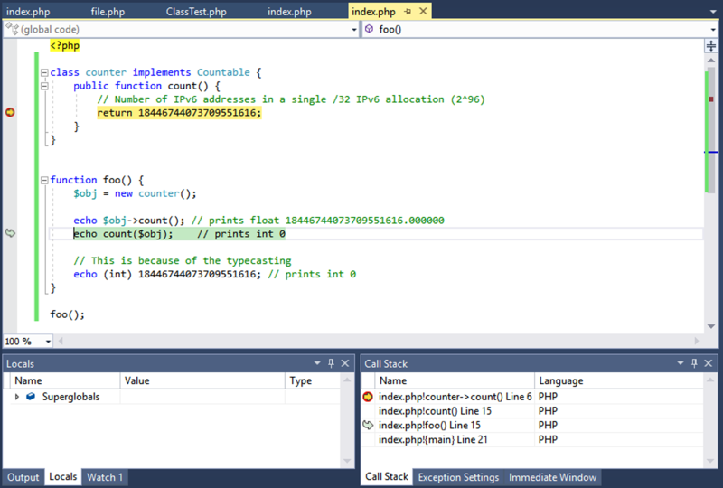

/*
Title: Pila de llamadas
Description: View the function calls that are currently on the stack
*/

# Pila de llamadas

La **Pila de llamadas** es muy útil cuando se inspecciona el [estado del programa](inspecting-data). Se pueden ver las llamadas a función que están actualmente en la pila, cambiar el contexto en el cual está depurando a otro marco de pila en la llamada de pila e inspeccionar el estado del programa en diferentes marcos.

La ventana **Pila de Llamadas** muestra el nombre de cada función y el lenguaje de programación en el cual está escrito (por ejemplo, PHP). El nombre de la función puede estar opcionalmente acompañado de información, como el nombre del archivo o el número de línea. Esta información adicional puede ser activada o desactivada.

Una flecha amarilla identifica el marco de pila donde el puntero de ejecución está ubicado actualmente. En la configuración estándar, éste es el marco cuya información aparece en el origen, **Variables locales**, **Inspección**, Ventana **Automático**.

> **Note**: Cambiar el marco no influirá la evaluación de la expresión, que siempre es evaluada con respecto al marco de pila.
