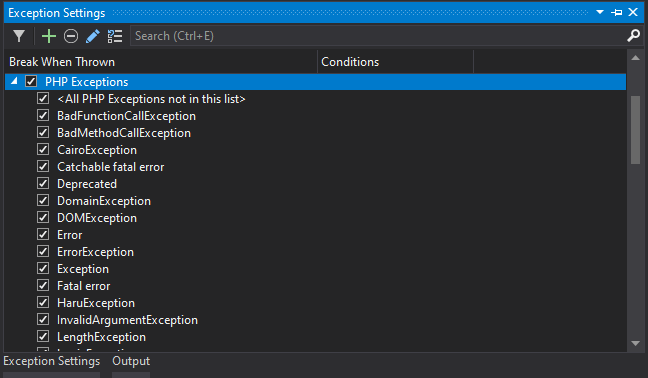
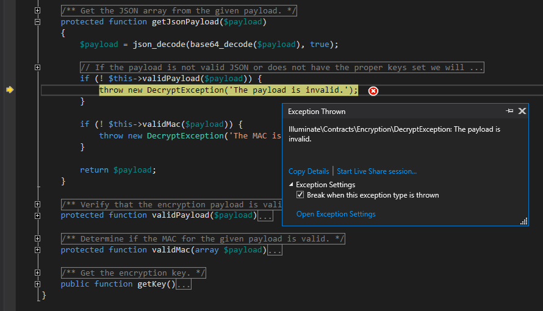
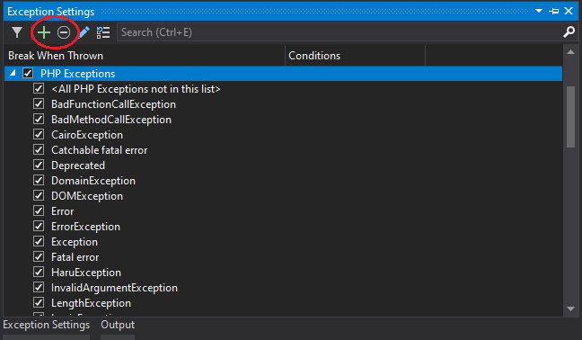
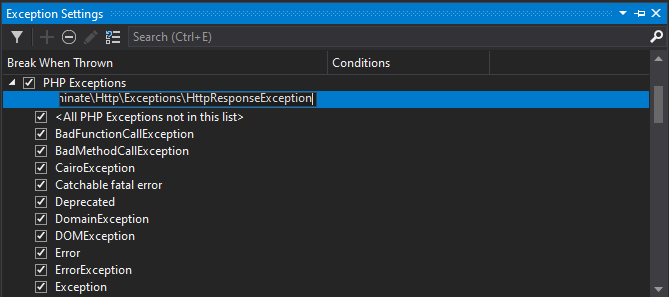

/*
Title: Exceptions or errors
Description: Break on exceptions or errors when they are thrown
*/

# Break on Exceptions or errors

PHP reports errors, warnings and notices when the program ends up in some unexpected state. Since PHP7 this error reporting is mostly reported by throwing an exception. 

PHP Tools for Visual Studio debugger handles both types of error handling – traditional PHP Errors and PHP Exceptions. 

## Break when an exception is thrown

You can instruct the debugger to break when the exception is thrown, which will allow you to [inspect the current state of the program](inspecting-data).  

With a PHP project opened, use `Debug | Windows | Exception Settings` to open the **Exception Settings** window. Find **PHP Exceptions** category and make sure the exception that you want to break on is checked. If the exception is not listed in Exception settings, check **<All PHP Exceptions not in this list>** item , or you can check the whole **PHP Exceptions**** category.

In the **Exception Settings** window you can also find **Error**, **Warning**, **Notice**, which are not exceptions but traditional PHP errors. These are not broken down further to specific errors. But you can enable/disable them as a whole category.

Then when you are debugging PHP program, Visual Studio will break when the exception is thrown in the same way as if a breakpoint was present at the location.

The exception handler dialog will present you the information about the exception, such as type of the exception and message. You can [inspect the program](inspecting-data), evaluate expressions, check the call stack, etc.

> **Note:** you can uncheck **Break when this exception type is thrown** directly in the exception handler and continue debugging (press <kbd>F5</kbd>). Visual Studio will add this exception type to the **Exception settings** and will remember that it shouldn’t break on this exception again.

## Add or delete exception in **Exception Settings**

**Exception settings** list just a few common exception types. It's likely you will not find the particular exception you want to break on in the list. You can either check **<All PHP Exceptions not in this list>** or choose the exception you want to break on.

Usually, it’s not necessary to explicitly add the exception to the list since you can decide in a lazy way what to do with the exception when it's first thrown. and the debugger can add it to the **Exception Settings** for you.

If you want to proactively add(or delete) the exception, in the **Exception Settings** window select **PHP Exceptions** category and click Add button(or delete button).

Fill the fully qualified exception name(including namespaces). Make sure the name is correct, the debugger doesn’t check if you’ve spelled the exception type correctly.

## Unhandled exceptions and fatal errors

When the exception is unhandled in user code and ends up being handled by PHP itself, it becomes unhandled and the program is terminated.

The debugger will always break when such an exception happens. This is qualified as a fatal error together with other errors which prevent the continuation of the script execution, E.g. parse error.

The inspection of the program state, in this case, does not work because the script is not running anymore. However, the debugger will show you the location where the exception has first occurred including the call stack.

If you want to inspect the program when an exception is first thrown you will need to make sure the debugger breaks on it when it's thrown.

## Common issues

**Stepping through code works, but PHP exceptions are not thrown in Visual Studio**

Check your `php.ini` for `xdebug.default_enable directive` and make sure it is set to `1` (this is a default value).
