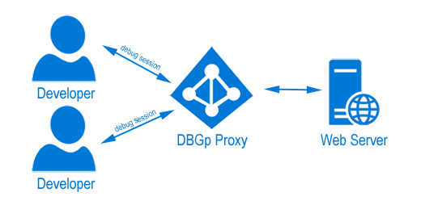
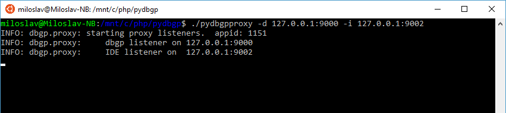
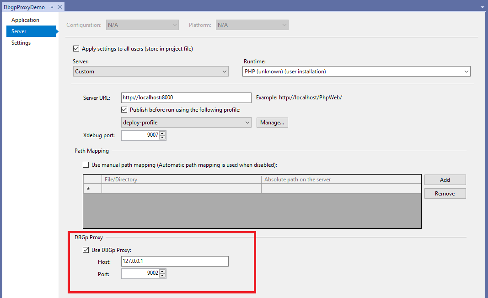
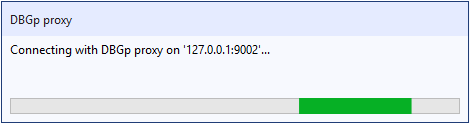
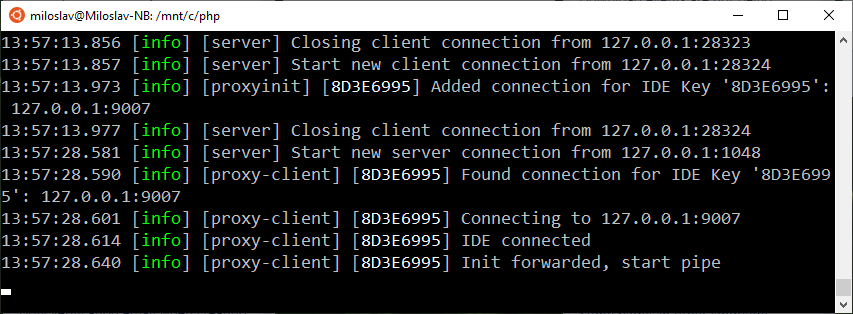
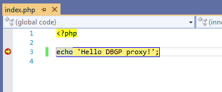

/*
Title: Multi-user debugging
Description: Debugging PHP with multiple users 
*/

# Multi-user debugging

When you want to debug PHP application remotely on one server you need to setup php to connect back to your computer. You do it by setting `xdebug.remote_host` to your IP address. 

The situation gets more complicated when team of programmers needs to debug the same application which runs on just this web server.

Xdebug doesn't allow to set more than one IP address to connect to. One option is to set `xdebug.remote_connect_back`. But this is not recommended, because it opens possibility for anyone to debug your application.

The solution is to use DBGp* proxy. Each developer from the team connects to the proxy and when debug session is initiated Xdebug connects to the proxy and sends the connection to the right IP address.



## Configuration

### STEP 1 -  Download and install DBGp proxy

1. Go to [Komodo's remode debugging package downloads](http://code.activestate.com/komodo/remotedebugging/) and get python remote debugging client for the operating system where you want to run the proxy.

2. Place the proxy on the web server, or any machine that is accessible by both the web server and developers.

3. The proxy is written in python, so make sure you have it installed.

4. Start the proxy with `-d` argument specifing the IP for Xdebug to connect to and `-i` port where the IDE is going to contact the proxy.



> **Tip:**
>
>If you run the proxy and you receive this mistake:
>
> ```
> Traceback (most recent call last):
> File "./pydbgpproxy", line 106, in <module>
>   import dbgp.serverBase
> ImportError: No module named dbgp.serverBase
> ```
> You can fixed it by executing this command:
>
>`echo "export PYTHONPATH=\${PYTHONPATH}:/mnt/c/pydbgp/pythonlib" » ~/.bashrc`


### STEP 2 - Ensure Xdebug is installed and configured on the server

On the server open `php.ini` and make sure Xdebug is configured in a way that `remote_host` points to IP address of the proxy. 

In the following case the proxy is on the same machine as web server, therefore `xdebug.remote_host = 127.0.0.1`. `zend_extension` points to the location of dll, because it's Windows server. In Linux case it would be `so` file.

```
[XDEBUG]
zend_extension="C:\Program Files (x86)\PHP\v7.0\ext\php_xdebug.dll"
xdebug.remote_enable = on
xdebug.remote_handler = dbgp
xdebug.remote_host = 127.0.0.1
xdebug.remote_port = 9000
```

3.) Configure PHP Tools to use DBGp proxy server

1. Navigate to project properties (right click on project node in **Solution Explorer**, choose properties)

2. Select Server tab and enable `Use DBGp proxy` command

3. Fill the host and port where the proxy is listening. In the screenshot bellow the host is configured to point to proxy located on the same machine. In most cases this will point out to a remote server.



4.) Start the debug session <kbd>F5</kbd>

PHP Tools will try to connect to DBGp proxy and register there to receive debug sessions

> Note:
> Typically IDE wants developer to choose IDE key. This is used by proxy to identify which developer is 
> executing the request and sending the debug session to the correct machine. PHP Tools selects the IDE key 
> automatically.



On the DBGp proxy output you can see sucessful connection from developer



In Visual Studio the debug session has been activated and breakpoint was hit




