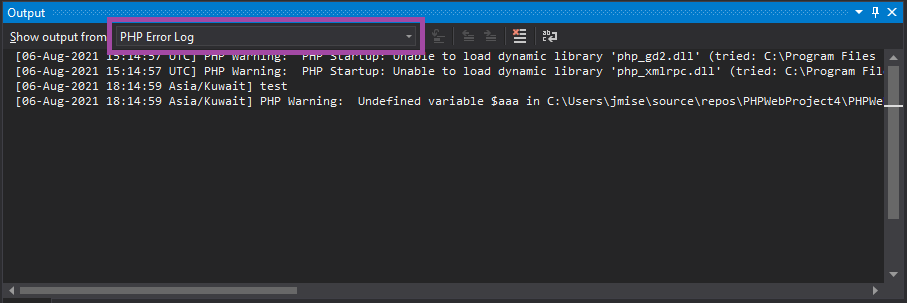
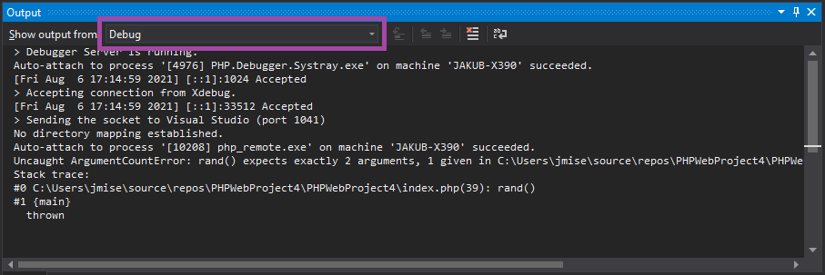

/*
Title: Output Window
Description: Using Output Window during debugging
*/

# Output Window

Visual Studio *Output Window* is used for various logging and informational messages.

*Output Window* can be opened from the Visual Studio menu `View` | `Output`.

## PHP Error Log

- builtin web server

## Debugger log

