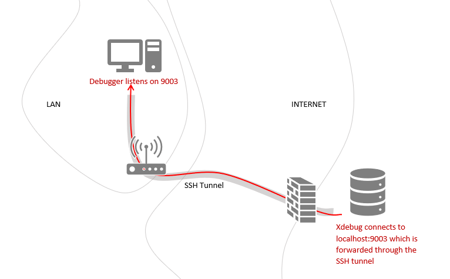

/*
Title: Remote Debugging via SSH Tunnel
Description: Configuring project to debug on a remote server via SSH Tunnel
*/

When you are on a different network than the server with a PHP application that you need to debug, you might have a problem. Xdebug from the remote server can't directly connect to your machine through all the firewalls, NAT routers or other network infrastructure. That makes PHP remote debugging impossible. Or does it?

One option would be to install a DBGp server on the network with the development server, but your administrator might rather watch cat videos than do this. Another solution is to use an SSH tunnel (or port forwarding).



## Open SSH Tunnel

For this solution to work, there is an obvious requirement. The server has to have an SSH server running and you must be able to login into it with an SSH client. If you are running Windows 10 you should have `ssh` command. If not, you can [install it](https://docs.microsoft.com/en-us/windows-server/administration/openssh/openssh_install_firstuse). If you are, however, running older Windows you'll need to install [Putty](https://www.chiark.greenend.org.uk/~sgtatham/putty/latest.html).

Assuming you are on Windows 10, open a command prompt and run this command:

```bash
ssh -R 9003:localhost:9003 devsense@ubuntu
```

This command opens an SSH session to the `ubuntu` server and logins with `devsense` account (replace with your login and server). The `-R` option instructs the SSH client to forward port `9003` from a remote machine to `localhost:9003` where PHP Tools Debugger will be listening.


When you are logged in, you can optionally check if the SSH tunnel is in place. Run `netstat -a -n | grep 9003`. You should see similar output as on the image above.

## Configure Xdebug on the server

SSH Tunnel takes care of forwarding the Xdebug connections from the remote server to your machine. But make sure to configure Xdebug on the server.

### Xdebug 2

```ini
[XDEBUG]
zend_extension = PATH_TO_XDEBUG_EXTENSION
xdebug.remote_enable = on
xdebug.remote_handler = dbgp
xdebug.remote_host = 127.0.0.1
xdebug.remote_port = 9003
xdebug.remote_mode = req
xdebug.idekey="php-vs"
```

### Xdebug 3

```ini
[XDEBUG]
zend_extension= PATH_TO_XDEBUG_EXTENSION
xdebug.mode = debug
xdebug.client_host = 127.0.0.1
xdebug.client_port = 9003
xdebug.start_with_request=trigger
```

## Configure PHP Project

Back on your machine, configure the PHP project. This part is identical to a regular [remote debugging](remote-debug) configuration.

- Open or [create a new PHP project](../project/new-project)
- Go to `Project / Properties`, and switch to `Server` tab
- Fill `Server URL` and `Xdebug port`.
- If you need to, provide a path mapping. But in simple cases, the debugger should figure it out on its own.
- Save the project properties


Now when you run the project (press <kbd>F5</kbd>) the debugging should work as usual:

