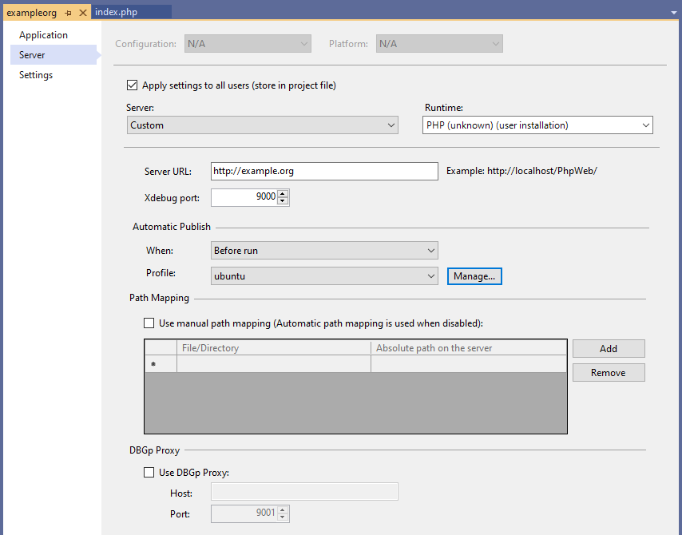

/*
Title: Remote Debugging
Description: Configuring project to debug on a remote server
*/

# Remote debug

In case the PHP code is running on a remote server (on any platform), it is still possible to debug it inside local Visual Studio. This option is available in the PHP project properties, under the Server tab.

## Configure Remote Debug

Go to `Project / Properties`, and switch to `Server` tab, as depicted on the screenshot below.

Under the `Server` drop down list, choose the `Custom` option. And fill in the following fields:

- **Server URL:** is the full public URL where the remote server hosts the PHP application.
- **Xdebug port:** matches the configured Xdebug port number (aka "remote port" or "client port"). Xdebug (the debugging extension installed on the remote server) will contact Visual Studio on this port number. See [configuring Xdebug](configuring-xdebug) for more details.
- **Path Mapping** is _optional_ set of directories mapping paths on the remote computer to the corresponding paths on the local computer. This allows convenient debugging of the remote code locally. If it's not set, it will be determined automatically.
- **DBGp Proxy** is standard proxy configuration allowing more developers debugging the same remote project. Configure the values according your proxy. See [multi-user debugging](multi-user) for more details. Note, the DBGp Proxy key gets generated automatically based on user's name or their computer' name.

## Starting the debug

Once the project is configured to debug using custom server, initiate the debugging in a standard way - either press `F5` or go to `Debug / Run`. The server URL gets opened in the browser.

## Optional - Automatic publish

Usually the project is developed locally and deployed on the remote server. For this purpose configure the **Automatic Publish** section of the project properties. This allows to continuously upload the locally modified filed over to the remote server upon starting the debug session.

## Troubleshooting

Please watch Visual Studio' Output pane for details. Every important step or error gets logged there. This might help you to get additional information.
