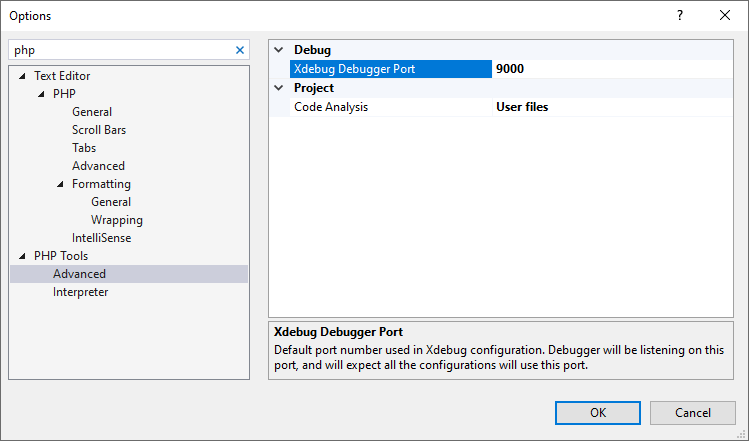

/*
Title: Solución de problemas
Description: Troubleshoot most common issues with debugging PHP code in Visual Studio
*/

# Solución de problemas

Esta lista muestra los problemas más comunes con el depurador y sus soluciones para resolver dificultades rápidamente. En el caso de que no pudiera conseguir una solución acá, por favor, utilice nuestro [Foro de soporte técnico](http://support.devsense.com).

## Lista de comprobación

- Ejecute el siguiente script:
```php
<?php phpinfo(); ?>
 ``` 
 
 Verifique si la extensión **Xdebug** está cargada. La salida correcta se puede apreciar en la siguiente imagen:


- Asegúrese de que  `xdebug.remote_port` en `php.ini` es igual a los ajustes de su Visual Studio (`Herramientas | Opciones | PHP Tools | Avanzado`). 

```
zend_extension="C:\Program Files\IIS Express\PHP\v7.0\ext\php_xdebug.dll"
xdebug.remote_enable = on
xdebug.remote_handler = dbgp
xdebug.remote_host = 127.0.0.1
xdebug.remote_port = 9000
xdebug.remote_mode = req
```



- Si tenga Xdebug 3, tu configuracion es differente:
  
```
zend_extension="C:\Program Files\IIS Express\PHP\v7.4\ext\php_xdebug.dll"
xdebug.mode=debug
xdebug.client_host = 127.0.0.1
xdebug.client_port = 9003
xdebug.start_with_request = trigger
```

- Asegúrese de que la directive **PHP Web Project**, en **ASP.NET Web Site**. Puede [Crear un proyecto a partir de archivos de código fuente existentes](https://docs.microsoft.com/es-es/previous-versions/visualstudio/visual-studio-2013/754c3hy7(v=vs.120)).

## Utilizar un servidor WAMP

WAMP instala su propia configuración de PHP. Para utilizar la instalación de WAMP con PHP Tools, configure el servidor personalizado en las propiedades del proyecto y asegúrese de que el `php.ini` que corresponde a su servidor WAMP está configurado apropiadamente. PHP Tools no verifica el `php.ini` en la instalación WAMP.

## Problemas comunes y sus soluciones

### El navegador abre una página en blanco

Asegúrese de que la primera página cargada esté libre de errores y que no haya dos funciones con el mismo nombre. El depurador no admite errores de análisis en el script inicial.

### En la ventana de salida aparece el siguiente mensaje: “No se estableció ninguna asignación de directorio. El depurador probablemente no funcione correctamente.”

Asegúrese de que el archivo que solicita como el primero está incluido en su proyecto. El mecanismo automático de asignación requiere que el archivo sea parte del proyecto para poder asignarlo correctamente.

### No puedo hacer que el depurador funcione. Estoy ejecutando Zend Framework. ¿Es éste un problema conocido?

No, pero hay un par de cosas que deben estar configuradas para poder depurar la aplicación Zend Framework con Xdebug:

Asegúrese de que ZendExtensionManager cargue después del **Xdebug** (cambie el orden en `php.ini`); o descoméntelo completamente.
Apague zend_optimizer.

### Al utilizar la Inspección rápida, Inspección o Ventana Inmediato, la depuración deja de funcionar.

Existe un problema conocido con **Xdebug** que causa que las sesiones de depuración dejen de funcionar para la solicitud actual. Tiene que utilizar la función `set_error_handler()` para conseguir los errores y utilizar Inspección rápida, Inspección o Ventana Inmediato para evaluar la expresión que está causando el error. Esta combinación hace que **Xdebug** no se pueda utilizar para el resto de la solicitud.

Para solucionar esto, recomendamos no llamar `set_error_handler()` en su código cuando está depurando. 

Más información en [xdebug.org/docs/faq](http://xdebug.org/docs/faq) (únicamente en inglés).

### “El desplazamiento por el código funciona, pero las excepciones no se producen en Visual Studio”

Verifique su `php.ini` para `xdebug.default_enable directive` y asegúrese de que está ajustado a 1 (éste es un valor predeterminado).

### “El depurador no funciona cuando 'No abra ninguna página. Espere por la solicitud de una aplicación externa' está establecido en los ajustes del proyecto”

El problema tiene que ver con que **Xdebug** está esperando una cadena de inicialización GET que sea suministrada en la solicitud URL. La solución de este problema puede ser instruir a Xdebug a comenzar la sesión de depuración al abrir el proyecto en su navegador con la cadena de consulta `?XDEBUG_SESSION_START=1` o añadir: 

```
xdebug.remote_autostart = 1
```

O para Xdebug 3:

```
xdebug.start_with_request=yes
```

al archivo `php.ini` en la sección de configuración de **Xdebug** lo que lo forzará a iniciar en cada solicitud.
