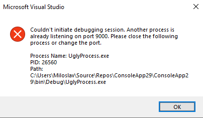

/*
Title: Troubleshooting
Description: Troubleshoot most common issues with debugging PHP code in Visual Studio
*/

# Troubleshooting

This list shows common issues with the debugger and their solutions, so you can solve problems quickly. In case you could not find an answer here, please feel free to ask on our [Support forum](https://community.devsense.com).

> **Note** This guide is mainly useful if you are configuring PHP yourself. Many of the following issues are automatically validated by **PHP Tools for Visual Studio**

## Checklist

- Run the following script:
```php
<?php phpinfo(); ?>
 ``` 
 
- Check whether **Xdebug** extension is loaded as `zend_extension`. If it's loaded as a regular extension, you would see a warning **XDEBUG NOT LOADED AS ZEND EXTENSION** in the `phpinfo()` output. In that case open your `php.ini` and change `extension=PATH_TO_XDEBUG\xdebug.dll` to `zend_extension=PATH_TO_XDEBUG\xdebug.dll`. 

 The correct output is depicted bellow:


 > **Note:** Loading Xdebug as a regular extension will result in anomalous behaviour. `phpinfo` will show that Xdebug is enabled (there might be warning which can be missed, or in older versions warning is absent). Xdebug log would show that it's connecting and communicating correctly with IDE, but instead of breaking, the script runs and then debugging stops.

- Ensure `xdebug.remote_port` directive in `php.ini` is matching the settings in your Visual Studio (`Tools | Options | PHP Tools | Advanced`). 
  
```ini
zend_extension = "C:\Program Files\IIS Express\PHP\v7.0\ext\php_xdebug.dll"
xdebug.remote_enable = on
xdebug.remote_handler = dbgp
xdebug.remote_host = 127.0.0.1
xdebug.remote_port = 9000
xdebug.remote_mode = req
```


- If you have Xdebug 3, your configuration options are different
  
```ini
zend_extension = "C:\Program Files\IIS Express\PHP\v7.4\ext\php_xdebug.dll"
xdebug.mode = debug
xdebug.client_host = 127.0.0.1
xdebug.client_port = 9003
xdebug.start_with_request = trigger
```

- Ensure you are using a **PHP Web Project**, not an **ASP.NET Web Site**. You can [convert web to the PHP project from menu](Project/from-existing-code).

## Using WAMP Server

WAMP setup installs its own PHP configuration. To use WAMP installation with PHP Tools, set up Custom Server in your project properties and ensure `php.ini` corresponding to your WAMP server is configured properly. PHP Tools does not check `php.ini` in WAMP installation.

## Most Common Issues

### Browser Opens an Empty White Page

Ensure that your first loaded page is syntax-error-free, and that there are not two functions with the same name. The debugger does not handle parse error on the entering script.

### I get this message in the output window: "There wasn't established any directory mapping. Debugging most likely won't work correctly."

Make sure the file you are requesting as the first one is included in your project. Automatic mapping mechanism requires that a file is part of the project in order to map it correctly.

### I can't get the debugger to work. I'm running Zend Framework. Is that a known issue?

No, there are just a few things that have to be configured in order to be able to debug the Zend framework application with Xdebug:

Make sure ZendExtensionManager loads after **Xdebug** (switch the order in `php.ini`); or comment it out completely.
Turn off zend_optimizer.

### While using QuickWatch, Watch or Immediate window, debugging stops working

There is a known issue with **Xdebug** causing debugging sessions to stop working for the current request. You have to use `set_error_handler()` function to catch errors and to use QuickWatch, Watch or Immediate window to evaluate an expression throwing an error. This combination makes **Xdebug** unusable for the rest of the request.

As a workaround, it is recommended not to call `set_error_handler()` in your code when debugging. 

More at [xdebug.org/docs/faq](http://xdebug.org/docs/faq).

### "Stepping through code works, but PHP exceptions are not thrown in Visual Studio"

Check your `php.ini` for `xdebug.default_enable` directive and make sure it is set to `1` (this is a default value).

### "Debugger won't work when 'Don't open a page. Wait for a request from an external application' is set in the project settings."

The problem has to do with the fact that **Xdebug** is expecting a GET initialization string to be supplied in the URL request. The solution to this problem would be to instruct Xdebug to start the debug session by opening your project in your browser with `?XDEBUG_SESSION_START=1` query string or add 

```ini
xdebug.remote_autostart = 1
```

or for Xdebug 3:

```ini
xdebug.start_with_request=yes
```

to `php.ini` file in the **Xdebug** configuration section which will force it to start on every request.

### The debug session started, but breakpoints do not break

One of the most common reasons is that Xdebug port is being used by 3rd party application (e.g. HP tools). You can either change Xdebug port or close the application.

Since version `1.32.11685` you will be able to see what process is holding the port directly in Visual Studio.



## Collecting Xdebug logs

When determining the issue related to debugging it's useful to collect logs directly from **Xdebug**

Open `php.ini` file in the **Xdebug** configuration section and add 

 - Xdebug 2:
 `xdebug.remote_log="path_to_log/xdebug.log"`

 - Xdebug 3:
 `xdebug.log="path_to_log/xdebug.log"`

The log file contains all the comunication of Xdebug with IDE.

```
[1222] Log opened at 2021-08-23 15:55:55.265278
[1222] [Step Debug] INFO: Connecting to configured address/port: 192.168.0.103:9003.
[1222] [Step Debug] INFO: Connected to debugging client: 192.168.0.103:9003 (through xdebug.client_host/xdebug.client_port). :-)
[1222] [Step Debug] -> <init xmlns="urn:debugger_protocol_v1" xmlns:xdebug="https://xdebug.org/dbgp/xdebug" fileuri="file:///var/www/html/phpinfo.php" language="PHP" xdebug:language_version="7.2.24-0ubuntu0.18.04.8" protocol_version="1.0" appid="1222" idekey="D69FE4EA"><engine version="3.0.4"><![CDATA[Xdebug]]></engine><author><![CDATA[Derick Rethans]]></author><url><![CDATA[https://xdebug.org]]></url><copyright><![CDATA[Copyright (c) 2002-2021 by Derick Rethans]]></copyright></init>
```

When the log is no longer necessary, turn it off. It slows the debugger and it might grow significantly over time.
