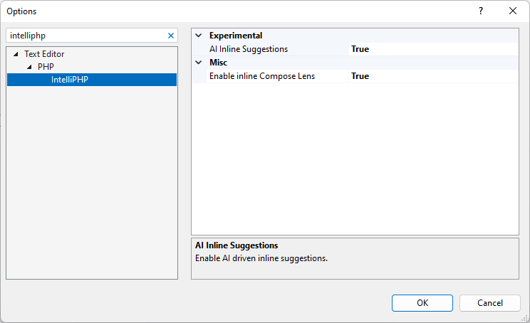

/*
Title: IntelliPHP
Description: AI Autocomplete for PHP
*/

# IntelliPHP - AI Autocomplete for PHP

IntelliPHP is an advanced AI-assisted development tool specifically tailored for PHP programmers. Just like its counterpart **IntelliCode**, IntelliPHP harnesses the power of machine learning to understand PHP code and provide context-aware suggestions. Unlike GitHub Copilot, IntelliPHP operates entirely locally, ensuring that code remains secure and private within their own development environments.

The primary aim of IntelliPHP is to save developers time spent in typing code. It's designed to offer suggestions ranging from short and highly likely suggestions up to whole lines of code. The model has been trained in-house on vast repositories of PHP code, making it adept at providing accurate and relevant suggestions tailored to PHP development.

## Installation and Setup

IntelliPHP seamlessly integrates with Visual Studio 2022, enhancing your PHP development experience. To get started, follow these simple steps:

1. **Prerequisites:** Ensure you have Visual Studio 2022 installed on your system.

2. **Download and Install IntelliPHP:** IntelliPHP is part of PHP Tools for Visual Studio extension which you can download [HERE](https://www.devsense.com/en/download) or directly from Visual Studio in `Tools | Extensions` menu.

3. **Configuration:** IntelliPHP is enabled by default starting from version `1.74`. If needed, you turn it on or off when you go to `Tools | Options | Text Editor | PHP | IntelliPHP`.

## Features

IntelliPHP is designed to save you time and boost your productivity. Here are some of its key features:

- **AI Auto-completion:** Enjoy context-aware auto-completion suggestions as you type your PHP code.
- **Code Snippets:** IntelliPHP provides code snippets and whole lines of code to streamline your development process.
- **Framework Support:** Whether you're using Laravel, Symfony, or any other PHP frameworks, IntelliPHP has you covered.
- **Local:** IntelliPHP operates locally, no code leaves your machine EVER.
- **Speed:** IntelliPHP was designed to run efficiently on CPU, no GPU is required! The suggestions are returned without any latency penalty caused by the network.

## Accepting suggestions

When IntelliPHP offers a suggestion, you can effortlessly incorporate it into your code:

**Accepting Suggestions:** Simply press <kbd>TAB</kbd> to accept a suggestion. If you've already partially typed a suggestion, the first <kbd>TAB</kbd> will complete the first part, and a second <kbd>TAB</kbd> will finish the rest.

**Continuous Typing:** If a suggestion isn't what you need, continue typing, and the suggestion will disappear. A new one might appear if it's a better fit for your code.

## Troubleshooting

Encountering issues? Please let us know at [community.devsense.com](https://community.devsense.com)
