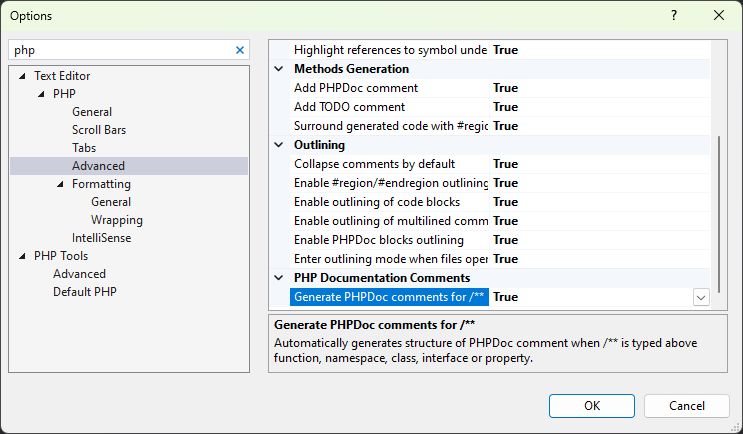
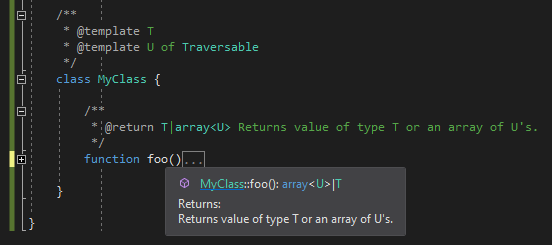
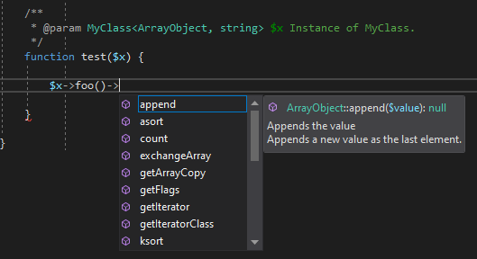

/*
Title: PHPDoc Comments
Description: PHPDoc syntax and features
Version: 1.64 and higher
*/

# PHP Documentary Comments (PHPDoc)

PHPDoc is a standard way of documenting and annotating the PHP code. It is a well-known format of block comments prefixed with `/**` characters, and it is used to annotate functions, classes, properties, and also local variables. With PHPDoc it is possible to provide documentation, additional type information, and other information for the editor.

## Example

A regular PHPDoc comment looks like the following (in case of a function documentation):

```php
/**
 * A short description.
 * @param array<int> $a A parameter summary.
 * @return int A return value summary.
 */
function foo($a) { ... }
```

In this case it would be placed right above the function declaration in the PHP code. The editor would provide a short description whenever it provides `foo` code completion, and it would treat the function as it accepts one argument of type array of integers, and returning a value of type integer.

## Generate PHPDoc

The PHP Editor automatically generates corresponding PHPDoc stub upon typing `/**`. This works above functions, classes, interfaces, traits, properties, and constant declarations.

Place caret above function, class, namespace, property, or constant declaration. Type `/**` and the corresponding PHPDoc block will be generated. The PHP Tools Editor also infers the types and possible exceptions being thrown by the function, so it gets annotated as well.


The PHPDoc is inserted as a code snippet with placeholders. Missing information can be filled in. To jump between fields, press `TAB`.

### Options

This behavior can be turned off or on (it is *on* by default) in the Visual Studio's Options window (Tools / Options), in Text Editor / PHP / Advanced, the option `Generate PHPDoc comments for /**`.



### Completing PHPDoc Tags

The PHP Tools Editor provides completion and snippets for PHPDoc tags as well. Place the caret inside PHPDoc block and either type `@` or press `Ctrl+Space`. 


Complete the tag with `TAB` to insert it as a full snippet, or just confirm the selection to insert the tag name.

## Documentation

The text inside the PHPDoc is used for documentation purposes. It can be one or more lines of text. It will be available in quick tool tips, in signature help, or in code completion tool tips.


> The quick tool tip above shows information from the corresponding PHPDoc comment.

### Excluding from IntelliSense

In some cases, the function represents a dummy declaration and is not supposed to be used by developers or being seen in IntelliSense at all. Use `@ignore` PHPDoc tag to annotate such function.

```php
/** @ignore */
function a_dummy_function() { ... }
```

> Example of a function that won't be listed in IntelliSense.

## Type Annotations

There are several PHPDoc tags that may be used to annotate the function parameters, function return value, property type, constant type, or a variable type. The standard PHPDoc tags are the following:

- `@param`: specifies the parameter type and description in the form: `@param (type) ($name) (description)`.
- `@return`: provides information about the return value in the form: `@return (type) (description)`.
- `@var`: allows to annotate properties, constants, class constants: `@var (type) (description)`.
- `@global`: annotates global variables within the current scope: `@global (type) ($name) (description)`.

In order to annotate a local variable, the `@var` tag is used:

```php
    /**
     * @var MyClass $x The local variable referring to my class.
     */
    $x = do_something();
```

The annotation can be placed on a single line as well:

```php
    /** @var MyClass $x */
```

Or the variable name can be omitted completely if it can be inferred from the statement below it:

```php
    /** @var MyClass */
    $x = do_something(); // <-- the editor will know that $x will be MyClass.
```

### Generics

The editor understands generic type annotations (also known as templates).

The class/function with template type arguments is annotated with `@template` PHPDoc tag, optionaly specifying the template type constrain:



Notice, the tooltip for class `MyClass` shows the template arguments as well. The type constrain `Traversable` is used whenever the type `U` is not bound (whenever the editor does not know the actual assigned type), so it can provide code analytics and code completion.

In order to use the template type arguments, specify them as any other type within PHPDoc.



Notice, the editor will substitute `T` with `ArrayObject` and `U` with `string`. This results in working code completion, and the editor will properly provides completion after `foo()` which is expected to return either `ArrayObject` or `array<string>`.

### Psalm/PHPStan

The 3rd party code linters like *Psalm* or *PHPStan* introduce extended PHPDoc type annotations. Those are supported by the PHP Tools Editor as well. Types can be specified in various forms including:

- `callable(mixed...):(Option<T>)`
- `array<int, mixed>`
- `array-key`
- `non-empty-string`
- `class-name`

The editor respects those annotations but may not take the full advantage of them (yet).

## Class Annotations

There are several PHPDoc tag specific to class/interface declartion.

- `@extends` allows to describe the base class name including its generic type arguments. Example: `@extends ArrayObject<int, MyUser>`
- `@implements` allows to describe an implemented interface with its generic type arguments. Example: `@implements Iterable<int>`
- `@use` is used above a trait use to describe its generic type arguments.
- `@method` declares a method in case the class provides dynamic methods through magic `__call()` function. This information is used by the code completion to provide this additional method in the list.
- `@property` similarly to `@method` allows to define a dynamic property.

## Code Validation

The PHPDoc is validated for valid type names, valid tag names, and common typos.


For the quick fixes there are same rules as for the PHP code; invalid type names may get completed namespace. In case the type name is ambiguous or needs to get fully qualified, the `\` prefix may get inserted by the code completion or by the quick fix.

## Formatting

The PHPDoc comment block is formatted according to the statement below which it corresponds with. The block is formatted according to standards, indented.

## See Also

- [Code Completion](code-completion)
