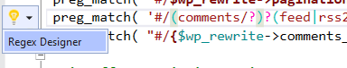

/*
Title: Regular Expressions
Description: Highlighting and editing regular expression (PCRE)
Version: 1.52 and higher
*/

>> Reguires Visual Studio 2019 or higher

Perl Compatible Regular Expressions (PCRE) are integral part of most PHP applications. PHP Tools for Visual Studio 2019 introduces features making the editing and testing regular expressions easier. The features are the following:

- colorization of the expression
- highlighting of matching parentheses
- validation and error reporting
- separate `Regex Tool Window` which highlights expression, updates the regex expression in corresponding PHP code, shows regex groups, allows to test the regex with a test subject and see all the matches, matched groups, and matched captures.

## Colorization

The regular expression syntax is highlighted, as well as matching braces. The color scheme is a part of Visual Studio, and it can be changed in Visual Studio's menu `Tools` / `Options` / `Fonts and Colors`.

The color scheme is adapted for both the light, blue, and dark themes.

> **Note:** the colorization works for string literals that do not contain any variables, and are a part of preg_*** function calls. The colorization also works for HEREDOC and NOWDOC syntaxes, if they are introduced with either REGEX, PCRE, or PREG labels. All the following syntaxes work:

## Regex Tool Window

For detailed analysis of the regular expression and eventual testing, there is **Regex Tool Window**. The tool window is opened using a code action **`Regex Designer`**. Navigate the keyboard caret at some regular expression, open code actions (usually `Ctrl`+`.`), and choose `Regex Designer`.

The command opens the *Regex Tool Window* that gets *linked* with the source code. It allows to edit the regular expression without dealing with PHP string escaping, and transparently updates the source code with the edited text.

The tool window is divided into 3 parts:

- **The actual regular expression** is the raw regular expression, it can be edited, shows eventual errors by underlining them, and updates the original source code.
- **Output** shows the groups of the regular expression. In case there is a test subject (below) it shows all the matches, matched groups, and single captures.
- **Test Subject** allows to test the regular expression. If it matches, the **Output** pane shows the matched portions of the text.

