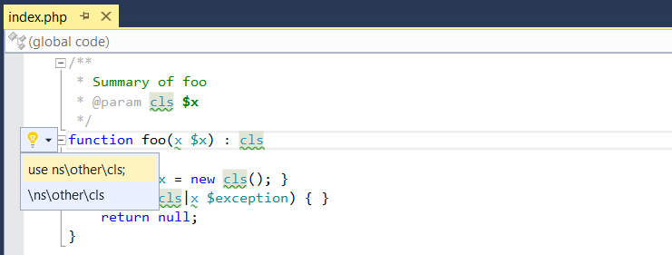

/*
Title: Suggestions
Description: Code suggestions.
*/

# Suggestions

The suggestions feature provides users with tips and constructs that improve code structure, readability or efficiency. PHP Tools provide the suggestions in situations, where the code is suspected to be invalid or where refactoring options are available.

The suggestions are provided as `Light Bulb Suggestions`, in the Visual Studio 2015 and newer, or as `Smart Tags`, in older supported versions of the Visual Studio. Suggestions are available when a light bulb icon is shown on the left margin next to the selected line (or when an arrow is next to the caret in the case of Smart Tags). The following image shows the suggestions displayed for an unknown type.

## Available Suggestions

PHP Tools provides suggestions for refactoring, code generation, and for fixing common issues such as an unknown type. The available code suggestion is displayed on the left margin of the text editor.

### Refactoring

PHP Tools provides refactoring suggestions whenever the system can help restructure a code. Currently supported suggestions are:

- **Rename identifier**: Whenever an identifier name is changed, PHP Tools offers to change all the references to that identifier (variable uses, function call, etc.). There is an option to *Rename* and to *Rename with Preview*.
- **Implement interface**: When a class implements an interface, PHP Tools offers to create empty implementation of the interface methods.
- **Implement abstract methods**: Similar to the interface implementation but for base class with abstract methods.
- Add missing **`$this->`** before an unknown function call that is actually a current class's method.
- **Generate constructor**: allows to create a *__construct()* method, either empty or with stub initializing all the class's properties.
- **Sort Uses**: sorts the `use` statements alphabetically. The sort respects comments on the same line, and comments before the `use` statement.
- **Getter/Setter**: quickly creates a getter method, a setter method, or both for selected class property. The method gets annotated with property type and description.

### Code fixes

PHP Tools provides suggestions for unknown types that are not properly referenced in the code but are defined in the project.
These suggestions help correctly reference a type that is defined but is used without a use declaration or proper qualification.
Currently supported suggestions for unknown types are:

- Add use declaration.
  - Add a use declaration that will make the type known as it is currently written. For example the class `A\B\C` referenced as `C` would require `use A\B\C;`.
- Add full qualification.
  - Replace the current type name with its fully qualified version. For example, `C` would be replaced with `\A\B\C`.
- Add short name.
  - This suggestion is similar to the full qualification, but it takes into account existing use declarations and locates the shortest known name of the type.
