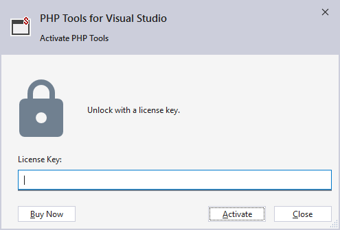
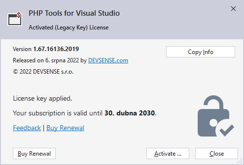

/*
Title: Product Activation
Description: Activate PHP Tools for Visual Studio
*/

# Product Activation

Once you have [downloaded PHP Tools](https://www.devsense.com/en/download), [installed it](https://docs.devsense.com/en/vs/installation) and [installed PHP](https://docs.devsense.com/en/vs/installation/install-php), it's time to activate the product.

PHP Tools for Visual Studio comes with a free trial to evaluate the software. You can enable the trial first to see whether PHP Tools suits you. The trial allows free access to all developing features for 30 days. When the trial ends, you can activate the software using a purchased license key.

## Activate Trial

As explained before, PHP Tools for Visual Studio comes with a free, 30-day trial. This trial can be started anytime, but until then, only a set of basic features will work. PHP Tools will ask to start the trial every time Visual Studio starts (see picture below). 

This dialog box will appear every time, unless the trial has been started, the product has been activated, or the dialog box has been disabled in its Close menu. 

Click **Begin Trial** to start a free 30-day evaluation.

> **Note:** The trial can also be activated from the Visual Studio menu. Click **Help**, and then **Activate PHP Tools for Visual Studio** to re-open the activation dialog.

## Obtain your License Key

The license key can be purchased online from our [Purchase page](https://www.devsense.com/purchase). For detailed information about licence types, licensing model, purchase, upgrades and renewal, see our [FAQ section](https://www.devsense.com/en/purchase#faq).

## Enter License Key

Once you have a purchased license key, you can activate your copy of PHP Tools for Visual Studio. The product can be activated from the Visual Studio menu. Click `Help | Activate PHP Tools for Visual Studio` to open the activation dialog. 

Then, paste your license key and click "Activate".

> **Note**: If you have a blocked Internet connection, you can also activate the product. More on [offline activation](offline-activation).

To review the status of your maintenance and support subscription, go to `Help | PHP Tools for Visual Studio`. [What's the maintenance and support subscription?](https://www.devsense.com/en/purchase/faq/upgrades-and-renewal#what-is-the-maintenance-and-support-subscription)

This window gives you information about your license status, product version and the option to renew your subscription.

## Related links

- [Offline activation](offline-activation): How to activate the product license with a blocked Internet connection.
