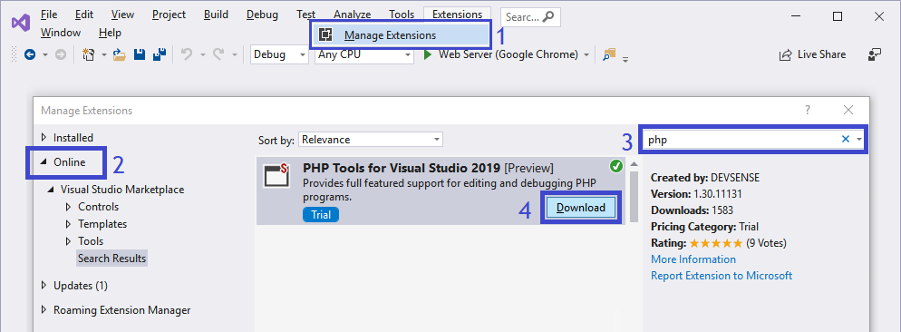

/*
Title: Installation Instructions
Description: How to install PHP Tools for Visual Studio
*/

## Instalación básica

Antes de instalar PHP Tools, necesita tener instalado *Microsoft Visual Studio*. Puede descargar la versión [Community](https://visualstudio.microsoft.com/es/vs/community/) de Visual Studio que es **gratis**. PHP Tools es compatible con todas las versiones de Visual Studio, excepto las versiones express.

Si ya tiene instalado Visual Studio, puede ir directamente a **Administrar extensiones** y buscar **PHP Tools for Visual Studio**.

Una vez que haya descargado el paquete, deberá cerrar Visual Studio. El software será instalado y Visual Studio será configurado para  desarrollo en PHP. Antes de abrir Visual Studio nuevamente, debe [activar el producto](https://docs.devsense.com/es/vs/installation) para poder [comenzar a utilizar PHP Tools](https://docs.devsense.com/es/vs.)

Si necesita una explicación más detallada, por favor continúe leyendo.

## Requisitos

Para instalar PHP Tools para Visual Studio necesitará:

- **Acceso en modo administrador**. Por favor asegúrese que tiene acceso como administrador a su disco duro, porque el paquete de instalación copia archivos en su sistema. Para Visual Studio 2010 hasta 2015, necesitará acceso a **Archivos de Programa**.
- **Microsoft Visual Studio**. Instale Microsoft Visual Studio. La edición [Comunity](https://visualstudio.microsoft.com/es/vs/community/) es gratuita, pero también puede instalar cualquiera de las otras ediciones de Visual Studio como *Profesional* o *Enterprise*. Las ediciones Express no con compatibles.

## Download

El paquete de descarga de PHP Tools puede ser descargado de:

- [Visual Studio Marketplace](https://marketplace.visualstudio.com/search?term="php%20tools"&target=VS&vsVersion=)-	Elija la edición de acuerdo a la versión de su Visual Studio.
- [DEVSENSE.com](https://www.devsense.com/en/download#vs)-	Descargue cualquier versión o cualquier actualización de PHP Tools for Visual Studio directamente desde nuestra página.

#### Instrucciones:

Una vez que haya descagado PHP Tools:

1. Cierre *Visual Studio*
2. Ejecute el paquete de instalación descargado de las ubicaciones anteriormente mencionadas.
3. Siga las instrucciones en pantalla.
4. Reinicie *Visual Studio*.

El paquete de instalación del software también puede ser utilizado para instalar PHP Tools en una máquina [sin conexión a internet](https://docs.devsense.com/en/vs/installation/offline-activation).

## Activation

El producto contiene una versión de prueba gratis por 30 días, con todas las características y funciones. Por favor, vea [activación del producto](/vs/installation/activation).

## Actualizaciones

Visual Studio busca actualizaciones para PHP Tools automáticamente y le notificará cuando haya alguna disponible. Por favor, ingrese a [actualizaciones](https://docs.devsense.com/en/vs/installation/updatet) para más información.
